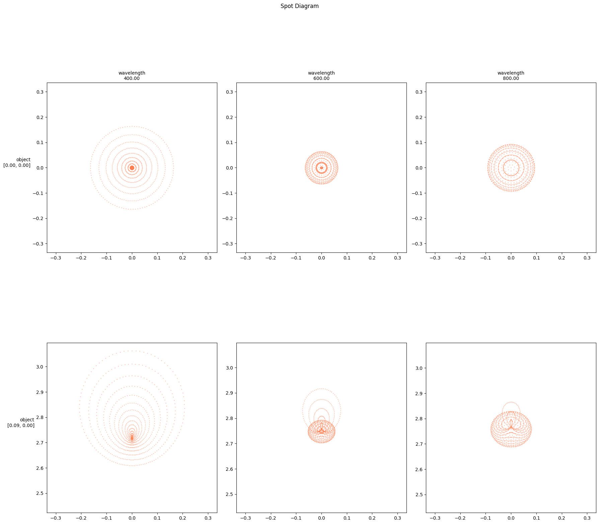
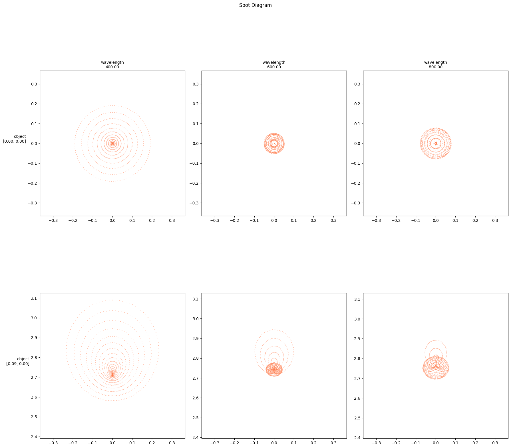

# Spot diagram


```python
from IPython.display import clear_output
clear_output()
```


```python
import torch
import torch.nn as nn
import torch.optim as optim
import torchlensmaker as tlm

surface = tlm.surfaces.Sphere(diameter=15, r=tlm.parameter(32.6656))
lens = tlm.BiLens(surface, material="BK7", outer_thickness=1.5)

optics = nn.Sequential(
    tlm.ObjectAtInfinity(beam_diameter=10, angular_size=5.),
    tlm.Wavelength(400, 800),
    tlm.Gap(1),
    lens,
    tlm.Gap(30),
    tlm.ImagePlane(15),
)

clear_output()
tlm.show2d(optics, sampling={"base": tlm.sampling.dense(10), "object": tlm.sampling.dense(3), "wavelength": 3})
#tlm.show3d(optics, sampling={"sampler": "uniform", "base": 100, "object": 5}, end=100)
```


<div data-jp-suppress-context-menu id='tlmviewer-2f3a5958' class='tlmviewer' style='width: 100%; aspect-ratio: 16 / 9;'></div><script type='module'>async function importtlm() {
    try {
        return await import("/tlmviewer.js");
    } catch (error) {
        console.log("error", error);
        return await import("/files/test_notebooks/tlmviewer.js");
    }
}

const module = await importtlm();
const tlmviewer = module.tlmviewer;

const data = '{"mode": "2D", "camera": "XY", "data": [{"type": "surfaces", "data": [{"matrix": [[1.0, 0.0, 1.0], [0.0, 1.0, 0.0], [0.0, 0.0, 1.0]], "samples": [[0.87265587, 7.50000572], [0.85519218, 7.42558718], [0.83790207, 7.3511281], [0.82078552, 7.27662849], [0.80384636, 7.20208931], [0.78707886, 7.12751055], [0.77048874, 7.05289316], [0.75407219, 6.97823715], [0.73782921, 6.90354252], [0.72176361, 6.82880974], [0.70586967, 6.75404024], [0.69015312, 6.67923403], [0.67461205, 6.60439825], [0.65924454, 6.5295186], [0.6440506, 6.45460367], [0.62903595, 6.37965298], [0.61419296, 6.30466747], [0.59952927, 6.22964716], [0.58503723, 6.15459347], [0.57072449, 6.07950544], [0.5565834, 6.00438452], [0.54262161, 5.92923021], [0.5288353, 5.85404396], [0.51522446, 5.77882528], [0.50178909, 5.70357513], [0.48853302, 5.62830162], [0.47545242, 5.55298948], [0.46254349, 5.47764635], [0.44981384, 5.40227413], [0.43725967, 5.32687235], [0.4248848, 5.25144053], [0.41268158, 5.17598057], [0.40066147, 5.100492], [0.38881302, 5.02497578], [0.37714386, 4.9494319], [0.36565018, 4.87386036], [0.35433197, 4.79826307], [0.34319305, 4.72263861], [0.33222961, 4.64698935], [0.32144165, 4.57131386], [0.31083298, 4.49562168], [0.30040359, 4.4198966], [0.29014969, 4.34414721], [0.28007507, 4.26837444], [0.27017212, 4.19257832], [0.26045227, 4.11675882], [0.25090408, 4.04091692], [0.241539, 3.96505308], [0.2323494, 3.88916731], [0.22333527, 3.81326056], [0.21450043, 3.73733282], [0.20584488, 3.66138434], [0.19736481, 3.58541608], [0.18906403, 3.50943589], [0.18094254, 3.43342876], [0.17299652, 3.3574028], [0.1652298, 3.28135848], [0.15763855, 3.20529604], [0.15022659, 3.12921619], [0.14299393, 3.05311918], [0.13594055, 2.97700524], [0.12906265, 2.90087533], [0.12236404, 2.82472944], [0.11584091, 2.74856806], [0.10949707, 2.67239165], [0.10333252, 2.59620047], [0.09734726, 2.52000308], [0.09154129, 2.443784], [0.0859108, 2.36755157], [0.08045959, 2.29130602], [0.07518768, 2.21504807], [0.07009125, 2.13877797], [0.06517792, 2.06249619], [0.06044006, 1.98620296], [0.0558815, 1.909899], [0.05150223, 1.83358455], [0.04730225, 1.75725996], [0.04327774, 1.68092597], [0.03943253, 1.60458267], [0.03577042, 1.5282383], [0.03227997, 1.45187783], [0.02897263, 1.37550938], [0.02584457, 1.29913342], [0.022892, 1.22275031], [0.02011871, 1.14636064], [0.01752853, 1.06996453], [0.01511383, 0.99356264], [0.01287842, 0.91715527], [0.0108223, 0.84074295], [0.00894165, 0.76432592], [0.00724411, 0.68790478], [0.00572586, 0.61147988], [0.00438309, 0.53505158], [0.0032196, 0.45862818], [0.00223541, 0.38219443], [0.00143051, 0.30575863], [0.0008049, 0.22932117], [0.00035858, 0.15288243], [8.774e-05, 0.07644285], [0.0, -2.86e-06], [8.774e-05, -0.07644285], [0.00035858, -0.15288243], [0.0008049, -0.22932117], [0.00143051, -0.30575863], [0.00223541, -0.38219443], [0.0032196, -0.45862818], [0.00438309, -0.53505158], [0.00572586, -0.61147988], [0.00724411, -0.68790478], [0.00894165, -0.76432592], [0.0108223, -0.84074295], [0.01287842, -0.91715527], [0.01511383, -0.99356264], [0.01752853, -1.06996453], [0.02011871, -1.14636064], [0.022892, -1.22275031], [0.02584457, -1.29913342], [0.02897263, -1.37550938], [0.03227997, -1.45187783], [0.03577042, -1.5282383], [0.03943253, -1.60458267], [0.04327774, -1.68092597], [0.04730225, -1.75725996], [0.05150223, -1.83358455], [0.0558815, -1.909899], [0.06044006, -1.98620296], [0.06517792, -2.06249619], [0.07009125, -2.13877797], [0.07518768, -2.21504807], [0.08045959, -2.29130602], [0.0859108, -2.36755157], [0.09154129, -2.443784], [0.09734726, -2.52000308], [0.10333252, -2.59620047], [0.10949707, -2.67239165], [0.11584091, -2.74856806], [0.12236404, -2.82472944], [0.12906265, -2.90087533], [0.13594055, -2.97700524], [0.14299393, -3.05311918], [0.15022659, -3.12921619], [0.15763855, -3.20529604], [0.1652298, -3.28135848], [0.17299652, -3.3574028], [0.18094254, -3.43342876], [0.18906403, -3.50943589], [0.19736481, -3.58541608], [0.20584488, -3.66138434], [0.21450043, -3.73733282], [0.22333527, -3.81326056], [0.2323494, -3.88916731], [0.241539, -3.96505308], [0.25090408, -4.04091692], [0.26045227, -4.11675882], [0.27017212, -4.19257832], [0.28007507, -4.26837444], [0.29014969, -4.34414721], [0.30040359, -4.4198966], [0.31083298, -4.49562168], [0.32144165, -4.57131386], [0.33222961, -4.64698935], [0.34319305, -4.72263861], [0.35433197, -4.79826307], [0.36565018, -4.87386036], [0.37714386, -4.9494319], [0.38881302, -5.02497578], [0.40066147, -5.100492], [0.41268158, -5.17598057], [0.4248848, -5.25144053], [0.43725967, -5.32687235], [0.44981384, -5.40227413], [0.46254349, -5.47764635], [0.47545242, -5.55298948], [0.48853302, -5.62830162], [0.50178909, -5.70357513], [0.51522446, -5.77882528], [0.5288353, -5.85404396], [0.54262161, -5.92923021], [0.5565834, -6.00438452], [0.57072449, -6.07950544], [0.58503723, -6.15459347], [0.59952927, -6.22964716], [0.61419296, -6.30466747], [0.62903595, -6.37965298], [0.6440506, -6.45460367], [0.65924454, -6.5295186], [0.67461205, -6.60439825], [0.69015312, -6.67923403], [0.70586967, -6.75404024], [0.72176361, -6.82880974], [0.73782921, -6.90354252], [0.75407219, -6.97823715], [0.77048874, -7.05289316], [0.78707886, -7.12751055], [0.80384636, -7.20208931], [0.82078552, -7.27662849], [0.83790207, -7.3511281], [0.85519218, -7.42558718], [0.87265587, -7.50000572]]}]}, {"type": "surfaces", "data": [{"matrix": [[-1.0, 0.0, 4.24530775], [0.0, -1.0, 0.0], [0.0, 0.0, 1.0]], "samples": [[0.87265587, 7.50000572], [0.85519218, 7.42558718], [0.83790207, 7.3511281], [0.82078552, 7.27662849], [0.80384636, 7.20208931], [0.78707886, 7.12751055], [0.77048874, 7.05289316], [0.75407219, 6.97823715], [0.73782921, 6.90354252], [0.72176361, 6.82880974], [0.70586967, 6.75404024], [0.69015312, 6.67923403], [0.67461205, 6.60439825], [0.65924454, 6.5295186], [0.6440506, 6.45460367], [0.62903595, 6.37965298], [0.61419296, 6.30466747], [0.59952927, 6.22964716], [0.58503723, 6.15459347], [0.57072449, 6.07950544], [0.5565834, 6.00438452], [0.54262161, 5.92923021], [0.5288353, 5.85404396], [0.51522446, 5.77882528], [0.50178909, 5.70357513], [0.48853302, 5.62830162], [0.47545242, 5.55298948], [0.46254349, 5.47764635], [0.44981384, 5.40227413], [0.43725967, 5.32687235], [0.4248848, 5.25144053], [0.41268158, 5.17598057], [0.40066147, 5.100492], [0.38881302, 5.02497578], [0.37714386, 4.9494319], [0.36565018, 4.87386036], [0.35433197, 4.79826307], [0.34319305, 4.72263861], [0.33222961, 4.64698935], [0.32144165, 4.57131386], [0.31083298, 4.49562168], [0.30040359, 4.4198966], [0.29014969, 4.34414721], [0.28007507, 4.26837444], [0.27017212, 4.19257832], [0.26045227, 4.11675882], [0.25090408, 4.04091692], [0.241539, 3.96505308], [0.2323494, 3.88916731], [0.22333527, 3.81326056], [0.21450043, 3.73733282], [0.20584488, 3.66138434], [0.19736481, 3.58541608], [0.18906403, 3.50943589], [0.18094254, 3.43342876], [0.17299652, 3.3574028], [0.1652298, 3.28135848], [0.15763855, 3.20529604], [0.15022659, 3.12921619], [0.14299393, 3.05311918], [0.13594055, 2.97700524], [0.12906265, 2.90087533], [0.12236404, 2.82472944], [0.11584091, 2.74856806], [0.10949707, 2.67239165], [0.10333252, 2.59620047], [0.09734726, 2.52000308], [0.09154129, 2.443784], [0.0859108, 2.36755157], [0.08045959, 2.29130602], [0.07518768, 2.21504807], [0.07009125, 2.13877797], [0.06517792, 2.06249619], [0.06044006, 1.98620296], [0.0558815, 1.909899], [0.05150223, 1.83358455], [0.04730225, 1.75725996], [0.04327774, 1.68092597], [0.03943253, 1.60458267], [0.03577042, 1.5282383], [0.03227997, 1.45187783], [0.02897263, 1.37550938], [0.02584457, 1.29913342], [0.022892, 1.22275031], [0.02011871, 1.14636064], [0.01752853, 1.06996453], [0.01511383, 0.99356264], [0.01287842, 0.91715527], [0.0108223, 0.84074295], [0.00894165, 0.76432592], [0.00724411, 0.68790478], [0.00572586, 0.61147988], [0.00438309, 0.53505158], [0.0032196, 0.45862818], [0.00223541, 0.38219443], [0.00143051, 0.30575863], [0.0008049, 0.22932117], [0.00035858, 0.15288243], [8.774e-05, 0.07644285], [0.0, -2.86e-06], [8.774e-05, -0.07644285], [0.00035858, -0.15288243], [0.0008049, -0.22932117], [0.00143051, -0.30575863], [0.00223541, -0.38219443], [0.0032196, -0.45862818], [0.00438309, -0.53505158], [0.00572586, -0.61147988], [0.00724411, -0.68790478], [0.00894165, -0.76432592], [0.0108223, -0.84074295], [0.01287842, -0.91715527], [0.01511383, -0.99356264], [0.01752853, -1.06996453], [0.02011871, -1.14636064], [0.022892, -1.22275031], [0.02584457, -1.29913342], [0.02897263, -1.37550938], [0.03227997, -1.45187783], [0.03577042, -1.5282383], [0.03943253, -1.60458267], [0.04327774, -1.68092597], [0.04730225, -1.75725996], [0.05150223, -1.83358455], [0.0558815, -1.909899], [0.06044006, -1.98620296], [0.06517792, -2.06249619], [0.07009125, -2.13877797], [0.07518768, -2.21504807], [0.08045959, -2.29130602], [0.0859108, -2.36755157], [0.09154129, -2.443784], [0.09734726, -2.52000308], [0.10333252, -2.59620047], [0.10949707, -2.67239165], [0.11584091, -2.74856806], [0.12236404, -2.82472944], [0.12906265, -2.90087533], [0.13594055, -2.97700524], [0.14299393, -3.05311918], [0.15022659, -3.12921619], [0.15763855, -3.20529604], [0.1652298, -3.28135848], [0.17299652, -3.3574028], [0.18094254, -3.43342876], [0.18906403, -3.50943589], [0.19736481, -3.58541608], [0.20584488, -3.66138434], [0.21450043, -3.73733282], [0.22333527, -3.81326056], [0.2323494, -3.88916731], [0.241539, -3.96505308], [0.25090408, -4.04091692], [0.26045227, -4.11675882], [0.27017212, -4.19257832], [0.28007507, -4.26837444], [0.29014969, -4.34414721], [0.30040359, -4.4198966], [0.31083298, -4.49562168], [0.32144165, -4.57131386], [0.33222961, -4.64698935], [0.34319305, -4.72263861], [0.35433197, -4.79826307], [0.36565018, -4.87386036], [0.37714386, -4.9494319], [0.38881302, -5.02497578], [0.40066147, -5.100492], [0.41268158, -5.17598057], [0.4248848, -5.25144053], [0.43725967, -5.32687235], [0.44981384, -5.40227413], [0.46254349, -5.47764635], [0.47545242, -5.55298948], [0.48853302, -5.62830162], [0.50178909, -5.70357513], [0.51522446, -5.77882528], [0.5288353, -5.85404396], [0.54262161, -5.92923021], [0.5565834, -6.00438452], [0.57072449, -6.07950544], [0.58503723, -6.15459347], [0.59952927, -6.22964716], [0.61419296, -6.30466747], [0.62903595, -6.37965298], [0.6440506, -6.45460367], [0.65924454, -6.5295186], [0.67461205, -6.60439825], [0.69015312, -6.67923403], [0.70586967, -6.75404024], [0.72176361, -6.82880974], [0.73782921, -6.90354252], [0.75407219, -6.97823715], [0.77048874, -7.05289316], [0.78707886, -7.12751055], [0.80384636, -7.20208931], [0.82078552, -7.27662849], [0.83790207, -7.3511281], [0.85519218, -7.42558718], [0.87265587, -7.50000572]]}]}, {"type": "surfaces", "data": [{"matrix": [[1.0, 0.0, 34.24530775], [0.0, 1.0, 0.0], [0.0, 0.0, 1.0]], "samples": [[0.0, -7.5], [0.0, -7.4242425], [0.0, -7.34848499], [0.0, -7.27272749], [0.0, -7.19696951], [0.0, -7.12121201], [0.0, -7.0454545], [0.0, -6.969697], [0.0, -6.8939395], [0.0, -6.81818199], [0.0, -6.74242401], [0.0, -6.66666651], [0.0, -6.590909], [0.0, -6.5151515], [0.0, -6.439394], [0.0, -6.36363649], [0.0, -6.28787899], [0.0, -6.21212101], [0.0, -6.13636351], [0.0, -6.060606], [0.0, -5.9848485], [0.0, -5.909091], [0.0, -5.83333349], [0.0, -5.75757551], [0.0, -5.68181801], [0.0, -5.6060605], [0.0, -5.530303], [0.0, -5.4545455], [0.0, -5.37878799], [0.0, -5.30303001], [0.0, -5.22727251], [0.0, -5.15151501], [0.0, -5.0757575], [0.0, -5.0], [0.0, -4.9242425], [0.0, -4.84848499], [0.0, -4.77272701], [0.0, -4.69696951], [0.0, -4.62121201], [0.0, -4.5454545], [0.0, -4.469697], [0.0, -4.3939395], [0.0, -4.31818151], [0.0, -4.24242401], [0.0, -4.16666651], [0.0, -4.090909], [0.0, -4.0151515], [0.0, -3.93939376], [0.0, -3.86363626], [0.0, -3.78787875], [0.0, -3.71212125], [0.0, -3.63636374], [0.0, -3.56060624], [0.0, -3.4848485], [0.0, -3.409091], [0.0, -3.33333349], [0.0, -3.25757575], [0.0, -3.18181825], [0.0, -3.10606074], [0.0, -3.030303], [0.0, -2.9545455], [0.0, -2.87878799], [0.0, -2.80303049], [0.0, -2.72727275], [0.0, -2.65151525], [0.0, -2.57575774], [0.0, -2.5], [0.0, -2.4242425], [0.0, -2.34848499], [0.0, -2.27272725], [0.0, -2.19696975], [0.0, -2.12121224], [0.0, -2.0454545], [0.0, -1.969697], [0.0, -1.8939395], [0.0, -1.81818187], [0.0, -1.74242425], [0.0, -1.66666675], [0.0, -1.59090912], [0.0, -1.5151515], [0.0, -1.439394], [0.0, -1.36363637], [0.0, -1.28787887], [0.0, -1.21212125], [0.0, -1.13636363], [0.0, -1.06060612], [0.0, -0.9848485], [0.0, -0.90909094], [0.0, -0.83333337], [0.0, -0.75757575], [0.0, -0.68181819], [0.0, -0.60606062], [0.0, -0.53030306], [0.0, -0.45454547], [0.0, -0.37878788], [0.0, -0.30303031], [0.0, -0.22727273], [0.0, -0.15151516], [0.0, -0.07575758], [0.0, 0.0], [0.0, 0.07575758], [0.0, 0.15151516], [0.0, 0.22727273], [0.0, 0.30303031], [0.0, 0.37878788], [0.0, 0.45454547], [0.0, 0.53030306], [0.0, 0.60606062], [0.0, 0.68181819], [0.0, 0.75757575], [0.0, 0.83333337], [0.0, 0.90909094], [0.0, 0.9848485], [0.0, 1.06060612], [0.0, 1.13636363], [0.0, 1.21212125], [0.0, 1.28787887], [0.0, 1.36363637], [0.0, 1.439394], [0.0, 1.5151515], [0.0, 1.59090912], [0.0, 1.66666675], [0.0, 1.74242425], [0.0, 1.81818187], [0.0, 1.8939395], [0.0, 1.969697], [0.0, 2.0454545], [0.0, 2.12121224], [0.0, 2.19696975], [0.0, 2.27272725], [0.0, 2.34848499], [0.0, 2.4242425], [0.0, 2.5], [0.0, 2.57575774], [0.0, 2.65151525], [0.0, 2.72727275], [0.0, 2.80303049], [0.0, 2.87878799], [0.0, 2.9545455], [0.0, 3.030303], [0.0, 3.10606074], [0.0, 3.18181825], [0.0, 3.25757575], [0.0, 3.33333349], [0.0, 3.409091], [0.0, 3.4848485], [0.0, 3.56060624], [0.0, 3.63636374], [0.0, 3.71212125], [0.0, 3.78787875], [0.0, 3.86363626], [0.0, 3.93939376], [0.0, 4.0151515], [0.0, 4.090909], [0.0, 4.16666651], [0.0, 4.24242401], [0.0, 4.31818151], [0.0, 4.3939395], [0.0, 4.469697], [0.0, 4.5454545], [0.0, 4.62121201], [0.0, 4.69696951], [0.0, 4.77272701], [0.0, 4.84848499], [0.0, 4.9242425], [0.0, 5.0], [0.0, 5.0757575], [0.0, 5.15151501], [0.0, 5.22727251], [0.0, 5.30303001], [0.0, 5.37878799], [0.0, 5.4545455], [0.0, 5.530303], [0.0, 5.6060605], [0.0, 5.68181801], [0.0, 5.75757551], [0.0, 5.83333349], [0.0, 5.909091], [0.0, 5.9848485], [0.0, 6.060606], [0.0, 6.13636351], [0.0, 6.21212101], [0.0, 6.28787899], [0.0, 6.36363649], [0.0, 6.439394], [0.0, 6.5151515], [0.0, 6.590909], [0.0, 6.66666651], [0.0, 6.74242401], [0.0, 6.81818199], [0.0, 6.8939395], [0.0, 6.969697], [0.0, 7.0454545], [0.0, 7.12121201], [0.0, 7.19696951], [0.0, 7.27272749], [0.0, 7.34848499], [0.0, 7.4242425], [0.0, 7.5]]}]}, {"type": "rays", "points": [[0.0, -5.0, 1.39442248, -5.0608818], [0.0, -5.0, 1.39442248, -5.0608818], [0.0, -5.0, 1.39442248, -5.0608818], [0.0, -5.0, 1.3849336, -5.0], [0.0, -5.0, 1.3849336, -5.0], [0.0, -5.0, 1.3849336, -5.0], [0.0, -5.0, 1.37568743, -4.93993619], [0.0, -5.0, 1.37568743, -4.93993619], [0.0, -5.0, 1.37568743, -4.93993619], [0.0, -3.88888889, 1.23884643, -3.94297809], [0.0, -3.88888889, 1.23884643, -3.94297809], [0.0, -3.88888889, 1.23884643, -3.94297809], [0.0, -3.88888889, 1.23231514, -3.88888889], [0.0, -3.88888889, 1.23231514, -3.88888889], [0.0, -3.88888889, 1.23231514, -3.88888889], [0.0, -3.88888889, 1.22594197, -3.83536311], [0.0, -3.88888889, 1.22594197, -3.83536311], [0.0, -3.88888889, 1.22594197, -3.83536311], [0.0, -2.77777778, 1.12254103, -2.82678898], [0.0, -2.77777778, 1.12254103, -2.82678898], [0.0, -2.77777778, 1.12254103, -2.82678898], [0.0, -2.77777778, 1.11832094, -2.77777778], [0.0, -2.77777778, 1.11832094, -2.77777778], [0.0, -2.77777778, 1.11832094, -2.77777778], [0.0, -2.77777778, 1.11420571, -2.72913051], [0.0, -2.77777778, 1.11420571, -2.72913051], [0.0, -2.77777778, 1.11420571, -2.72913051], [0.0, -1.66666667, 1.04490884, -1.71228837], [0.0, -1.66666667, 1.04490884, -1.71228837], [0.0, -1.66666667, 1.04490884, -1.71228837], [0.0, -1.66666667, 1.0425461, -1.66666667], [0.0, -1.66666667, 1.0425461, -1.66666667], [0.0, -1.66666667, 1.0425461, -1.66666667], [0.0, -1.66666667, 1.04025743, -1.62124805], [0.0, -1.66666667, 1.04025743, -1.62124805], [0.0, -1.66666667, 1.04025743, -1.62124805], [0.0, -0.55555556, 1.00550087, -0.59945667], [0.0, -0.55555556, 1.00550087, -0.59945667], [0.0, -0.55555556, 1.00550087, -0.59945667], [0.0, -0.55555556, 1.00472461, -0.55555556], [0.0, -0.55555556, 1.00472461, -0.55555556], [0.0, -0.55555556, 1.00472461, -0.55555556], [0.0, -0.55555556, 1.00400839, -0.5117196], [0.0, -0.55555556, 1.00400839, -0.5117196], [0.0, -0.55555556, 1.00400839, -0.5117196], [0.0, 0.55555556, 1.00400839, 0.5117196], [0.0, 0.55555556, 1.00400839, 0.5117196], [0.0, 0.55555556, 1.00400839, 0.5117196], [0.0, 0.55555556, 1.00472461, 0.55555556], [0.0, 0.55555556, 1.00472461, 0.55555556], [0.0, 0.55555556, 1.00472461, 0.55555556], [0.0, 0.55555556, 1.00550087, 0.59945667], [0.0, 0.55555556, 1.00550087, 0.59945667], [0.0, 0.55555556, 1.00550087, 0.59945667], [0.0, 1.66666667, 1.04025743, 1.62124805], [0.0, 1.66666667, 1.04025743, 1.62124805], [0.0, 1.66666667, 1.04025743, 1.62124805], [0.0, 1.66666667, 1.0425461, 1.66666667], [0.0, 1.66666667, 1.0425461, 1.66666667], [0.0, 1.66666667, 1.0425461, 1.66666667], [0.0, 1.66666667, 1.04490884, 1.71228837], [0.0, 1.66666667, 1.04490884, 1.71228837], [0.0, 1.66666667, 1.04490884, 1.71228837], [0.0, 2.77777778, 1.11420571, 2.72913051], [0.0, 2.77777778, 1.11420571, 2.72913051], [0.0, 2.77777778, 1.11420571, 2.72913051], [0.0, 2.77777778, 1.11832094, 2.77777778], [0.0, 2.77777778, 1.11832094, 2.77777778], [0.0, 2.77777778, 1.11832094, 2.77777778], [0.0, 2.77777778, 1.12254103, 2.82678898], [0.0, 2.77777778, 1.12254103, 2.82678898], [0.0, 2.77777778, 1.12254103, 2.82678898], [0.0, 3.88888889, 1.22594197, 3.83536311], [0.0, 3.88888889, 1.22594197, 3.83536311], [0.0, 3.88888889, 1.22594197, 3.83536311], [0.0, 3.88888889, 1.23231514, 3.88888889], [0.0, 3.88888889, 1.23231514, 3.88888889], [0.0, 3.88888889, 1.23231514, 3.88888889], [0.0, 3.88888889, 1.23884643, 3.94297809], [0.0, 3.88888889, 1.23884643, 3.94297809], [0.0, 3.88888889, 1.23884643, 3.94297809], [0.0, 5.0, 1.37568743, 4.93993619], [0.0, 5.0, 1.37568743, 4.93993619], [0.0, 5.0, 1.37568743, 4.93993619], [0.0, 5.0, 1.3849336, 5.0], [0.0, 5.0, 1.3849336, 5.0], [0.0, 5.0, 1.3849336, 5.0], [0.0, 5.0, 1.39442248, 5.0608818], [0.0, 5.0, 1.39442248, 5.0608818], [0.0, 5.0, 1.39442248, 5.0608818]], "color": "#ffa724", "variables": {"base": [[-5.0], [-5.0], [-5.0], [-5.0], [-5.0], [-5.0], [-5.0], [-5.0], [-5.0], [-3.88888889], [-3.88888889], [-3.88888889], [-3.88888889], [-3.88888889], [-3.88888889], [-3.88888889], [-3.88888889], [-3.88888889], [-2.77777778], [-2.77777778], [-2.77777778], [-2.77777778], [-2.77777778], [-2.77777778], [-2.77777778], [-2.77777778], [-2.77777778], [-1.66666667], [-1.66666667], [-1.66666667], [-1.66666667], [-1.66666667], [-1.66666667], [-1.66666667], [-1.66666667], [-1.66666667], [-0.55555556], [-0.55555556], [-0.55555556], [-0.55555556], [-0.55555556], [-0.55555556], [-0.55555556], [-0.55555556], [-0.55555556], [0.55555556], [0.55555556], [0.55555556], [0.55555556], [0.55555556], [0.55555556], [0.55555556], [0.55555556], [0.55555556], [1.66666667], [1.66666667], [1.66666667], [1.66666667], [1.66666667], [1.66666667], [1.66666667], [1.66666667], [1.66666667], [2.77777778], [2.77777778], [2.77777778], [2.77777778], [2.77777778], [2.77777778], [2.77777778], [2.77777778], [2.77777778], [3.88888889], [3.88888889], [3.88888889], [3.88888889], [3.88888889], [3.88888889], [3.88888889], [3.88888889], [3.88888889], [5.0], [5.0], [5.0], [5.0], [5.0], [5.0], [5.0], [5.0], [5.0]], "object": [[-0.04363323], [-0.04363323], [-0.04363323], [0.0], [0.0], [0.0], [0.04363323], [0.04363323], [0.04363323], [-0.04363323], [-0.04363323], [-0.04363323], [0.0], [0.0], [0.0], [0.04363323], [0.04363323], [0.04363323], [-0.04363323], [-0.04363323], [-0.04363323], [0.0], [0.0], [0.0], [0.04363323], [0.04363323], [0.04363323], [-0.04363323], [-0.04363323], [-0.04363323], [0.0], [0.0], [0.0], [0.04363323], [0.04363323], [0.04363323], [-0.04363323], [-0.04363323], [-0.04363323], [0.0], [0.0], [0.0], [0.04363323], [0.04363323], [0.04363323], [-0.04363323], [-0.04363323], [-0.04363323], [0.0], [0.0], [0.0], [0.04363323], [0.04363323], [0.04363323], [-0.04363323], [-0.04363323], [-0.04363323], [0.0], [0.0], [0.0], [0.04363323], [0.04363323], [0.04363323], [-0.04363323], [-0.04363323], [-0.04363323], [0.0], [0.0], [0.0], [0.04363323], [0.04363323], [0.04363323], [-0.04363323], [-0.04363323], [-0.04363323], [0.0], [0.0], [0.0], [0.04363323], [0.04363323], [0.04363323], [-0.04363323], [-0.04363323], [-0.04363323], [0.0], [0.0], [0.0], [0.04363323], [0.04363323], [0.04363323]], "wavelength": [400.0, 600.0, 800.0, 400.0, 600.0, 800.0, 400.0, 600.0, 800.0, 400.0, 600.0, 800.0, 400.0, 600.0, 800.0, 400.0, 600.0, 800.0, 400.0, 600.0, 800.0, 400.0, 600.0, 800.0, 400.0, 600.0, 800.0, 400.0, 600.0, 800.0, 400.0, 600.0, 800.0, 400.0, 600.0, 800.0, 400.0, 600.0, 800.0, 400.0, 600.0, 800.0, 400.0, 600.0, 800.0, 400.0, 600.0, 800.0, 400.0, 600.0, 800.0, 400.0, 600.0, 800.0, 400.0, 600.0, 800.0, 400.0, 600.0, 800.0, 400.0, 600.0, 800.0, 400.0, 600.0, 800.0, 400.0, 600.0, 800.0, 400.0, 600.0, 800.0, 400.0, 600.0, 800.0, 400.0, 600.0, 800.0, 400.0, 600.0, 800.0, 400.0, 600.0, 800.0, 400.0, 600.0, 800.0, 400.0, 600.0, 800.0]}, "domain": {"base": [-5.0, 5.0], "object": [-0.04363323, 0.04363323], "wavelength": [400.0, 800.0]}, "layers": [1]}, {"type": "rays", "points": [[1.39442248, -5.0608818, 3.86084077, -4.99698648], [1.39442248, -5.0608818, 3.86035965, -5.00009361], [1.39442248, -5.0608818, 3.86018902, -5.00119506], [1.3849336, -5.0, 3.88078865, -4.86637402], [1.3849336, -5.0, 3.88042108, -4.8688132], [1.3849336, -5.0, 3.88029073, -4.86967786], [1.37568743, -4.93993619, 3.90038636, -4.73446488], [1.37568743, -4.93993619, 3.90013006, -4.73621418], [1.37568743, -4.93993619, 3.90003919, -4.7368343], [1.23884643, -3.94297809, 4.01105976, -3.90497508], [1.23884643, -3.94297809, 4.01071323, -3.90785195], [1.23884643, -3.94297809, 4.01059032, -3.90887186], [1.23231514, -3.88888889, 4.02668413, -3.77294934], [1.23231514, -3.88888889, 4.02643864, -3.77505997], [1.23231514, -3.88888889, 4.02635158, -3.77580822], [1.22594197, -3.83536311, 4.0418859, -3.63983699], [1.22594197, -3.83536311, 4.04173704, -3.64116434], [1.22594197, -3.83536311, 4.04168425, -3.64163491], [1.12254103, -2.82678898, 4.12319866, -2.82181194], [1.12254103, -2.82678898, 4.12298536, -2.82427086], [1.12254103, -2.82678898, 4.12290969, -2.82514265], [1.11832094, -2.77777778, 4.13447202, -2.68863289], [1.11832094, -2.77777778, 4.13433821, -2.69025253], [1.11832094, -2.77777778, 4.13429076, -2.69082675], [1.11420571, -2.72913051, 4.14526089, -2.55463731], [1.11420571, -2.72913051, 4.14520062, -2.55540551], [1.11420571, -2.72913051, 4.14517925, -2.55567787], [1.04490884, -1.71228837, 4.19868112, -1.74470611], [1.04490884, -1.71228837, 4.19857922, -1.74661026], [1.04490884, -1.71228837, 4.19854306, -1.74728539], [1.0425461, -1.66666667, 4.20557397, -1.61067581], [1.0425461, -1.66666667, 4.2055238, -1.61169177], [1.0425461, -1.66666667, 4.205506, -1.61205198], [1.04025743, -1.62124805, 4.21193774, -1.47613985], [1.04025743, -1.62124805, 4.21193229, -1.47626032], [1.04025743, -1.62124805, 4.21193036, -1.47630304], [1.00550087, -0.59945667, 4.23841478, -0.67102784], [1.00550087, -0.59945667, 4.23838887, -0.67228749], [1.00550087, -0.59945667, 4.23837968, -0.67273411], [1.00472461, -0.55555556, 4.24090208, -0.53647742], [1.00472461, -0.55555556, 4.2408964, -0.53682337], [1.00472461, -0.55555556, 4.24089438, -0.53694603], [1.00400839, -0.5117196, 4.24283705, -0.40175585], [1.00400839, -0.5117196, 4.24284406, -0.40118568], [1.00400839, -0.5117196, 4.24284654, -0.40098352], [1.00400839, 0.5117196, 4.24283705, 0.40175585], [1.00400839, 0.5117196, 4.24284406, 0.40118568], [1.00400839, 0.5117196, 4.24284654, 0.40098352], [1.00472461, 0.55555556, 4.24090208, 0.53647742], [1.00472461, 0.55555556, 4.2408964, 0.53682337], [1.00472461, 0.55555556, 4.24089438, 0.53694603], [1.00550087, 0.59945667, 4.23841478, 0.67102784], [1.00550087, 0.59945667, 4.23838887, 0.67228749], [1.00550087, 0.59945667, 4.23837968, 0.67273411], [1.04025743, 1.62124805, 4.21193774, 1.47613985], [1.04025743, 1.62124805, 4.21193229, 1.47626032], [1.04025743, 1.62124805, 4.21193036, 1.47630304], [1.0425461, 1.66666667, 4.20557397, 1.61067581], [1.0425461, 1.66666667, 4.2055238, 1.61169177], [1.0425461, 1.66666667, 4.205506, 1.61205198], [1.04490884, 1.71228837, 4.19868112, 1.74470611], [1.04490884, 1.71228837, 4.19857922, 1.74661026], [1.04490884, 1.71228837, 4.19854306, 1.74728539], [1.11420571, 2.72913051, 4.14526089, 2.55463731], [1.11420571, 2.72913051, 4.14520062, 2.55540551], [1.11420571, 2.72913051, 4.14517925, 2.55567787], [1.11832094, 2.77777778, 4.13447202, 2.68863289], [1.11832094, 2.77777778, 4.13433821, 2.69025253], [1.11832094, 2.77777778, 4.13429076, 2.69082675], [1.12254103, 2.82678898, 4.12319866, 2.82181194], [1.12254103, 2.82678898, 4.12298536, 2.82427086], [1.12254103, 2.82678898, 4.12290969, 2.82514265], [1.22594197, 3.83536311, 4.0418859, 3.63983699], [1.22594197, 3.83536311, 4.04173704, 3.64116434], [1.22594197, 3.83536311, 4.04168425, 3.64163491], [1.23231514, 3.88888889, 4.02668413, 3.77294934], [1.23231514, 3.88888889, 4.02643864, 3.77505997], [1.23231514, 3.88888889, 4.02635158, 3.77580822], [1.23884643, 3.94297809, 4.01105976, 3.90497508], [1.23884643, 3.94297809, 4.01071323, 3.90785195], [1.23884643, 3.94297809, 4.01059032, 3.90887186], [1.37568743, 4.93993619, 3.90038636, 4.73446488], [1.37568743, 4.93993619, 3.90013006, 4.73621418], [1.37568743, 4.93993619, 3.90003919, 4.7368343], [1.3849336, 5.0, 3.88078865, 4.86637402], [1.3849336, 5.0, 3.88042108, 4.8688132], [1.3849336, 5.0, 3.88029073, 4.86967786], [1.39442248, 5.0608818, 3.86084077, 4.99698648], [1.39442248, 5.0608818, 3.86035965, 5.00009361], [1.39442248, 5.0608818, 3.86018902, 5.00119506]], "color": "#ffa724", "variables": {"base": [[-5.0], [-5.0], [-5.0], [-5.0], [-5.0], [-5.0], [-5.0], [-5.0], [-5.0], [-3.88888889], [-3.88888889], [-3.88888889], [-3.88888889], [-3.88888889], [-3.88888889], [-3.88888889], [-3.88888889], [-3.88888889], [-2.77777778], [-2.77777778], [-2.77777778], [-2.77777778], [-2.77777778], [-2.77777778], [-2.77777778], [-2.77777778], [-2.77777778], [-1.66666667], [-1.66666667], [-1.66666667], [-1.66666667], [-1.66666667], [-1.66666667], [-1.66666667], [-1.66666667], [-1.66666667], [-0.55555556], [-0.55555556], [-0.55555556], [-0.55555556], [-0.55555556], [-0.55555556], [-0.55555556], [-0.55555556], [-0.55555556], [0.55555556], [0.55555556], [0.55555556], [0.55555556], [0.55555556], [0.55555556], [0.55555556], [0.55555556], [0.55555556], [1.66666667], [1.66666667], [1.66666667], [1.66666667], [1.66666667], [1.66666667], [1.66666667], [1.66666667], [1.66666667], [2.77777778], [2.77777778], [2.77777778], [2.77777778], [2.77777778], [2.77777778], [2.77777778], [2.77777778], [2.77777778], [3.88888889], [3.88888889], [3.88888889], [3.88888889], [3.88888889], [3.88888889], [3.88888889], [3.88888889], [3.88888889], [5.0], [5.0], [5.0], [5.0], [5.0], [5.0], [5.0], [5.0], [5.0]], "object": [[-0.04363323], [-0.04363323], [-0.04363323], [0.0], [0.0], [0.0], [0.04363323], [0.04363323], [0.04363323], [-0.04363323], [-0.04363323], [-0.04363323], [0.0], [0.0], [0.0], [0.04363323], [0.04363323], [0.04363323], [-0.04363323], [-0.04363323], [-0.04363323], [0.0], [0.0], [0.0], [0.04363323], [0.04363323], [0.04363323], [-0.04363323], [-0.04363323], [-0.04363323], [0.0], [0.0], [0.0], [0.04363323], [0.04363323], [0.04363323], [-0.04363323], [-0.04363323], [-0.04363323], [0.0], [0.0], [0.0], [0.04363323], [0.04363323], [0.04363323], [-0.04363323], [-0.04363323], [-0.04363323], [0.0], [0.0], [0.0], [0.04363323], [0.04363323], [0.04363323], [-0.04363323], [-0.04363323], [-0.04363323], [0.0], [0.0], [0.0], [0.04363323], [0.04363323], [0.04363323], [-0.04363323], [-0.04363323], [-0.04363323], [0.0], [0.0], [0.0], [0.04363323], [0.04363323], [0.04363323], [-0.04363323], [-0.04363323], [-0.04363323], [0.0], [0.0], [0.0], [0.04363323], [0.04363323], [0.04363323], [-0.04363323], [-0.04363323], [-0.04363323], [0.0], [0.0], [0.0], [0.04363323], [0.04363323], [0.04363323]], "wavelength": [400.0, 600.0, 800.0, 400.0, 600.0, 800.0, 400.0, 600.0, 800.0, 400.0, 600.0, 800.0, 400.0, 600.0, 800.0, 400.0, 600.0, 800.0, 400.0, 600.0, 800.0, 400.0, 600.0, 800.0, 400.0, 600.0, 800.0, 400.0, 600.0, 800.0, 400.0, 600.0, 800.0, 400.0, 600.0, 800.0, 400.0, 600.0, 800.0, 400.0, 600.0, 800.0, 400.0, 600.0, 800.0, 400.0, 600.0, 800.0, 400.0, 600.0, 800.0, 400.0, 600.0, 800.0, 400.0, 600.0, 800.0, 400.0, 600.0, 800.0, 400.0, 600.0, 800.0, 400.0, 600.0, 800.0, 400.0, 600.0, 800.0, 400.0, 600.0, 800.0, 400.0, 600.0, 800.0, 400.0, 600.0, 800.0, 400.0, 600.0, 800.0, 400.0, 600.0, 800.0, 400.0, 600.0, 800.0, 400.0, 600.0, 800.0]}, "domain": {"base": [-5.0, 5.0], "object": [-0.04363323, 0.04363323], "wavelength": [400.0, 800.0]}, "layers": [1]}, {"type": "rays", "points": [[3.86084077, -4.99698648, 34.24530775, -1.23617995], [3.86035965, -5.00009361, 34.24530775, -1.38089016], [3.86018902, -5.00119506, 34.24530775, -1.43149406], [3.88078865, -4.86637402, 34.24530775, 0.1637556], [3.88042108, -4.8688132, 34.24530775, 0.01940401], [3.88029073, -4.86967786, 34.24530775, -0.03104761], [3.90038636, -4.73446488, 34.24530775, 1.59506422], [3.90013006, -4.73621418, 34.24530775, 1.45023122], [3.90003919, -4.7368343, 34.24530775, 1.39963879], [4.01105976, -3.90497508, 34.24530775, -1.31754362], [4.01071323, -3.90785195, 34.24530775, -1.42768472], [4.01059032, -3.90887186, 34.24530775, -1.46623035], [4.02668413, -3.77294934, 34.24530775, 0.06195246], [4.02643864, -3.77505997, 34.24530775, -0.0466906], [4.02635158, -3.77580822, 34.24530775, -0.08469374], [4.0418859, -3.63983699, 34.24530775, 1.46470546], [4.04173704, -3.64116434, 34.24530775, 1.35697696], [4.04168425, -3.64163491, 34.24530775, 1.31931202], [4.12319866, -2.82181194, 34.24530775, -1.35510269], [4.12298536, -2.82427086, 34.24530775, -1.43314886], [4.12290969, -2.82514265, 34.24530775, -1.46047817], [4.13447202, -2.68863289, 34.24530775, 0.01093111], [4.13433821, -2.69025253, 34.24530775, -0.06486151], [4.13429076, -2.69082675, 34.24530775, -0.09138918], [4.14526089, -2.55463731, 34.24530775, 1.39301784], [4.14520062, -2.55540551, 34.24530775, 1.31909476], [4.14517925, -2.55567787, 34.24530775, 1.29323394], [4.19868112, -1.74470611, 34.24530775, -1.36485388], [4.19857922, -1.74661026, 34.24530775, -1.41234162], [4.19854306, -1.74728539, 34.24530775, -1.42897812], [4.20557397, -1.61067581, 34.24530775, -0.00631061], [4.2055238, -1.61169177, 34.24530775, -0.05109765], [4.205506, -1.61205198, 34.24530775, -0.06677911], [4.21193774, -1.47613985, 34.24530775, 1.36165456], [4.21193229, -1.47626032, 34.24530775, 1.31934975], [4.21193036, -1.47630304, 34.24530775, 1.30454651], [4.23841478, -0.67102784, 34.24530775, -1.36066371], [4.23838887, -0.67228749, 34.24530775, -1.37836204], [4.23837968, -0.67273411, 34.24530775, -1.38456766], [4.24090208, -0.53647742, 34.24530775, -0.00420454], [4.2408964, -0.53682337, 34.24530775, -0.01902213], [4.24089438, -0.53694603, 34.24530775, -0.02421121], [4.24283705, -0.40175585, 34.24530775, 1.35536156], [4.24284406, -0.40118568, 34.24530775, 1.34335377], [4.24284654, -0.40098352, 34.24530775, 1.33915628], [4.24283705, 0.40175585, 34.24530775, -1.35536156], [4.24284406, 0.40118568, 34.24530775, -1.34335377], [4.24284654, 0.40098352, 34.24530775, -1.33915628], [4.24090208, 0.53647742, 34.24530775, 0.00420454], [4.2408964, 0.53682337, 34.24530775, 0.01902213], [4.24089438, 0.53694603, 34.24530775, 0.02421121], [4.23841478, 0.67102784, 34.24530775, 1.36066371], [4.23838887, 0.67228749, 34.24530775, 1.37836204], [4.23837968, 0.67273411, 34.24530775, 1.38456766], [4.21193774, 1.47613985, 34.24530775, -1.36165456], [4.21193229, 1.47626032, 34.24530775, -1.31934975], [4.21193036, 1.47630304, 34.24530775, -1.30454651], [4.20557397, 1.61067581, 34.24530775, 0.00631061], [4.2055238, 1.61169177, 34.24530775, 0.05109765], [4.205506, 1.61205198, 34.24530775, 0.06677911], [4.19868112, 1.74470611, 34.24530775, 1.36485388], [4.19857922, 1.74661026, 34.24530775, 1.41234162], [4.19854306, 1.74728539, 34.24530775, 1.42897812], [4.14526089, 2.55463731, 34.24530775, -1.39301784], [4.14520062, 2.55540551, 34.24530775, -1.31909476], [4.14517925, 2.55567787, 34.24530775, -1.29323394], [4.13447202, 2.68863289, 34.24530775, -0.01093111], [4.13433821, 2.69025253, 34.24530775, 0.06486151], [4.13429076, 2.69082675, 34.24530775, 0.09138918], [4.12319866, 2.82181194, 34.24530775, 1.35510269], [4.12298536, 2.82427086, 34.24530775, 1.43314886], [4.12290969, 2.82514265, 34.24530775, 1.46047817], [4.0418859, 3.63983699, 34.24530775, -1.46470546], [4.04173704, 3.64116434, 34.24530775, -1.35697696], [4.04168425, 3.64163491, 34.24530775, -1.31931202], [4.02668413, 3.77294934, 34.24530775, -0.06195246], [4.02643864, 3.77505997, 34.24530775, 0.0466906], [4.02635158, 3.77580822, 34.24530775, 0.08469374], [4.01105976, 3.90497508, 34.24530775, 1.31754362], [4.01071323, 3.90785195, 34.24530775, 1.42768472], [4.01059032, 3.90887186, 34.24530775, 1.46623035], [3.90038636, 4.73446488, 34.24530775, -1.59506422], [3.90013006, 4.73621418, 34.24530775, -1.45023122], [3.90003919, 4.7368343, 34.24530775, -1.39963879], [3.88078865, 4.86637402, 34.24530775, -0.1637556], [3.88042108, 4.8688132, 34.24530775, -0.01940401], [3.88029073, 4.86967786, 34.24530775, 0.03104761], [3.86084077, 4.99698648, 34.24530775, 1.23617995], [3.86035965, 5.00009361, 34.24530775, 1.38089016], [3.86018902, 5.00119506, 34.24530775, 1.43149406]], "color": "#ffa724", "variables": {"base": [[-5.0], [-5.0], [-5.0], [-5.0], [-5.0], [-5.0], [-5.0], [-5.0], [-5.0], [-3.88888889], [-3.88888889], [-3.88888889], [-3.88888889], [-3.88888889], [-3.88888889], [-3.88888889], [-3.88888889], [-3.88888889], [-2.77777778], [-2.77777778], [-2.77777778], [-2.77777778], [-2.77777778], [-2.77777778], [-2.77777778], [-2.77777778], [-2.77777778], [-1.66666667], [-1.66666667], [-1.66666667], [-1.66666667], [-1.66666667], [-1.66666667], [-1.66666667], [-1.66666667], [-1.66666667], [-0.55555556], [-0.55555556], [-0.55555556], [-0.55555556], [-0.55555556], [-0.55555556], [-0.55555556], [-0.55555556], [-0.55555556], [0.55555556], [0.55555556], [0.55555556], [0.55555556], [0.55555556], [0.55555556], [0.55555556], [0.55555556], [0.55555556], [1.66666667], [1.66666667], [1.66666667], [1.66666667], [1.66666667], [1.66666667], [1.66666667], [1.66666667], [1.66666667], [2.77777778], [2.77777778], [2.77777778], [2.77777778], [2.77777778], [2.77777778], [2.77777778], [2.77777778], [2.77777778], [3.88888889], [3.88888889], [3.88888889], [3.88888889], [3.88888889], [3.88888889], [3.88888889], [3.88888889], [3.88888889], [5.0], [5.0], [5.0], [5.0], [5.0], [5.0], [5.0], [5.0], [5.0]], "object": [[-0.04363323], [-0.04363323], [-0.04363323], [0.0], [0.0], [0.0], [0.04363323], [0.04363323], [0.04363323], [-0.04363323], [-0.04363323], [-0.04363323], [0.0], [0.0], [0.0], [0.04363323], [0.04363323], [0.04363323], [-0.04363323], [-0.04363323], [-0.04363323], [0.0], [0.0], [0.0], [0.04363323], [0.04363323], [0.04363323], [-0.04363323], [-0.04363323], [-0.04363323], [0.0], [0.0], [0.0], [0.04363323], [0.04363323], [0.04363323], [-0.04363323], [-0.04363323], [-0.04363323], [0.0], [0.0], [0.0], [0.04363323], [0.04363323], [0.04363323], [-0.04363323], [-0.04363323], [-0.04363323], [0.0], [0.0], [0.0], [0.04363323], [0.04363323], [0.04363323], [-0.04363323], [-0.04363323], [-0.04363323], [0.0], [0.0], [0.0], [0.04363323], [0.04363323], [0.04363323], [-0.04363323], [-0.04363323], [-0.04363323], [0.0], [0.0], [0.0], [0.04363323], [0.04363323], [0.04363323], [-0.04363323], [-0.04363323], [-0.04363323], [0.0], [0.0], [0.0], [0.04363323], [0.04363323], [0.04363323], [-0.04363323], [-0.04363323], [-0.04363323], [0.0], [0.0], [0.0], [0.04363323], [0.04363323], [0.04363323]], "wavelength": [400.0, 600.0, 800.0, 400.0, 600.0, 800.0, 400.0, 600.0, 800.0, 400.0, 600.0, 800.0, 400.0, 600.0, 800.0, 400.0, 600.0, 800.0, 400.0, 600.0, 800.0, 400.0, 600.0, 800.0, 400.0, 600.0, 800.0, 400.0, 600.0, 800.0, 400.0, 600.0, 800.0, 400.0, 600.0, 800.0, 400.0, 600.0, 800.0, 400.0, 600.0, 800.0, 400.0, 600.0, 800.0, 400.0, 600.0, 800.0, 400.0, 600.0, 800.0, 400.0, 600.0, 800.0, 400.0, 600.0, 800.0, 400.0, 600.0, 800.0, 400.0, 600.0, 800.0, 400.0, 600.0, 800.0, 400.0, 600.0, 800.0, 400.0, 600.0, 800.0, 400.0, 600.0, 800.0, 400.0, 600.0, 800.0, 400.0, 600.0, 800.0, 400.0, 600.0, 800.0, 400.0, 600.0, 800.0, 400.0, 600.0, 800.0]}, "domain": {"base": [-5.0, 5.0], "object": [-0.04363323, 0.04363323], "wavelength": [400.0, 800.0]}, "layers": [1]}, {"type": "points", "data": [[0.0, 0.0], [1.0, 0.0], [1.87265387, 0.0], [3.37265387, 0.0], [4.24530775, 0.0], [34.24530775, 0.0]], "layers": [4]}]}';

setTimeout(() => {
    tlmviewer.embed(document.getElementById("tlmviewer-2f3a5958"), data);    
}, 0);
</script>


```python
import numpy as np

clear_output()

# TODO object coordinates are given as radian here
# but as degrees in light source init / tlm.Rotate

# if you give exact values in a sampling dict
# it becomes dimension specific

sampling = {"object": [[np.deg2rad(0), 0.], [np.deg2rad(5), 0.]], "wavelength": 3}

tlm.show3d(optics, sampling | {"base":3})

f, _ = tlm.spot_diagram(optics, sampling | {"base":1000}, row="object", col="wavelength", figsize=(18, 18))
f.savefig("spot.png")

#tlm.plot_magnification(optics, {"base": 100, "object": 5, "wavelength": 3} , color_dim="object")
```


<div data-jp-suppress-context-menu id='tlmviewer-b1714d56' class='tlmviewer' style='width: 100%; aspect-ratio: 16 / 9;'></div><script type='module'>async function importtlm() {
    try {
        return await import("/tlmviewer.js");
    } catch (error) {
        console.log("error", error);
        return await import("/files/test_notebooks/tlmviewer.js");
    }
}

const module = await importtlm();
const tlmviewer = module.tlmviewer;

const data = '{"mode": "3D", "camera": "orthographic", "data": [{"type": "surfaces", "data": [{"matrix": [[1.0, 0.0, 0.0, 1.0], [0.0, 1.0, 0.0, 0.0], [0.0, 0.0, 1.0, 0.0], [0.0, 0.0, 0.0, 1.0]], "samples": [[0.0, -2.86e-06], [8.774e-05, -0.07644285], [0.00035858, -0.15288243], [0.0008049, -0.22932117], [0.00143051, -0.30575863], [0.00223541, -0.38219443], [0.0032196, -0.45862818], [0.00438309, -0.53505158], [0.00572586, -0.61147988], [0.00724411, -0.68790478], [0.00894165, -0.76432592], [0.0108223, -0.84074295], [0.01287842, -0.91715527], [0.01511383, -0.99356264], [0.01752853, -1.06996453], [0.02011871, -1.14636064], [0.022892, -1.22275031], [0.02584457, -1.29913342], [0.02897263, -1.37550938], [0.03227997, -1.45187783], [0.03577042, -1.5282383], [0.03943253, -1.60458267], [0.04327774, -1.68092597], [0.04730225, -1.75725996], [0.05150223, -1.83358455], [0.0558815, -1.909899], [0.06044006, -1.98620296], [0.06517792, -2.06249619], [0.07009125, -2.13877797], [0.07518768, -2.21504807], [0.08045959, -2.29130602], [0.0859108, -2.36755157], [0.09154129, -2.443784], [0.09734726, -2.52000308], [0.10333252, -2.59620047], [0.10949707, -2.67239165], [0.11584091, -2.74856806], [0.12236404, -2.82472944], [0.12906265, -2.90087533], [0.13594055, -2.97700524], [0.14299393, -3.05311918], [0.15022659, -3.12921619], [0.15763855, -3.20529604], [0.1652298, -3.28135848], [0.17299652, -3.3574028], [0.18094254, -3.43342876], [0.18906403, -3.50943589], [0.19736481, -3.58541608], [0.20584488, -3.66138434], [0.21450043, -3.73733282], [0.22333527, -3.81326056], [0.2323494, -3.88916731], [0.241539, -3.96505308], [0.25090408, -4.04091692], [0.26045227, -4.11675882], [0.27017212, -4.19257832], [0.28007507, -4.26837444], [0.29014969, -4.34414721], [0.30040359, -4.4198966], [0.31083298, -4.49562168], [0.32144165, -4.57131386], [0.33222961, -4.64698935], [0.34319305, -4.72263861], [0.35433197, -4.79826307], [0.36565018, -4.87386036], [0.37714386, -4.9494319], [0.38881302, -5.02497578], [0.40066147, -5.100492], [0.41268158, -5.17598057], [0.4248848, -5.25144053], [0.43725967, -5.32687235], [0.44981384, -5.40227413], [0.46254349, -5.47764635], [0.47545242, -5.55298948], [0.48853302, -5.62830162], [0.50178909, -5.70357513], [0.51522446, -5.77882528], [0.5288353, -5.85404396], [0.54262161, -5.92923021], [0.5565834, -6.00438452], [0.57072449, -6.07950544], [0.58503723, -6.15459347], [0.59952927, -6.22964716], [0.61419296, -6.30466747], [0.62903595, -6.37965298], [0.6440506, -6.45460367], [0.65924454, -6.5295186], [0.67461205, -6.60439825], [0.69015312, -6.67923403], [0.70586967, -6.75404024], [0.72176361, -6.82880974], [0.73782921, -6.90354252], [0.75407219, -6.97823715], [0.77048874, -7.05289316], [0.78707886, -7.12751055], [0.80384636, -7.20208931], [0.82078552, -7.27662849], [0.83790207, -7.3511281], [0.85519218, -7.42558718], [0.87265587, -7.50000572]]}]}, {"type": "surfaces", "data": [{"matrix": [[-1.0, 0.0, 0.0, 4.24530775], [0.0, -1.0, 0.0, 0.0], [0.0, 0.0, -1.0, 0.0], [0.0, 0.0, 0.0, 1.0]], "samples": [[0.0, -2.86e-06], [8.774e-05, -0.07644285], [0.00035858, -0.15288243], [0.0008049, -0.22932117], [0.00143051, -0.30575863], [0.00223541, -0.38219443], [0.0032196, -0.45862818], [0.00438309, -0.53505158], [0.00572586, -0.61147988], [0.00724411, -0.68790478], [0.00894165, -0.76432592], [0.0108223, -0.84074295], [0.01287842, -0.91715527], [0.01511383, -0.99356264], [0.01752853, -1.06996453], [0.02011871, -1.14636064], [0.022892, -1.22275031], [0.02584457, -1.29913342], [0.02897263, -1.37550938], [0.03227997, -1.45187783], [0.03577042, -1.5282383], [0.03943253, -1.60458267], [0.04327774, -1.68092597], [0.04730225, -1.75725996], [0.05150223, -1.83358455], [0.0558815, -1.909899], [0.06044006, -1.98620296], [0.06517792, -2.06249619], [0.07009125, -2.13877797], [0.07518768, -2.21504807], [0.08045959, -2.29130602], [0.0859108, -2.36755157], [0.09154129, -2.443784], [0.09734726, -2.52000308], [0.10333252, -2.59620047], [0.10949707, -2.67239165], [0.11584091, -2.74856806], [0.12236404, -2.82472944], [0.12906265, -2.90087533], [0.13594055, -2.97700524], [0.14299393, -3.05311918], [0.15022659, -3.12921619], [0.15763855, -3.20529604], [0.1652298, -3.28135848], [0.17299652, -3.3574028], [0.18094254, -3.43342876], [0.18906403, -3.50943589], [0.19736481, -3.58541608], [0.20584488, -3.66138434], [0.21450043, -3.73733282], [0.22333527, -3.81326056], [0.2323494, -3.88916731], [0.241539, -3.96505308], [0.25090408, -4.04091692], [0.26045227, -4.11675882], [0.27017212, -4.19257832], [0.28007507, -4.26837444], [0.29014969, -4.34414721], [0.30040359, -4.4198966], [0.31083298, -4.49562168], [0.32144165, -4.57131386], [0.33222961, -4.64698935], [0.34319305, -4.72263861], [0.35433197, -4.79826307], [0.36565018, -4.87386036], [0.37714386, -4.9494319], [0.38881302, -5.02497578], [0.40066147, -5.100492], [0.41268158, -5.17598057], [0.4248848, -5.25144053], [0.43725967, -5.32687235], [0.44981384, -5.40227413], [0.46254349, -5.47764635], [0.47545242, -5.55298948], [0.48853302, -5.62830162], [0.50178909, -5.70357513], [0.51522446, -5.77882528], [0.5288353, -5.85404396], [0.54262161, -5.92923021], [0.5565834, -6.00438452], [0.57072449, -6.07950544], [0.58503723, -6.15459347], [0.59952927, -6.22964716], [0.61419296, -6.30466747], [0.62903595, -6.37965298], [0.6440506, -6.45460367], [0.65924454, -6.5295186], [0.67461205, -6.60439825], [0.69015312, -6.67923403], [0.70586967, -6.75404024], [0.72176361, -6.82880974], [0.73782921, -6.90354252], [0.75407219, -6.97823715], [0.77048874, -7.05289316], [0.78707886, -7.12751055], [0.80384636, -7.20208931], [0.82078552, -7.27662849], [0.83790207, -7.3511281], [0.85519218, -7.42558718], [0.87265587, -7.50000572]]}]}, {"type": "surfaces", "data": [{"matrix": [[1.0, 0.0, 0.0, 34.24530775], [0.0, 1.0, 0.0, 0.0], [0.0, 0.0, 1.0, 0.0], [0.0, 0.0, 0.0, 1.0]], "samples": [[0.0, 0.0], [0.0, 0.07575758], [0.0, 0.15151516], [0.0, 0.22727273], [0.0, 0.30303031], [0.0, 0.37878788], [0.0, 0.45454547], [0.0, 0.53030306], [0.0, 0.60606062], [0.0, 0.68181819], [0.0, 0.75757575], [0.0, 0.83333337], [0.0, 0.90909094], [0.0, 0.9848485], [0.0, 1.06060612], [0.0, 1.13636363], [0.0, 1.21212125], [0.0, 1.28787887], [0.0, 1.36363637], [0.0, 1.439394], [0.0, 1.5151515], [0.0, 1.59090912], [0.0, 1.66666675], [0.0, 1.74242425], [0.0, 1.81818187], [0.0, 1.8939395], [0.0, 1.969697], [0.0, 2.0454545], [0.0, 2.12121224], [0.0, 2.19696975], [0.0, 2.27272725], [0.0, 2.34848499], [0.0, 2.4242425], [0.0, 2.5], [0.0, 2.57575774], [0.0, 2.65151525], [0.0, 2.72727275], [0.0, 2.80303049], [0.0, 2.87878799], [0.0, 2.9545455], [0.0, 3.030303], [0.0, 3.10606074], [0.0, 3.18181825], [0.0, 3.25757575], [0.0, 3.33333349], [0.0, 3.409091], [0.0, 3.4848485], [0.0, 3.56060624], [0.0, 3.63636374], [0.0, 3.71212125], [0.0, 3.78787875], [0.0, 3.86363626], [0.0, 3.93939376], [0.0, 4.0151515], [0.0, 4.090909], [0.0, 4.16666651], [0.0, 4.24242401], [0.0, 4.31818151], [0.0, 4.3939395], [0.0, 4.469697], [0.0, 4.5454545], [0.0, 4.62121201], [0.0, 4.69696951], [0.0, 4.77272701], [0.0, 4.84848499], [0.0, 4.9242425], [0.0, 5.0], [0.0, 5.0757575], [0.0, 5.15151501], [0.0, 5.22727251], [0.0, 5.30303001], [0.0, 5.37878799], [0.0, 5.4545455], [0.0, 5.530303], [0.0, 5.6060605], [0.0, 5.68181801], [0.0, 5.75757551], [0.0, 5.83333349], [0.0, 5.909091], [0.0, 5.9848485], [0.0, 6.060606], [0.0, 6.13636351], [0.0, 6.21212101], [0.0, 6.28787899], [0.0, 6.36363649], [0.0, 6.439394], [0.0, 6.5151515], [0.0, 6.590909], [0.0, 6.66666651], [0.0, 6.74242401], [0.0, 6.81818199], [0.0, 6.8939395], [0.0, 6.969697], [0.0, 7.0454545], [0.0, 7.12121201], [0.0, 7.19696951], [0.0, 7.27272749], [0.0, 7.34848499], [0.0, 7.4242425], [0.0, 7.5]]}]}, {"type": "rays", "points": [[0.0, 0.0, 0.0, 1.0, 0.0, 0.0], [0.0, 0.0, 0.0, 1.0, 0.0, 0.0], [0.0, 0.0, 0.0, 1.0, 0.0, 0.0], [0.0, 0.0, 0.0, 1.00011719, 0.08749892, 0.0], [0.0, 0.0, 0.0, 1.00011719, 0.08749892, 0.0], [0.0, 0.0, 0.0, 1.00011719, 0.08749892, 0.0], [0.0, -5.0, -0.0, 1.3849336, -5.0, -0.0], [0.0, -5.0, -0.0, 1.3849336, -5.0, -0.0], [0.0, -5.0, -0.0, 1.3849336, -5.0, -0.0], [0.0, -5.0, -0.0, 1.36664053, -4.88043445, -0.0], [0.0, -5.0, -0.0, 1.36664053, -4.88043445, -0.0], [0.0, -5.0, -0.0, 1.36664053, -4.88043445, -0.0], [0.0, 5.0, 0.0, 1.3849336, 5.0, 0.0], [0.0, 5.0, 0.0, 1.3849336, 5.0, 0.0], [0.0, 5.0, 0.0, 1.3849336, 5.0, 0.0], [0.0, 5.0, 0.0, 1.40420181, 5.12285174, 0.0], [0.0, 5.0, 0.0, 1.40420181, 5.12285174, 0.0], [0.0, 5.0, 0.0, 1.40420181, 5.12285174, 0.0]], "color": "#ffa724", "variables": {"wavelength": [400.0, 600.0, 800.0, 400.0, 600.0, 800.0, 400.0, 600.0, 800.0, 400.0, 600.0, 800.0, 400.0, 600.0, 800.0, 400.0, 600.0, 800.0]}, "domain": {"base": [-5.0, 5.0], "object": [0.0, 0.08726646], "wavelength": [400.0, 800.0]}, "layers": [1]}, {"type": "rays", "points": [[1.0, 0.0, 0.0, 4.24530775, 0.0, 0.0], [1.0, 0.0, 0.0, 4.24530775, 0.0, 0.0], [1.0, 0.0, 0.0, 4.24530775, 0.0, 0.0], [1.00011719, 0.08749892, 0.0, 4.24419593, 0.26950967, 0.0], [1.00011719, 0.08749892, 0.0, 4.2441807, 0.27134909, 0.0], [1.00011719, 0.08749892, 0.0, 4.24417527, 0.27200131, 0.0], [1.3849336, -5.0, -0.0, 3.88078865, -4.86637402, -0.0], [1.3849336, -5.0, -0.0, 3.88042108, -4.8688132, -0.0], [1.3849336, -5.0, -0.0, 3.88029073, -4.86967786, -0.0], [1.36664053, -4.88043445, -0.0, 3.91965356, -4.60101382, -0.0], [1.36664053, -4.88043445, -0.0, 3.9195064, -4.60204806, -0.0], [1.36664053, -4.88043445, -0.0, 3.91945422, -4.60241471, -0.0], [1.3849336, 5.0, 0.0, 3.88078865, 4.86637402, 0.0], [1.3849336, 5.0, 0.0, 3.88042108, 4.8688132, 0.0], [1.3849336, 5.0, 0.0, 3.88029073, 4.86967786, 0.0], [1.40420181, 5.12285174, 0.0, 3.8405186, 5.1265492, 0.0], [1.40420181, 5.12285174, 0.0, 3.83992151, 5.13030519, 0.0], [1.40420181, 5.12285174, 0.0, 3.83970973, 5.1316367, 0.0]], "color": "#ffa724", "variables": {"wavelength": [400.0, 600.0, 800.0, 400.0, 600.0, 800.0, 400.0, 600.0, 800.0, 400.0, 600.0, 800.0, 400.0, 600.0, 800.0, 400.0, 600.0, 800.0]}, "domain": {"base": [-5.0, 5.0], "object": [0.0, 0.08726646], "wavelength": [400.0, 800.0]}, "layers": [1]}, {"type": "rays", "points": [[4.24530775, 0.0, 0.0, 34.24530775, 0.0, 0.0], [4.24530775, 0.0, 0.0, 34.24530775, 0.0, 0.0], [4.24530775, 0.0, 0.0, 34.24530775, 0.0, 0.0], [4.24419593, 0.26950967, 0.0, 34.24530775, 2.71812736, 0.0], [4.2441807, 0.27134909, 0.0, 34.24530775, 2.72392038, 0.0], [4.24417527, 0.27200131, 0.0, 34.24530775, 2.72596421, 0.0], [3.88078865, -4.86637402, -0.0, 34.24530775, 0.1637556, 0.0], [3.88042108, -4.8688132, -0.0, 34.24530775, 0.01940401, 0.0], [3.88029073, -4.86967786, -0.0, 34.24530775, -0.03104761, -0.0], [3.91965356, -4.60101382, -0.0, 34.24530775, 3.06290888, 0.0], [3.9195064, -4.60204806, -0.0, 34.24530775, 2.91670706, 0.0], [3.91945422, -4.60241471, -0.0, 34.24530775, 2.86566494, 0.0], [3.88078865, 4.86637402, 0.0, 34.24530775, -0.1637556, 0.0], [3.88042108, 4.8688132, 0.0, 34.24530775, -0.01940401, 0.0], [3.88029073, 4.86967786, 0.0, 34.24530775, 0.03104761, 0.0], [3.8405186, 5.1265492, 0.0, 34.24530775, 2.60925586, 0.0], [3.83992151, 5.13030519, 0.0, 34.24530775, 2.75513512, 0.0], [3.83970973, 5.1316367, 0.0, 34.24530775, 2.80617471, 0.0]], "color": "#ffa724", "variables": {"wavelength": [400.0, 600.0, 800.0, 400.0, 600.0, 800.0, 400.0, 600.0, 800.0, 400.0, 600.0, 800.0, 400.0, 600.0, 800.0, 400.0, 600.0, 800.0]}, "domain": {"base": [-5.0, 5.0], "object": [0.0, 0.08726646], "wavelength": [400.0, 800.0]}, "layers": [1]}, {"type": "points", "data": [[0.0, 0.0, 0.0], [1.0, 0.0, 0.0], [1.87265387, 0.0, 0.0], [3.37265387, 0.0, 0.0], [4.24530775, 0.0, 0.0], [34.24530775, 0.0, 0.0]], "layers": [4]}]}';

setTimeout(() => {
    tlmviewer.embed(document.getElementById("tlmviewer-b1714d56"), data);    
}, 0);
</script>


    

    


```python
tlm.optimize(
    optics,
    optimizer = optim.Adam(optics.parameters(), lr=3e-5),
    sampling = {"base": 100, "object": 10, "wavelength": 3},
    dim = 2,
    num_iter = 10
).plot()

print(surface.radius())
```

    [  1/10] L= 10.228 | grad norm= 6322.182714995097
    [  2/10] L= 10.064 | grad norm= 4575.299617823124
    [  3/10] L=  9.955 | grad norm= 2864.363910908461
    [  4/10] L=  9.898 | grad norm= 1237.5664892778705
    [  5/10] L=  9.885 | grad norm= 230.5689082810071
    [  6/10] L=  9.902 | grad norm= 1445.083818183612
    [  7/10] L=  9.931 | grad norm= 2321.8109051533706
    [  8/10] L=  9.953 | grad norm= 2827.3609706068387
    [  9/10] L=  9.961 | grad norm= 2986.9053838828927
    [ 10/10] L=  9.955 | grad norm= 2859.0436337134684


    

    


    tensor(32.5046, dtype=torch.float64, grad_fn=<DivBackward0>)


```python
f, _ = tlm.spot_diagram(optics, sampling | {"base":1000}, row="object", col="wavelength", figsize=(18, 18))
```


    

    

