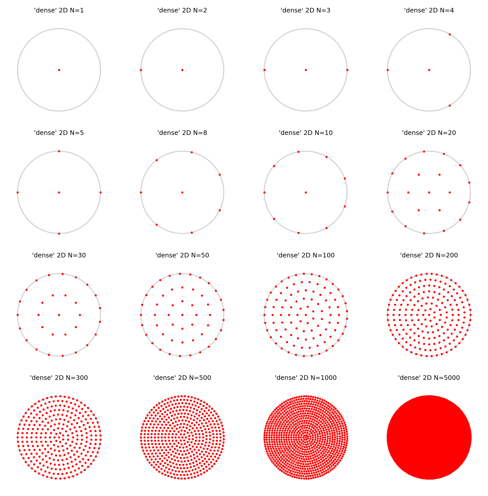
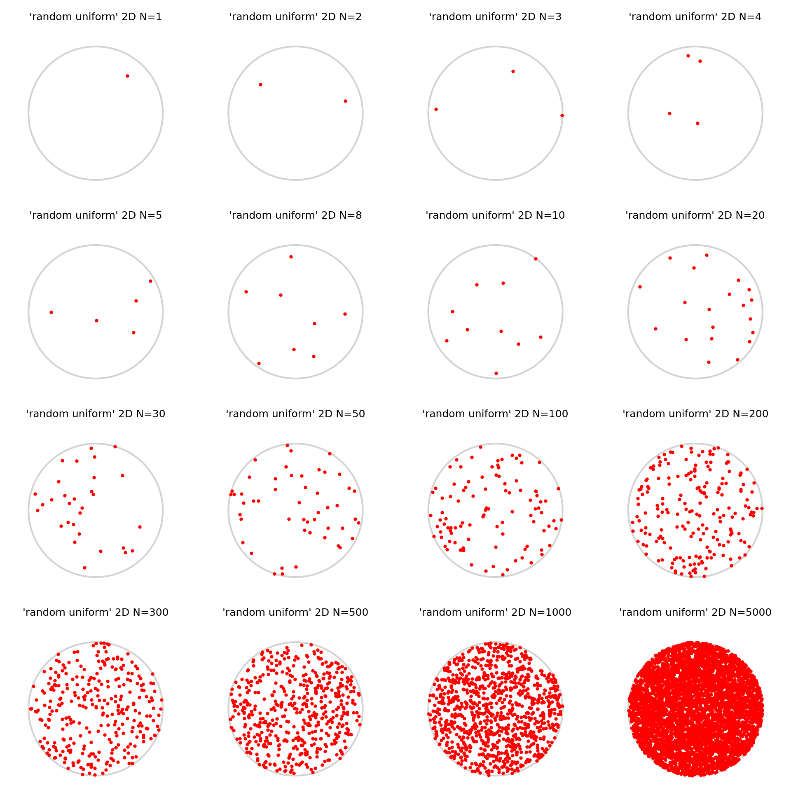
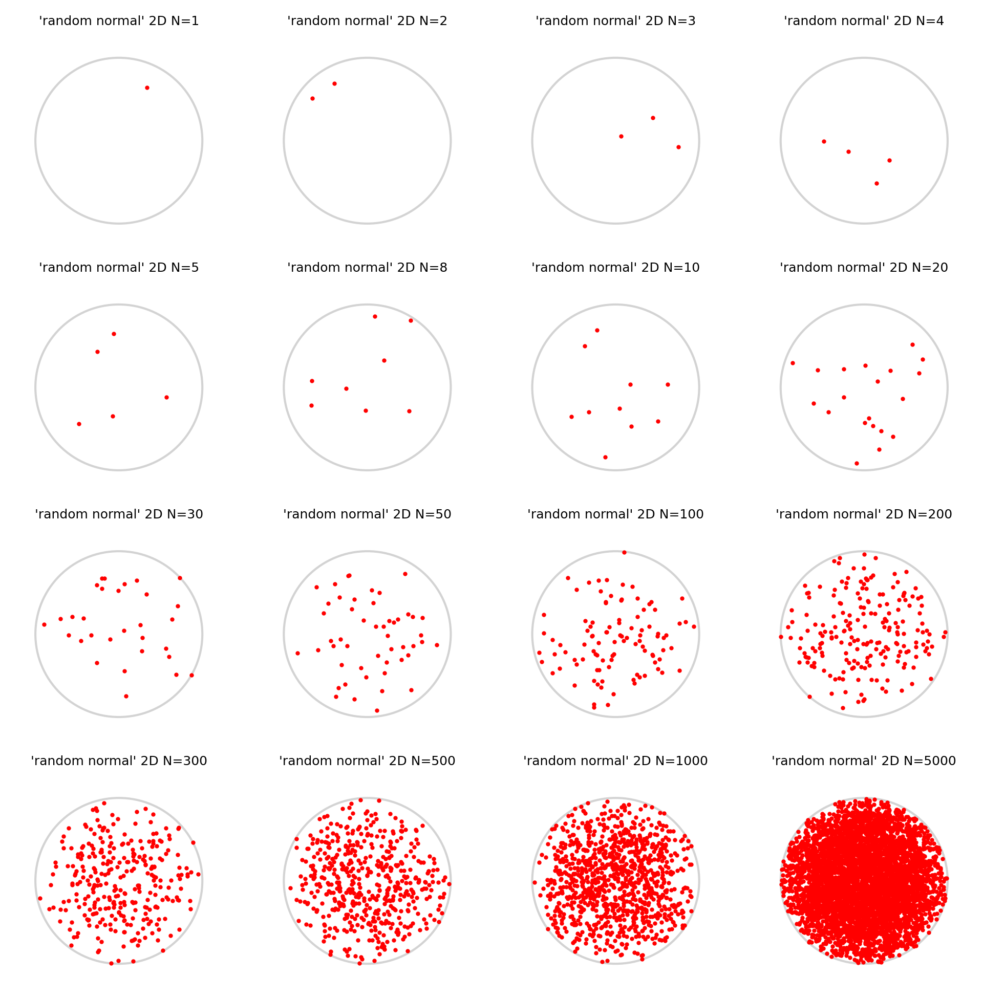

```python
import torch
import matplotlib.pyplot as plt

from torchlensmaker.sampling import (
    sampleND,
)

Ns = [1, 2, 3, 4,
      5, 8, 10, 20,
      30, 50, 100, 200,
      300, 500, 1000, 5000]

samplers = ["uniform", "linear", "random"]

plt.close('all')

def test_sampler2D(sampler, diameter, dtype):
    fig, axes = plt.subplots(4, 4, figsize=(8, 8), dpi=300)

    for N, ax in zip(Ns, axes.flatten()):
        ax.set_axis_off()
        ax.set_title(f"{sampler} 2D N={N}", fontsize=6)
        points = sampleND(sampler, N, diameter, 2, dtype)
        #assert points.shape[0] == N, (sampler, N)
        assert points.shape[1] == 2
        
        ax.add_patch(plt.Circle((0, 0), diameter/2, color='lightgrey', fill=False))
        ax.plot(points[:, 0].numpy(), points[:, 1].numpy(), marker=".", linestyle="none", markersize=2, color="red")
        ax.set_xlim([-0.62*diameter, 0.62*diameter])
        ax.set_ylim([-0.62*diameter, 0.62*diameter])


def test_sampler1D(sampler, diameter, dtype):
    fig, axes = plt.subplots(4, 4, figsize=(8, 8), dpi=300)

    for N, ax in zip(Ns, axes.flatten()):
            ax.set_axis_off()
            ax.set_title(f"{sampler} 1D N={N}", fontsize=6)
            points = sampleND(sampler, N, diameter, 1, dtype)
            assert points.shape[0] == N, (sampler, N)
            assert points.dim() == 1
            
            ax.add_patch(plt.Circle((0, 0), diameter/2, color='lightgrey', fill=False))
            ax.plot(points.numpy(), torch.zeros_like(points).numpy(), marker=".", linestyle="none", markersize=2, color="red")
            ax.set_xlim([-0.62*diameter, 0.62*diameter])
            ax.set_ylim([-0.62*diameter, 0.62*diameter])
    

for sampler in samplers:
    test_sampler2D(sampler, 10.0, torch.float64)
    test_sampler1D(sampler, 10.0, torch.float64)

```


    

    


    

    


    

    


    

    


    

    


    

    

