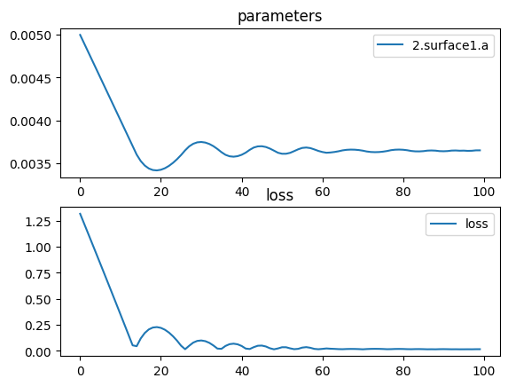

# Triple Lens


```python
import torch
import torch.nn as nn
import torch.optim as optim
import torchlensmaker as tlm

lens_diameter = 15.0

surface = tlm.Parabola(lens_diameter, a=tlm.parameter(0.005))
lens1 = tlm.BiLens(surface, material = 'BK7-nd', outer_thickness=0.5)
lens2 = tlm.BiLens(surface, material = 'BK7-nd', outer_thickness=0.5)
lens3 = tlm.BiLens(surface, material = 'BK7-nd', outer_thickness=0.5)

optics = nn.Sequential(
    tlm.PointSourceAtInfinity(0.9*lens_diameter),
    tlm.Gap(15),
    
    lens1,
    tlm.Gap(5),
    lens2,
    tlm.Gap(5),
    lens3,
    
    tlm.Gap(40),
    tlm.FocalPoint(),
)

tlm.show(optics, dim=2)
tlm.show(optics, dim=3)
```


<div data-jp-suppress-context-menu id='tlmviewer-8b754a6f' class='tlmviewer' style='width: 100%; aspect-ratio: 16 / 9;'></div><script type='module'>async function importtlm() {
    try {
        return await import("/tlmviewer.js");
    } catch (error) {
        console.log("error", error);
        return await import("/files/test_notebooks/tlmviewer.js");
    }
}

const module = await importtlm();
const tlmviewer = module.tlmviewer;

const data = '{"mode": "2D", "camera": "XY", "data": [{"type": "surfaces", "data": [{"matrix": [[1.0, 0.0, 15.0], [0.0, 1.0, 0.0], [0.0, 0.0, 1.0]], "samples": [[0.28125, -7.5], [0.27559689, -7.4242425], [0.27000114, -7.34848499], [0.26446283, -7.27272749], [0.25898185, -7.19696951], [0.25355831, -7.12121201], [0.24819213, -7.0454545], [0.24288337, -6.969697], [0.23763201, -6.8939395], [0.23243803, -6.81818199], [0.2273014, -6.74242401], [0.22222221, -6.66666651], [0.21720041, -6.590909], [0.212236, -6.5151515], [0.20732896, -6.439394], [0.20247933, -6.36363649], [0.1976871, -6.28787899], [0.19295223, -6.21212101], [0.18827479, -6.13636351], [0.18365473, -6.060606], [0.17909206, -5.9848485], [0.17458677, -5.909091], [0.1701389, -5.83333349], [0.16574839, -5.75757551], [0.16141526, -5.68181801], [0.15713957, -5.6060605], [0.15292126, -5.530303], [0.14876032, -5.4545455], [0.14465679, -5.37878799], [0.14061064, -5.30303001], [0.13662188, -5.22727251], [0.13269053, -5.15151501], [0.12881656, -5.0757575], [0.125, -5.0], [0.12124082, -4.9242425], [0.11753903, -4.84848499], [0.11389461, -4.77272701], [0.11030761, -4.69696951], [0.106778, -4.62121201], [0.10330578, -4.5454545], [0.09989095, -4.469697], [0.09653351, -4.3939395], [0.09323346, -4.31818151], [0.0899908, -4.24242401], [0.08680555, -4.16666651], [0.08367768, -4.090909], [0.08060721, -4.0151515], [0.07759412, -3.93939376], [0.07463842, -3.86363626], [0.07174013, -3.78787875], [0.06889922, -3.71212125], [0.06611571, -3.63636374], [0.06338958, -3.56060624], [0.06072084, -3.4848485], [0.05810951, -3.409091], [0.05555556, -3.33333349], [0.053059, -3.25757575], [0.05061983, -3.18181825], [0.04823807, -3.10606074], [0.04591368, -3.030303], [0.04364669, -2.9545455], [0.0414371, -2.87878799], [0.0392849, -2.80303049], [0.03719008, -2.72727275], [0.03515267, -2.65151525], [0.03317264, -2.57575774], [0.03125, -2.5], [0.02938476, -2.4242425], [0.02757691, -2.34848499], [0.02582644, -2.27272725], [0.02413338, -2.19696975], [0.02249771, -2.12121224], [0.02091942, -2.0454545], [0.01939853, -1.969697], [0.01793503, -1.8939395], [0.01652893, -1.81818187], [0.01518021, -1.74242425], [0.01388889, -1.66666675], [0.01265496, -1.59090912], [0.01147842, -1.5151515], [0.01035928, -1.439394], [0.00929752, -1.36363637], [0.00829316, -1.28787887], [0.00734619, -1.21212125], [0.00645661, -1.13636363], [0.00562443, -1.06060612], [0.00484963, -0.9848485], [0.00413223, -0.90909094], [0.00347222, -0.83333337], [0.00286961, -0.75757575], [0.00232438, -0.68181819], [0.00183655, -0.60606062], [0.00140611, -0.53030306], [0.00103306, -0.45454547], [0.0007174, -0.37878788], [0.00045914, -0.30303031], [0.00025826, -0.22727273], [0.00011478, -0.15151516], [2.87e-05, -0.07575758], [0.0, 0.0], [2.87e-05, 0.07575758], [0.00011478, 0.15151516], [0.00025826, 0.22727273], [0.00045914, 0.30303031], [0.0007174, 0.37878788], [0.00103306, 0.45454547], [0.00140611, 0.53030306], [0.00183655, 0.60606062], [0.00232438, 0.68181819], [0.00286961, 0.75757575], [0.00347222, 0.83333337], [0.00413223, 0.90909094], [0.00484963, 0.9848485], [0.00562443, 1.06060612], [0.00645661, 1.13636363], [0.00734619, 1.21212125], [0.00829316, 1.28787887], [0.00929752, 1.36363637], [0.01035928, 1.439394], [0.01147842, 1.5151515], [0.01265496, 1.59090912], [0.01388889, 1.66666675], [0.01518021, 1.74242425], [0.01652893, 1.81818187], [0.01793503, 1.8939395], [0.01939853, 1.969697], [0.02091942, 2.0454545], [0.02249771, 2.12121224], [0.02413338, 2.19696975], [0.02582644, 2.27272725], [0.02757691, 2.34848499], [0.02938476, 2.4242425], [0.03125, 2.5], [0.03317264, 2.57575774], [0.03515267, 2.65151525], [0.03719008, 2.72727275], [0.0392849, 2.80303049], [0.0414371, 2.87878799], [0.04364669, 2.9545455], [0.04591368, 3.030303], [0.04823807, 3.10606074], [0.05061983, 3.18181825], [0.053059, 3.25757575], [0.05555556, 3.33333349], [0.05810951, 3.409091], [0.06072084, 3.4848485], [0.06338958, 3.56060624], [0.06611571, 3.63636374], [0.06889922, 3.71212125], [0.07174013, 3.78787875], [0.07463842, 3.86363626], [0.07759412, 3.93939376], [0.08060721, 4.0151515], [0.08367768, 4.090909], [0.08680555, 4.16666651], [0.0899908, 4.24242401], [0.09323346, 4.31818151], [0.09653351, 4.3939395], [0.09989095, 4.469697], [0.10330578, 4.5454545], [0.106778, 4.62121201], [0.11030761, 4.69696951], [0.11389461, 4.77272701], [0.11753903, 4.84848499], [0.12124082, 4.9242425], [0.125, 5.0], [0.12881656, 5.0757575], [0.13269053, 5.15151501], [0.13662188, 5.22727251], [0.14061064, 5.30303001], [0.14465679, 5.37878799], [0.14876032, 5.4545455], [0.15292126, 5.530303], [0.15713957, 5.6060605], [0.16141526, 5.68181801], [0.16574839, 5.75757551], [0.1701389, 5.83333349], [0.17458677, 5.909091], [0.17909206, 5.9848485], [0.18365473, 6.060606], [0.18827479, 6.13636351], [0.19295223, 6.21212101], [0.1976871, 6.28787899], [0.20247933, 6.36363649], [0.20732896, 6.439394], [0.212236, 6.5151515], [0.21720041, 6.590909], [0.22222221, 6.66666651], [0.2273014, 6.74242401], [0.23243803, 6.81818199], [0.23763201, 6.8939395], [0.24288337, 6.969697], [0.24819213, 7.0454545], [0.25355831, 7.12121201], [0.25898185, 7.19696951], [0.26446283, 7.27272749], [0.27000114, 7.34848499], [0.27559689, 7.4242425], [0.28125, 7.5]]}]}, {"type": "surfaces", "data": [{"matrix": [[-1.0, 0.0, 16.0625], [0.0, -1.0, 0.0], [0.0, 0.0, 1.0]], "samples": [[0.28125, -7.5], [0.27559689, -7.4242425], [0.27000114, -7.34848499], [0.26446283, -7.27272749], [0.25898185, -7.19696951], [0.25355831, -7.12121201], [0.24819213, -7.0454545], [0.24288337, -6.969697], [0.23763201, -6.8939395], [0.23243803, -6.81818199], [0.2273014, -6.74242401], [0.22222221, -6.66666651], [0.21720041, -6.590909], [0.212236, -6.5151515], [0.20732896, -6.439394], [0.20247933, -6.36363649], [0.1976871, -6.28787899], [0.19295223, -6.21212101], [0.18827479, -6.13636351], [0.18365473, -6.060606], [0.17909206, -5.9848485], [0.17458677, -5.909091], [0.1701389, -5.83333349], [0.16574839, -5.75757551], [0.16141526, -5.68181801], [0.15713957, -5.6060605], [0.15292126, -5.530303], [0.14876032, -5.4545455], [0.14465679, -5.37878799], [0.14061064, -5.30303001], [0.13662188, -5.22727251], [0.13269053, -5.15151501], [0.12881656, -5.0757575], [0.125, -5.0], [0.12124082, -4.9242425], [0.11753903, -4.84848499], [0.11389461, -4.77272701], [0.11030761, -4.69696951], [0.106778, -4.62121201], [0.10330578, -4.5454545], [0.09989095, -4.469697], [0.09653351, -4.3939395], [0.09323346, -4.31818151], [0.0899908, -4.24242401], [0.08680555, -4.16666651], [0.08367768, -4.090909], [0.08060721, -4.0151515], [0.07759412, -3.93939376], [0.07463842, -3.86363626], [0.07174013, -3.78787875], [0.06889922, -3.71212125], [0.06611571, -3.63636374], [0.06338958, -3.56060624], [0.06072084, -3.4848485], [0.05810951, -3.409091], [0.05555556, -3.33333349], [0.053059, -3.25757575], [0.05061983, -3.18181825], [0.04823807, -3.10606074], [0.04591368, -3.030303], [0.04364669, -2.9545455], [0.0414371, -2.87878799], [0.0392849, -2.80303049], [0.03719008, -2.72727275], [0.03515267, -2.65151525], [0.03317264, -2.57575774], [0.03125, -2.5], [0.02938476, -2.4242425], [0.02757691, -2.34848499], [0.02582644, -2.27272725], [0.02413338, -2.19696975], [0.02249771, -2.12121224], [0.02091942, -2.0454545], [0.01939853, -1.969697], [0.01793503, -1.8939395], [0.01652893, -1.81818187], [0.01518021, -1.74242425], [0.01388889, -1.66666675], [0.01265496, -1.59090912], [0.01147842, -1.5151515], [0.01035928, -1.439394], [0.00929752, -1.36363637], [0.00829316, -1.28787887], [0.00734619, -1.21212125], [0.00645661, -1.13636363], [0.00562443, -1.06060612], [0.00484963, -0.9848485], [0.00413223, -0.90909094], [0.00347222, -0.83333337], [0.00286961, -0.75757575], [0.00232438, -0.68181819], [0.00183655, -0.60606062], [0.00140611, -0.53030306], [0.00103306, -0.45454547], [0.0007174, -0.37878788], [0.00045914, -0.30303031], [0.00025826, -0.22727273], [0.00011478, -0.15151516], [2.87e-05, -0.07575758], [0.0, 0.0], [2.87e-05, 0.07575758], [0.00011478, 0.15151516], [0.00025826, 0.22727273], [0.00045914, 0.30303031], [0.0007174, 0.37878788], [0.00103306, 0.45454547], [0.00140611, 0.53030306], [0.00183655, 0.60606062], [0.00232438, 0.68181819], [0.00286961, 0.75757575], [0.00347222, 0.83333337], [0.00413223, 0.90909094], [0.00484963, 0.9848485], [0.00562443, 1.06060612], [0.00645661, 1.13636363], [0.00734619, 1.21212125], [0.00829316, 1.28787887], [0.00929752, 1.36363637], [0.01035928, 1.439394], [0.01147842, 1.5151515], [0.01265496, 1.59090912], [0.01388889, 1.66666675], [0.01518021, 1.74242425], [0.01652893, 1.81818187], [0.01793503, 1.8939395], [0.01939853, 1.969697], [0.02091942, 2.0454545], [0.02249771, 2.12121224], [0.02413338, 2.19696975], [0.02582644, 2.27272725], [0.02757691, 2.34848499], [0.02938476, 2.4242425], [0.03125, 2.5], [0.03317264, 2.57575774], [0.03515267, 2.65151525], [0.03719008, 2.72727275], [0.0392849, 2.80303049], [0.0414371, 2.87878799], [0.04364669, 2.9545455], [0.04591368, 3.030303], [0.04823807, 3.10606074], [0.05061983, 3.18181825], [0.053059, 3.25757575], [0.05555556, 3.33333349], [0.05810951, 3.409091], [0.06072084, 3.4848485], [0.06338958, 3.56060624], [0.06611571, 3.63636374], [0.06889922, 3.71212125], [0.07174013, 3.78787875], [0.07463842, 3.86363626], [0.07759412, 3.93939376], [0.08060721, 4.0151515], [0.08367768, 4.090909], [0.08680555, 4.16666651], [0.0899908, 4.24242401], [0.09323346, 4.31818151], [0.09653351, 4.3939395], [0.09989095, 4.469697], [0.10330578, 4.5454545], [0.106778, 4.62121201], [0.11030761, 4.69696951], [0.11389461, 4.77272701], [0.11753903, 4.84848499], [0.12124082, 4.9242425], [0.125, 5.0], [0.12881656, 5.0757575], [0.13269053, 5.15151501], [0.13662188, 5.22727251], [0.14061064, 5.30303001], [0.14465679, 5.37878799], [0.14876032, 5.4545455], [0.15292126, 5.530303], [0.15713957, 5.6060605], [0.16141526, 5.68181801], [0.16574839, 5.75757551], [0.1701389, 5.83333349], [0.17458677, 5.909091], [0.17909206, 5.9848485], [0.18365473, 6.060606], [0.18827479, 6.13636351], [0.19295223, 6.21212101], [0.1976871, 6.28787899], [0.20247933, 6.36363649], [0.20732896, 6.439394], [0.212236, 6.5151515], [0.21720041, 6.590909], [0.22222221, 6.66666651], [0.2273014, 6.74242401], [0.23243803, 6.81818199], [0.23763201, 6.8939395], [0.24288337, 6.969697], [0.24819213, 7.0454545], [0.25355831, 7.12121201], [0.25898185, 7.19696951], [0.26446283, 7.27272749], [0.27000114, 7.34848499], [0.27559689, 7.4242425], [0.28125, 7.5]]}]}, {"type": "surfaces", "data": [{"matrix": [[1.0, 0.0, 21.0625], [0.0, 1.0, 0.0], [0.0, 0.0, 1.0]], "samples": [[0.28125, -7.5], [0.27559689, -7.4242425], [0.27000114, -7.34848499], [0.26446283, -7.27272749], [0.25898185, -7.19696951], [0.25355831, -7.12121201], [0.24819213, -7.0454545], [0.24288337, -6.969697], [0.23763201, -6.8939395], [0.23243803, -6.81818199], [0.2273014, -6.74242401], [0.22222221, -6.66666651], [0.21720041, -6.590909], [0.212236, -6.5151515], [0.20732896, -6.439394], [0.20247933, -6.36363649], [0.1976871, -6.28787899], [0.19295223, -6.21212101], [0.18827479, -6.13636351], [0.18365473, -6.060606], [0.17909206, -5.9848485], [0.17458677, -5.909091], [0.1701389, -5.83333349], [0.16574839, -5.75757551], [0.16141526, -5.68181801], [0.15713957, -5.6060605], [0.15292126, -5.530303], [0.14876032, -5.4545455], [0.14465679, -5.37878799], [0.14061064, -5.30303001], [0.13662188, -5.22727251], [0.13269053, -5.15151501], [0.12881656, -5.0757575], [0.125, -5.0], [0.12124082, -4.9242425], [0.11753903, -4.84848499], [0.11389461, -4.77272701], [0.11030761, -4.69696951], [0.106778, -4.62121201], [0.10330578, -4.5454545], [0.09989095, -4.469697], [0.09653351, -4.3939395], [0.09323346, -4.31818151], [0.0899908, -4.24242401], [0.08680555, -4.16666651], [0.08367768, -4.090909], [0.08060721, -4.0151515], [0.07759412, -3.93939376], [0.07463842, -3.86363626], [0.07174013, -3.78787875], [0.06889922, -3.71212125], [0.06611571, -3.63636374], [0.06338958, -3.56060624], [0.06072084, -3.4848485], [0.05810951, -3.409091], [0.05555556, -3.33333349], [0.053059, -3.25757575], [0.05061983, -3.18181825], [0.04823807, -3.10606074], [0.04591368, -3.030303], [0.04364669, -2.9545455], [0.0414371, -2.87878799], [0.0392849, -2.80303049], [0.03719008, -2.72727275], [0.03515267, -2.65151525], [0.03317264, -2.57575774], [0.03125, -2.5], [0.02938476, -2.4242425], [0.02757691, -2.34848499], [0.02582644, -2.27272725], [0.02413338, -2.19696975], [0.02249771, -2.12121224], [0.02091942, -2.0454545], [0.01939853, -1.969697], [0.01793503, -1.8939395], [0.01652893, -1.81818187], [0.01518021, -1.74242425], [0.01388889, -1.66666675], [0.01265496, -1.59090912], [0.01147842, -1.5151515], [0.01035928, -1.439394], [0.00929752, -1.36363637], [0.00829316, -1.28787887], [0.00734619, -1.21212125], [0.00645661, -1.13636363], [0.00562443, -1.06060612], [0.00484963, -0.9848485], [0.00413223, -0.90909094], [0.00347222, -0.83333337], [0.00286961, -0.75757575], [0.00232438, -0.68181819], [0.00183655, -0.60606062], [0.00140611, -0.53030306], [0.00103306, -0.45454547], [0.0007174, -0.37878788], [0.00045914, -0.30303031], [0.00025826, -0.22727273], [0.00011478, -0.15151516], [2.87e-05, -0.07575758], [0.0, 0.0], [2.87e-05, 0.07575758], [0.00011478, 0.15151516], [0.00025826, 0.22727273], [0.00045914, 0.30303031], [0.0007174, 0.37878788], [0.00103306, 0.45454547], [0.00140611, 0.53030306], [0.00183655, 0.60606062], [0.00232438, 0.68181819], [0.00286961, 0.75757575], [0.00347222, 0.83333337], [0.00413223, 0.90909094], [0.00484963, 0.9848485], [0.00562443, 1.06060612], [0.00645661, 1.13636363], [0.00734619, 1.21212125], [0.00829316, 1.28787887], [0.00929752, 1.36363637], [0.01035928, 1.439394], [0.01147842, 1.5151515], [0.01265496, 1.59090912], [0.01388889, 1.66666675], [0.01518021, 1.74242425], [0.01652893, 1.81818187], [0.01793503, 1.8939395], [0.01939853, 1.969697], [0.02091942, 2.0454545], [0.02249771, 2.12121224], [0.02413338, 2.19696975], [0.02582644, 2.27272725], [0.02757691, 2.34848499], [0.02938476, 2.4242425], [0.03125, 2.5], [0.03317264, 2.57575774], [0.03515267, 2.65151525], [0.03719008, 2.72727275], [0.0392849, 2.80303049], [0.0414371, 2.87878799], [0.04364669, 2.9545455], [0.04591368, 3.030303], [0.04823807, 3.10606074], [0.05061983, 3.18181825], [0.053059, 3.25757575], [0.05555556, 3.33333349], [0.05810951, 3.409091], [0.06072084, 3.4848485], [0.06338958, 3.56060624], [0.06611571, 3.63636374], [0.06889922, 3.71212125], [0.07174013, 3.78787875], [0.07463842, 3.86363626], [0.07759412, 3.93939376], [0.08060721, 4.0151515], [0.08367768, 4.090909], [0.08680555, 4.16666651], [0.0899908, 4.24242401], [0.09323346, 4.31818151], [0.09653351, 4.3939395], [0.09989095, 4.469697], [0.10330578, 4.5454545], [0.106778, 4.62121201], [0.11030761, 4.69696951], [0.11389461, 4.77272701], [0.11753903, 4.84848499], [0.12124082, 4.9242425], [0.125, 5.0], [0.12881656, 5.0757575], [0.13269053, 5.15151501], [0.13662188, 5.22727251], [0.14061064, 5.30303001], [0.14465679, 5.37878799], [0.14876032, 5.4545455], [0.15292126, 5.530303], [0.15713957, 5.6060605], [0.16141526, 5.68181801], [0.16574839, 5.75757551], [0.1701389, 5.83333349], [0.17458677, 5.909091], [0.17909206, 5.9848485], [0.18365473, 6.060606], [0.18827479, 6.13636351], [0.19295223, 6.21212101], [0.1976871, 6.28787899], [0.20247933, 6.36363649], [0.20732896, 6.439394], [0.212236, 6.5151515], [0.21720041, 6.590909], [0.22222221, 6.66666651], [0.2273014, 6.74242401], [0.23243803, 6.81818199], [0.23763201, 6.8939395], [0.24288337, 6.969697], [0.24819213, 7.0454545], [0.25355831, 7.12121201], [0.25898185, 7.19696951], [0.26446283, 7.27272749], [0.27000114, 7.34848499], [0.27559689, 7.4242425], [0.28125, 7.5]]}]}, {"type": "surfaces", "data": [{"matrix": [[-1.0, 0.0, 22.125], [0.0, -1.0, 0.0], [0.0, 0.0, 1.0]], "samples": [[0.28125, -7.5], [0.27559689, -7.4242425], [0.27000114, -7.34848499], [0.26446283, -7.27272749], [0.25898185, -7.19696951], [0.25355831, -7.12121201], [0.24819213, -7.0454545], [0.24288337, -6.969697], [0.23763201, -6.8939395], [0.23243803, -6.81818199], [0.2273014, -6.74242401], [0.22222221, -6.66666651], [0.21720041, -6.590909], [0.212236, -6.5151515], [0.20732896, -6.439394], [0.20247933, -6.36363649], [0.1976871, -6.28787899], [0.19295223, -6.21212101], [0.18827479, -6.13636351], [0.18365473, -6.060606], [0.17909206, -5.9848485], [0.17458677, -5.909091], [0.1701389, -5.83333349], [0.16574839, -5.75757551], [0.16141526, -5.68181801], [0.15713957, -5.6060605], [0.15292126, -5.530303], [0.14876032, -5.4545455], [0.14465679, -5.37878799], [0.14061064, -5.30303001], [0.13662188, -5.22727251], [0.13269053, -5.15151501], [0.12881656, -5.0757575], [0.125, -5.0], [0.12124082, -4.9242425], [0.11753903, -4.84848499], [0.11389461, -4.77272701], [0.11030761, -4.69696951], [0.106778, -4.62121201], [0.10330578, -4.5454545], [0.09989095, -4.469697], [0.09653351, -4.3939395], [0.09323346, -4.31818151], [0.0899908, -4.24242401], [0.08680555, -4.16666651], [0.08367768, -4.090909], [0.08060721, -4.0151515], [0.07759412, -3.93939376], [0.07463842, -3.86363626], [0.07174013, -3.78787875], [0.06889922, -3.71212125], [0.06611571, -3.63636374], [0.06338958, -3.56060624], [0.06072084, -3.4848485], [0.05810951, -3.409091], [0.05555556, -3.33333349], [0.053059, -3.25757575], [0.05061983, -3.18181825], [0.04823807, -3.10606074], [0.04591368, -3.030303], [0.04364669, -2.9545455], [0.0414371, -2.87878799], [0.0392849, -2.80303049], [0.03719008, -2.72727275], [0.03515267, -2.65151525], [0.03317264, -2.57575774], [0.03125, -2.5], [0.02938476, -2.4242425], [0.02757691, -2.34848499], [0.02582644, -2.27272725], [0.02413338, -2.19696975], [0.02249771, -2.12121224], [0.02091942, -2.0454545], [0.01939853, -1.969697], [0.01793503, -1.8939395], [0.01652893, -1.81818187], [0.01518021, -1.74242425], [0.01388889, -1.66666675], [0.01265496, -1.59090912], [0.01147842, -1.5151515], [0.01035928, -1.439394], [0.00929752, -1.36363637], [0.00829316, -1.28787887], [0.00734619, -1.21212125], [0.00645661, -1.13636363], [0.00562443, -1.06060612], [0.00484963, -0.9848485], [0.00413223, -0.90909094], [0.00347222, -0.83333337], [0.00286961, -0.75757575], [0.00232438, -0.68181819], [0.00183655, -0.60606062], [0.00140611, -0.53030306], [0.00103306, -0.45454547], [0.0007174, -0.37878788], [0.00045914, -0.30303031], [0.00025826, -0.22727273], [0.00011478, -0.15151516], [2.87e-05, -0.07575758], [0.0, 0.0], [2.87e-05, 0.07575758], [0.00011478, 0.15151516], [0.00025826, 0.22727273], [0.00045914, 0.30303031], [0.0007174, 0.37878788], [0.00103306, 0.45454547], [0.00140611, 0.53030306], [0.00183655, 0.60606062], [0.00232438, 0.68181819], [0.00286961, 0.75757575], [0.00347222, 0.83333337], [0.00413223, 0.90909094], [0.00484963, 0.9848485], [0.00562443, 1.06060612], [0.00645661, 1.13636363], [0.00734619, 1.21212125], [0.00829316, 1.28787887], [0.00929752, 1.36363637], [0.01035928, 1.439394], [0.01147842, 1.5151515], [0.01265496, 1.59090912], [0.01388889, 1.66666675], [0.01518021, 1.74242425], [0.01652893, 1.81818187], [0.01793503, 1.8939395], [0.01939853, 1.969697], [0.02091942, 2.0454545], [0.02249771, 2.12121224], [0.02413338, 2.19696975], [0.02582644, 2.27272725], [0.02757691, 2.34848499], [0.02938476, 2.4242425], [0.03125, 2.5], [0.03317264, 2.57575774], [0.03515267, 2.65151525], [0.03719008, 2.72727275], [0.0392849, 2.80303049], [0.0414371, 2.87878799], [0.04364669, 2.9545455], [0.04591368, 3.030303], [0.04823807, 3.10606074], [0.05061983, 3.18181825], [0.053059, 3.25757575], [0.05555556, 3.33333349], [0.05810951, 3.409091], [0.06072084, 3.4848485], [0.06338958, 3.56060624], [0.06611571, 3.63636374], [0.06889922, 3.71212125], [0.07174013, 3.78787875], [0.07463842, 3.86363626], [0.07759412, 3.93939376], [0.08060721, 4.0151515], [0.08367768, 4.090909], [0.08680555, 4.16666651], [0.0899908, 4.24242401], [0.09323346, 4.31818151], [0.09653351, 4.3939395], [0.09989095, 4.469697], [0.10330578, 4.5454545], [0.106778, 4.62121201], [0.11030761, 4.69696951], [0.11389461, 4.77272701], [0.11753903, 4.84848499], [0.12124082, 4.9242425], [0.125, 5.0], [0.12881656, 5.0757575], [0.13269053, 5.15151501], [0.13662188, 5.22727251], [0.14061064, 5.30303001], [0.14465679, 5.37878799], [0.14876032, 5.4545455], [0.15292126, 5.530303], [0.15713957, 5.6060605], [0.16141526, 5.68181801], [0.16574839, 5.75757551], [0.1701389, 5.83333349], [0.17458677, 5.909091], [0.17909206, 5.9848485], [0.18365473, 6.060606], [0.18827479, 6.13636351], [0.19295223, 6.21212101], [0.1976871, 6.28787899], [0.20247933, 6.36363649], [0.20732896, 6.439394], [0.212236, 6.5151515], [0.21720041, 6.590909], [0.22222221, 6.66666651], [0.2273014, 6.74242401], [0.23243803, 6.81818199], [0.23763201, 6.8939395], [0.24288337, 6.969697], [0.24819213, 7.0454545], [0.25355831, 7.12121201], [0.25898185, 7.19696951], [0.26446283, 7.27272749], [0.27000114, 7.34848499], [0.27559689, 7.4242425], [0.28125, 7.5]]}]}, {"type": "surfaces", "data": [{"matrix": [[1.0, 0.0, 27.125], [0.0, 1.0, 0.0], [0.0, 0.0, 1.0]], "samples": [[0.28125, -7.5], [0.27559689, -7.4242425], [0.27000114, -7.34848499], [0.26446283, -7.27272749], [0.25898185, -7.19696951], [0.25355831, -7.12121201], [0.24819213, -7.0454545], [0.24288337, -6.969697], [0.23763201, -6.8939395], [0.23243803, -6.81818199], [0.2273014, -6.74242401], [0.22222221, -6.66666651], [0.21720041, -6.590909], [0.212236, -6.5151515], [0.20732896, -6.439394], [0.20247933, -6.36363649], [0.1976871, -6.28787899], [0.19295223, -6.21212101], [0.18827479, -6.13636351], [0.18365473, -6.060606], [0.17909206, -5.9848485], [0.17458677, -5.909091], [0.1701389, -5.83333349], [0.16574839, -5.75757551], [0.16141526, -5.68181801], [0.15713957, -5.6060605], [0.15292126, -5.530303], [0.14876032, -5.4545455], [0.14465679, -5.37878799], [0.14061064, -5.30303001], [0.13662188, -5.22727251], [0.13269053, -5.15151501], [0.12881656, -5.0757575], [0.125, -5.0], [0.12124082, -4.9242425], [0.11753903, -4.84848499], [0.11389461, -4.77272701], [0.11030761, -4.69696951], [0.106778, -4.62121201], [0.10330578, -4.5454545], [0.09989095, -4.469697], [0.09653351, -4.3939395], [0.09323346, -4.31818151], [0.0899908, -4.24242401], [0.08680555, -4.16666651], [0.08367768, -4.090909], [0.08060721, -4.0151515], [0.07759412, -3.93939376], [0.07463842, -3.86363626], [0.07174013, -3.78787875], [0.06889922, -3.71212125], [0.06611571, -3.63636374], [0.06338958, -3.56060624], [0.06072084, -3.4848485], [0.05810951, -3.409091], [0.05555556, -3.33333349], [0.053059, -3.25757575], [0.05061983, -3.18181825], [0.04823807, -3.10606074], [0.04591368, -3.030303], [0.04364669, -2.9545455], [0.0414371, -2.87878799], [0.0392849, -2.80303049], [0.03719008, -2.72727275], [0.03515267, -2.65151525], [0.03317264, -2.57575774], [0.03125, -2.5], [0.02938476, -2.4242425], [0.02757691, -2.34848499], [0.02582644, -2.27272725], [0.02413338, -2.19696975], [0.02249771, -2.12121224], [0.02091942, -2.0454545], [0.01939853, -1.969697], [0.01793503, -1.8939395], [0.01652893, -1.81818187], [0.01518021, -1.74242425], [0.01388889, -1.66666675], [0.01265496, -1.59090912], [0.01147842, -1.5151515], [0.01035928, -1.439394], [0.00929752, -1.36363637], [0.00829316, -1.28787887], [0.00734619, -1.21212125], [0.00645661, -1.13636363], [0.00562443, -1.06060612], [0.00484963, -0.9848485], [0.00413223, -0.90909094], [0.00347222, -0.83333337], [0.00286961, -0.75757575], [0.00232438, -0.68181819], [0.00183655, -0.60606062], [0.00140611, -0.53030306], [0.00103306, -0.45454547], [0.0007174, -0.37878788], [0.00045914, -0.30303031], [0.00025826, -0.22727273], [0.00011478, -0.15151516], [2.87e-05, -0.07575758], [0.0, 0.0], [2.87e-05, 0.07575758], [0.00011478, 0.15151516], [0.00025826, 0.22727273], [0.00045914, 0.30303031], [0.0007174, 0.37878788], [0.00103306, 0.45454547], [0.00140611, 0.53030306], [0.00183655, 0.60606062], [0.00232438, 0.68181819], [0.00286961, 0.75757575], [0.00347222, 0.83333337], [0.00413223, 0.90909094], [0.00484963, 0.9848485], [0.00562443, 1.06060612], [0.00645661, 1.13636363], [0.00734619, 1.21212125], [0.00829316, 1.28787887], [0.00929752, 1.36363637], [0.01035928, 1.439394], [0.01147842, 1.5151515], [0.01265496, 1.59090912], [0.01388889, 1.66666675], [0.01518021, 1.74242425], [0.01652893, 1.81818187], [0.01793503, 1.8939395], [0.01939853, 1.969697], [0.02091942, 2.0454545], [0.02249771, 2.12121224], [0.02413338, 2.19696975], [0.02582644, 2.27272725], [0.02757691, 2.34848499], [0.02938476, 2.4242425], [0.03125, 2.5], [0.03317264, 2.57575774], [0.03515267, 2.65151525], [0.03719008, 2.72727275], [0.0392849, 2.80303049], [0.0414371, 2.87878799], [0.04364669, 2.9545455], [0.04591368, 3.030303], [0.04823807, 3.10606074], [0.05061983, 3.18181825], [0.053059, 3.25757575], [0.05555556, 3.33333349], [0.05810951, 3.409091], [0.06072084, 3.4848485], [0.06338958, 3.56060624], [0.06611571, 3.63636374], [0.06889922, 3.71212125], [0.07174013, 3.78787875], [0.07463842, 3.86363626], [0.07759412, 3.93939376], [0.08060721, 4.0151515], [0.08367768, 4.090909], [0.08680555, 4.16666651], [0.0899908, 4.24242401], [0.09323346, 4.31818151], [0.09653351, 4.3939395], [0.09989095, 4.469697], [0.10330578, 4.5454545], [0.106778, 4.62121201], [0.11030761, 4.69696951], [0.11389461, 4.77272701], [0.11753903, 4.84848499], [0.12124082, 4.9242425], [0.125, 5.0], [0.12881656, 5.0757575], [0.13269053, 5.15151501], [0.13662188, 5.22727251], [0.14061064, 5.30303001], [0.14465679, 5.37878799], [0.14876032, 5.4545455], [0.15292126, 5.530303], [0.15713957, 5.6060605], [0.16141526, 5.68181801], [0.16574839, 5.75757551], [0.1701389, 5.83333349], [0.17458677, 5.909091], [0.17909206, 5.9848485], [0.18365473, 6.060606], [0.18827479, 6.13636351], [0.19295223, 6.21212101], [0.1976871, 6.28787899], [0.20247933, 6.36363649], [0.20732896, 6.439394], [0.212236, 6.5151515], [0.21720041, 6.590909], [0.22222221, 6.66666651], [0.2273014, 6.74242401], [0.23243803, 6.81818199], [0.23763201, 6.8939395], [0.24288337, 6.969697], [0.24819213, 7.0454545], [0.25355831, 7.12121201], [0.25898185, 7.19696951], [0.26446283, 7.27272749], [0.27000114, 7.34848499], [0.27559689, 7.4242425], [0.28125, 7.5]]}]}, {"type": "surfaces", "data": [{"matrix": [[-1.0, 0.0, 28.1875], [0.0, -1.0, 0.0], [0.0, 0.0, 1.0]], "samples": [[0.28125, -7.5], [0.27559689, -7.4242425], [0.27000114, -7.34848499], [0.26446283, -7.27272749], [0.25898185, -7.19696951], [0.25355831, -7.12121201], [0.24819213, -7.0454545], [0.24288337, -6.969697], [0.23763201, -6.8939395], [0.23243803, -6.81818199], [0.2273014, -6.74242401], [0.22222221, -6.66666651], [0.21720041, -6.590909], [0.212236, -6.5151515], [0.20732896, -6.439394], [0.20247933, -6.36363649], [0.1976871, -6.28787899], [0.19295223, -6.21212101], [0.18827479, -6.13636351], [0.18365473, -6.060606], [0.17909206, -5.9848485], [0.17458677, -5.909091], [0.1701389, -5.83333349], [0.16574839, -5.75757551], [0.16141526, -5.68181801], [0.15713957, -5.6060605], [0.15292126, -5.530303], [0.14876032, -5.4545455], [0.14465679, -5.37878799], [0.14061064, -5.30303001], [0.13662188, -5.22727251], [0.13269053, -5.15151501], [0.12881656, -5.0757575], [0.125, -5.0], [0.12124082, -4.9242425], [0.11753903, -4.84848499], [0.11389461, -4.77272701], [0.11030761, -4.69696951], [0.106778, -4.62121201], [0.10330578, -4.5454545], [0.09989095, -4.469697], [0.09653351, -4.3939395], [0.09323346, -4.31818151], [0.0899908, -4.24242401], [0.08680555, -4.16666651], [0.08367768, -4.090909], [0.08060721, -4.0151515], [0.07759412, -3.93939376], [0.07463842, -3.86363626], [0.07174013, -3.78787875], [0.06889922, -3.71212125], [0.06611571, -3.63636374], [0.06338958, -3.56060624], [0.06072084, -3.4848485], [0.05810951, -3.409091], [0.05555556, -3.33333349], [0.053059, -3.25757575], [0.05061983, -3.18181825], [0.04823807, -3.10606074], [0.04591368, -3.030303], [0.04364669, -2.9545455], [0.0414371, -2.87878799], [0.0392849, -2.80303049], [0.03719008, -2.72727275], [0.03515267, -2.65151525], [0.03317264, -2.57575774], [0.03125, -2.5], [0.02938476, -2.4242425], [0.02757691, -2.34848499], [0.02582644, -2.27272725], [0.02413338, -2.19696975], [0.02249771, -2.12121224], [0.02091942, -2.0454545], [0.01939853, -1.969697], [0.01793503, -1.8939395], [0.01652893, -1.81818187], [0.01518021, -1.74242425], [0.01388889, -1.66666675], [0.01265496, -1.59090912], [0.01147842, -1.5151515], [0.01035928, -1.439394], [0.00929752, -1.36363637], [0.00829316, -1.28787887], [0.00734619, -1.21212125], [0.00645661, -1.13636363], [0.00562443, -1.06060612], [0.00484963, -0.9848485], [0.00413223, -0.90909094], [0.00347222, -0.83333337], [0.00286961, -0.75757575], [0.00232438, -0.68181819], [0.00183655, -0.60606062], [0.00140611, -0.53030306], [0.00103306, -0.45454547], [0.0007174, -0.37878788], [0.00045914, -0.30303031], [0.00025826, -0.22727273], [0.00011478, -0.15151516], [2.87e-05, -0.07575758], [0.0, 0.0], [2.87e-05, 0.07575758], [0.00011478, 0.15151516], [0.00025826, 0.22727273], [0.00045914, 0.30303031], [0.0007174, 0.37878788], [0.00103306, 0.45454547], [0.00140611, 0.53030306], [0.00183655, 0.60606062], [0.00232438, 0.68181819], [0.00286961, 0.75757575], [0.00347222, 0.83333337], [0.00413223, 0.90909094], [0.00484963, 0.9848485], [0.00562443, 1.06060612], [0.00645661, 1.13636363], [0.00734619, 1.21212125], [0.00829316, 1.28787887], [0.00929752, 1.36363637], [0.01035928, 1.439394], [0.01147842, 1.5151515], [0.01265496, 1.59090912], [0.01388889, 1.66666675], [0.01518021, 1.74242425], [0.01652893, 1.81818187], [0.01793503, 1.8939395], [0.01939853, 1.969697], [0.02091942, 2.0454545], [0.02249771, 2.12121224], [0.02413338, 2.19696975], [0.02582644, 2.27272725], [0.02757691, 2.34848499], [0.02938476, 2.4242425], [0.03125, 2.5], [0.03317264, 2.57575774], [0.03515267, 2.65151525], [0.03719008, 2.72727275], [0.0392849, 2.80303049], [0.0414371, 2.87878799], [0.04364669, 2.9545455], [0.04591368, 3.030303], [0.04823807, 3.10606074], [0.05061983, 3.18181825], [0.053059, 3.25757575], [0.05555556, 3.33333349], [0.05810951, 3.409091], [0.06072084, 3.4848485], [0.06338958, 3.56060624], [0.06611571, 3.63636374], [0.06889922, 3.71212125], [0.07174013, 3.78787875], [0.07463842, 3.86363626], [0.07759412, 3.93939376], [0.08060721, 4.0151515], [0.08367768, 4.090909], [0.08680555, 4.16666651], [0.0899908, 4.24242401], [0.09323346, 4.31818151], [0.09653351, 4.3939395], [0.09989095, 4.469697], [0.10330578, 4.5454545], [0.106778, 4.62121201], [0.11030761, 4.69696951], [0.11389461, 4.77272701], [0.11753903, 4.84848499], [0.12124082, 4.9242425], [0.125, 5.0], [0.12881656, 5.0757575], [0.13269053, 5.15151501], [0.13662188, 5.22727251], [0.14061064, 5.30303001], [0.14465679, 5.37878799], [0.14876032, 5.4545455], [0.15292126, 5.530303], [0.15713957, 5.6060605], [0.16141526, 5.68181801], [0.16574839, 5.75757551], [0.1701389, 5.83333349], [0.17458677, 5.909091], [0.17909206, 5.9848485], [0.18365473, 6.060606], [0.18827479, 6.13636351], [0.19295223, 6.21212101], [0.1976871, 6.28787899], [0.20247933, 6.36363649], [0.20732896, 6.439394], [0.212236, 6.5151515], [0.21720041, 6.590909], [0.22222221, 6.66666651], [0.2273014, 6.74242401], [0.23243803, 6.81818199], [0.23763201, 6.8939395], [0.24288337, 6.969697], [0.24819213, 7.0454545], [0.25355831, 7.12121201], [0.25898185, 7.19696951], [0.26446283, 7.27272749], [0.27000114, 7.34848499], [0.27559689, 7.4242425], [0.28125, 7.5]]}]}, {"type": "points", "data": [[68.1875, 0.0]], "color": "red"}, {"type": "rays", "points": [[0.0, -6.75, 15.2278125, -6.75], [0.0, -5.25, 15.1378125, -5.25], [0.0, -3.75, 15.0703125, -3.75], [0.0, -2.25, 15.0253125, -2.25], [0.0, -0.75, 15.0028125, -0.75], [0.0, 0.75, 15.0028125, 0.75], [0.0, 2.25, 15.0253125, 2.25], [0.0, 3.75, 15.0703125, 3.75], [0.0, 5.25, 15.1378125, 5.25], [0.0, 6.75, 15.2278125, 6.75]], "color": "#ffa724", "variables": {"base": [-6.75, -5.25, -3.75, -2.25, -0.75, 0.75, 2.25, 3.75, 5.25, 6.75]}, "domain": {"base": [-6.75, 6.75]}, "layers": [1]}, {"type": "rays", "points": [[15.2278125, -6.75, 15.83563464, -6.73595375], [15.1378125, -5.25, 15.92542986, -5.23584067], [15.0703125, -3.75, 15.992631, -3.7381547], [15.0253125, -2.25, 16.03736268, -2.24220058], [15.0028125, -0.75, 16.05970783, -0.74728485], [15.0028125, 0.75, 16.05970783, 0.74728485], [15.0253125, 2.25, 16.03736268, 2.24220058], [15.0703125, 3.75, 15.992631, 3.7381547], [15.1378125, 5.25, 15.92542986, 5.23584067], [15.2278125, 6.75, 15.83563464, 6.73595375]], "color": "#ffa724", "variables": {"base": [-6.75, -5.25, -3.75, -2.25, -0.75, 0.75, 2.25, 3.75, 5.25, 6.75]}, "domain": {"base": [-6.75, 6.75]}, "layers": [1]}, {"type": "rays", "points": [[15.83563464, -6.73595375, 21.26430143, -6.35297463], [15.92542986, -5.23584067, 21.184904, -4.9478075], [15.992631, -3.7381547, 21.1250757, -3.53767446], [16.03736268, -2.24220058, 21.08505713, -2.12401174], [16.05970783, -0.74728485, 21.06500801, -0.70823808], [16.05970783, 0.74728485, 21.06500801, 0.70823808], [16.03736268, 2.24220058, 21.08505713, 2.12401174], [15.992631, 3.7381547, 21.1250757, 3.53767446], [15.92542986, 5.23584067, 21.184904, 4.9478075], [15.83563464, 6.73595375, 21.26430143, 6.35297463]], "color": "#ffa724", "variables": {"base": [-6.75, -5.25, -3.75, -2.25, -0.75, 0.75, 2.25, 3.75, 5.25, 6.75]}, "domain": {"base": [-6.75, 6.75]}, "layers": [1]}, {"type": "rays", "points": [[21.26430143, -6.35297463, 21.92605319, -6.30788091], [21.184904, -4.9478075, 22.00473457, -4.90439462], [21.1250757, -3.53767446, 22.06367311, -3.50219629], [21.08505713, -2.12401174, 22.10293032, -2.10093693], [21.06500801, -0.70823808, 22.12254826, -0.70024847], [21.06500801, 0.70823808, 22.12254826, 0.70024847], [21.08505713, 2.12401174, 22.10293032, 2.10093693], [21.1250757, 3.53767446, 22.06367311, 3.50219629], [21.184904, 4.9478075, 22.00473457, 4.90439462], [21.26430143, 6.35297463, 21.92605319, 6.30788091]], "color": "#ffa724", "variables": {"base": [-6.75, -5.25, -3.75, -2.25, -0.75, 0.75, 2.25, 3.75, 5.25, 6.75]}, "domain": {"base": [-6.75, 6.75]}, "layers": [1]}, {"type": "rays", "points": [[21.92605319, -6.30788091, 27.28009053, -5.56939005], [22.00473457, -4.90439462, 27.21951179, -4.34768429], [22.06367311, -3.50219629, 27.17348381, -3.11396249], [22.10293032, -2.10093693, 27.14251722, -1.87174911], [22.12254826, -0.70024847, 27.12694985, -0.62447654], [22.12254826, 0.70024847, 27.12694985, 0.62447654], [22.10293032, 2.10093693, 27.14251722, 1.87174911], [22.06367311, 3.50219629, 27.17348381, 3.11396249], [22.00473457, 4.90439462, 27.21951179, 4.34768429], [21.92605319, 6.30788091, 27.28009053, 5.56939005]], "color": "#ffa724", "variables": {"base": [-6.75, -5.25, -3.75, -2.25, -0.75, 0.75, 2.25, 3.75, 5.25, 6.75]}, "domain": {"base": [-6.75, 6.75]}, "layers": [1]}, {"type": "rays", "points": [[27.28009053, -5.56939005, 28.03699424, -5.48645162], [27.21951179, -4.34768429, 28.09620009, -4.27317011], [27.17348381, -3.11396249, 28.1408241, -3.05535267], [27.14251722, -1.87174911, 28.17067448, -1.83442215], [27.12694985, -0.62447654, 28.18562928, -0.61167336], [27.12694985, 0.62447654, 28.18562928, 0.61167336], [27.14251722, 1.87174911, 28.17067448, 1.83442215], [27.17348381, 3.11396249, 28.1408241, 3.05535267], [27.21951179, 4.34768429, 28.09620009, 4.27317011], [27.28009053, 5.56939005, 28.03699424, 5.48645162]], "color": "#ffa724", "variables": {"base": [-6.75, -5.25, -3.75, -2.25, -0.75, 0.75, 2.25, 3.75, 5.25, 6.75]}, "domain": {"base": [-6.75, 6.75]}, "layers": [1]}, {"type": "rays", "points": [[28.03699424, -5.48645162, 67.78422257, 2.40798342], [28.09620009, -4.27317011, 67.95022994, 1.82835559], [28.1408241, -3.05535267, 68.06897675, 1.28216467], [28.17067448, -1.83442215, 68.14543517, 0.75979002], [28.18562928, -0.61167336, 68.18285952, 0.25167976], [28.18562928, 0.61167336, 68.18285952, -0.25167976], [28.17067448, 1.83442215, 68.14543517, -0.75979002], [28.1408241, 3.05535267, 68.06897675, -1.28216467], [28.09620009, 4.27317011, 67.95022994, -1.82835559], [28.03699424, 5.48645162, 67.78422257, -2.40798342]], "color": "#ffa724", "variables": {"base": [-6.75, -5.25, -3.75, -2.25, -0.75, 0.75, 2.25, 3.75, 5.25, 6.75]}, "domain": {"base": [-6.75, 6.75]}}, {"type": "points", "data": [[0.0, 0.0], [15.0, 0.0], [15.28125, 0.0], [15.78125, 0.0], [16.0625, 0.0], [21.0625, 0.0], [21.34375, 0.0], [21.84375, 0.0], [22.125, 0.0], [27.125, 0.0], [27.40625, 0.0], [27.90625, 0.0], [28.1875, 0.0], [68.1875, 0.0]], "layers": [4]}]}';

setTimeout(() => {
    tlmviewer.embed(document.getElementById("tlmviewer-8b754a6f"), data);    
}, 0);
</script>


<div data-jp-suppress-context-menu id='tlmviewer-3caa0edf' class='tlmviewer' style='width: 100%; aspect-ratio: 16 / 9;'></div><script type='module'>async function importtlm() {
    try {
        return await import("/tlmviewer.js");
    } catch (error) {
        console.log("error", error);
        return await import("/files/test_notebooks/tlmviewer.js");
    }
}

const module = await importtlm();
const tlmviewer = module.tlmviewer;

const data = '{"mode": "3D", "camera": "orthographic", "data": [{"type": "surfaces", "data": [{"matrix": [[1.0, 0.0, 0.0, 15.0], [0.0, 1.0, 0.0, 0.0], [0.0, 0.0, 1.0, 0.0], [0.0, 0.0, 0.0, 1.0]], "samples": [[0.0, 0.0], [2.87e-05, 0.07575758], [0.00011478, 0.15151516], [0.00025826, 0.22727273], [0.00045914, 0.30303031], [0.0007174, 0.37878788], [0.00103306, 0.45454547], [0.00140611, 0.53030306], [0.00183655, 0.60606062], [0.00232438, 0.68181819], [0.00286961, 0.75757575], [0.00347222, 0.83333337], [0.00413223, 0.90909094], [0.00484963, 0.9848485], [0.00562443, 1.06060612], [0.00645661, 1.13636363], [0.00734619, 1.21212125], [0.00829316, 1.28787887], [0.00929752, 1.36363637], [0.01035928, 1.439394], [0.01147842, 1.5151515], [0.01265496, 1.59090912], [0.01388889, 1.66666675], [0.01518021, 1.74242425], [0.01652893, 1.81818187], [0.01793503, 1.8939395], [0.01939853, 1.969697], [0.02091942, 2.0454545], [0.02249771, 2.12121224], [0.02413338, 2.19696975], [0.02582644, 2.27272725], [0.02757691, 2.34848499], [0.02938476, 2.4242425], [0.03125, 2.5], [0.03317264, 2.57575774], [0.03515267, 2.65151525], [0.03719008, 2.72727275], [0.0392849, 2.80303049], [0.0414371, 2.87878799], [0.04364669, 2.9545455], [0.04591368, 3.030303], [0.04823807, 3.10606074], [0.05061983, 3.18181825], [0.053059, 3.25757575], [0.05555556, 3.33333349], [0.05810951, 3.409091], [0.06072084, 3.4848485], [0.06338958, 3.56060624], [0.06611571, 3.63636374], [0.06889922, 3.71212125], [0.07174013, 3.78787875], [0.07463842, 3.86363626], [0.07759412, 3.93939376], [0.08060721, 4.0151515], [0.08367768, 4.090909], [0.08680555, 4.16666651], [0.0899908, 4.24242401], [0.09323346, 4.31818151], [0.09653351, 4.3939395], [0.09989095, 4.469697], [0.10330578, 4.5454545], [0.106778, 4.62121201], [0.11030761, 4.69696951], [0.11389461, 4.77272701], [0.11753903, 4.84848499], [0.12124082, 4.9242425], [0.125, 5.0], [0.12881656, 5.0757575], [0.13269053, 5.15151501], [0.13662188, 5.22727251], [0.14061064, 5.30303001], [0.14465679, 5.37878799], [0.14876032, 5.4545455], [0.15292126, 5.530303], [0.15713957, 5.6060605], [0.16141526, 5.68181801], [0.16574839, 5.75757551], [0.1701389, 5.83333349], [0.17458677, 5.909091], [0.17909206, 5.9848485], [0.18365473, 6.060606], [0.18827479, 6.13636351], [0.19295223, 6.21212101], [0.1976871, 6.28787899], [0.20247933, 6.36363649], [0.20732896, 6.439394], [0.212236, 6.5151515], [0.21720041, 6.590909], [0.22222221, 6.66666651], [0.2273014, 6.74242401], [0.23243803, 6.81818199], [0.23763201, 6.8939395], [0.24288337, 6.969697], [0.24819213, 7.0454545], [0.25355831, 7.12121201], [0.25898185, 7.19696951], [0.26446283, 7.27272749], [0.27000114, 7.34848499], [0.27559689, 7.4242425], [0.28125, 7.5]]}]}, {"type": "surfaces", "data": [{"matrix": [[-1.0, 0.0, 0.0, 16.0625], [0.0, -1.0, 0.0, 0.0], [0.0, 0.0, -1.0, 0.0], [0.0, 0.0, 0.0, 1.0]], "samples": [[0.0, 0.0], [2.87e-05, 0.07575758], [0.00011478, 0.15151516], [0.00025826, 0.22727273], [0.00045914, 0.30303031], [0.0007174, 0.37878788], [0.00103306, 0.45454547], [0.00140611, 0.53030306], [0.00183655, 0.60606062], [0.00232438, 0.68181819], [0.00286961, 0.75757575], [0.00347222, 0.83333337], [0.00413223, 0.90909094], [0.00484963, 0.9848485], [0.00562443, 1.06060612], [0.00645661, 1.13636363], [0.00734619, 1.21212125], [0.00829316, 1.28787887], [0.00929752, 1.36363637], [0.01035928, 1.439394], [0.01147842, 1.5151515], [0.01265496, 1.59090912], [0.01388889, 1.66666675], [0.01518021, 1.74242425], [0.01652893, 1.81818187], [0.01793503, 1.8939395], [0.01939853, 1.969697], [0.02091942, 2.0454545], [0.02249771, 2.12121224], [0.02413338, 2.19696975], [0.02582644, 2.27272725], [0.02757691, 2.34848499], [0.02938476, 2.4242425], [0.03125, 2.5], [0.03317264, 2.57575774], [0.03515267, 2.65151525], [0.03719008, 2.72727275], [0.0392849, 2.80303049], [0.0414371, 2.87878799], [0.04364669, 2.9545455], [0.04591368, 3.030303], [0.04823807, 3.10606074], [0.05061983, 3.18181825], [0.053059, 3.25757575], [0.05555556, 3.33333349], [0.05810951, 3.409091], [0.06072084, 3.4848485], [0.06338958, 3.56060624], [0.06611571, 3.63636374], [0.06889922, 3.71212125], [0.07174013, 3.78787875], [0.07463842, 3.86363626], [0.07759412, 3.93939376], [0.08060721, 4.0151515], [0.08367768, 4.090909], [0.08680555, 4.16666651], [0.0899908, 4.24242401], [0.09323346, 4.31818151], [0.09653351, 4.3939395], [0.09989095, 4.469697], [0.10330578, 4.5454545], [0.106778, 4.62121201], [0.11030761, 4.69696951], [0.11389461, 4.77272701], [0.11753903, 4.84848499], [0.12124082, 4.9242425], [0.125, 5.0], [0.12881656, 5.0757575], [0.13269053, 5.15151501], [0.13662188, 5.22727251], [0.14061064, 5.30303001], [0.14465679, 5.37878799], [0.14876032, 5.4545455], [0.15292126, 5.530303], [0.15713957, 5.6060605], [0.16141526, 5.68181801], [0.16574839, 5.75757551], [0.1701389, 5.83333349], [0.17458677, 5.909091], [0.17909206, 5.9848485], [0.18365473, 6.060606], [0.18827479, 6.13636351], [0.19295223, 6.21212101], [0.1976871, 6.28787899], [0.20247933, 6.36363649], [0.20732896, 6.439394], [0.212236, 6.5151515], [0.21720041, 6.590909], [0.22222221, 6.66666651], [0.2273014, 6.74242401], [0.23243803, 6.81818199], [0.23763201, 6.8939395], [0.24288337, 6.969697], [0.24819213, 7.0454545], [0.25355831, 7.12121201], [0.25898185, 7.19696951], [0.26446283, 7.27272749], [0.27000114, 7.34848499], [0.27559689, 7.4242425], [0.28125, 7.5]]}]}, {"type": "surfaces", "data": [{"matrix": [[1.0, 0.0, 0.0, 21.0625], [0.0, 1.0, 0.0, 0.0], [0.0, 0.0, 1.0, 0.0], [0.0, 0.0, 0.0, 1.0]], "samples": [[0.0, 0.0], [2.87e-05, 0.07575758], [0.00011478, 0.15151516], [0.00025826, 0.22727273], [0.00045914, 0.30303031], [0.0007174, 0.37878788], [0.00103306, 0.45454547], [0.00140611, 0.53030306], [0.00183655, 0.60606062], [0.00232438, 0.68181819], [0.00286961, 0.75757575], [0.00347222, 0.83333337], [0.00413223, 0.90909094], [0.00484963, 0.9848485], [0.00562443, 1.06060612], [0.00645661, 1.13636363], [0.00734619, 1.21212125], [0.00829316, 1.28787887], [0.00929752, 1.36363637], [0.01035928, 1.439394], [0.01147842, 1.5151515], [0.01265496, 1.59090912], [0.01388889, 1.66666675], [0.01518021, 1.74242425], [0.01652893, 1.81818187], [0.01793503, 1.8939395], [0.01939853, 1.969697], [0.02091942, 2.0454545], [0.02249771, 2.12121224], [0.02413338, 2.19696975], [0.02582644, 2.27272725], [0.02757691, 2.34848499], [0.02938476, 2.4242425], [0.03125, 2.5], [0.03317264, 2.57575774], [0.03515267, 2.65151525], [0.03719008, 2.72727275], [0.0392849, 2.80303049], [0.0414371, 2.87878799], [0.04364669, 2.9545455], [0.04591368, 3.030303], [0.04823807, 3.10606074], [0.05061983, 3.18181825], [0.053059, 3.25757575], [0.05555556, 3.33333349], [0.05810951, 3.409091], [0.06072084, 3.4848485], [0.06338958, 3.56060624], [0.06611571, 3.63636374], [0.06889922, 3.71212125], [0.07174013, 3.78787875], [0.07463842, 3.86363626], [0.07759412, 3.93939376], [0.08060721, 4.0151515], [0.08367768, 4.090909], [0.08680555, 4.16666651], [0.0899908, 4.24242401], [0.09323346, 4.31818151], [0.09653351, 4.3939395], [0.09989095, 4.469697], [0.10330578, 4.5454545], [0.106778, 4.62121201], [0.11030761, 4.69696951], [0.11389461, 4.77272701], [0.11753903, 4.84848499], [0.12124082, 4.9242425], [0.125, 5.0], [0.12881656, 5.0757575], [0.13269053, 5.15151501], [0.13662188, 5.22727251], [0.14061064, 5.30303001], [0.14465679, 5.37878799], [0.14876032, 5.4545455], [0.15292126, 5.530303], [0.15713957, 5.6060605], [0.16141526, 5.68181801], [0.16574839, 5.75757551], [0.1701389, 5.83333349], [0.17458677, 5.909091], [0.17909206, 5.9848485], [0.18365473, 6.060606], [0.18827479, 6.13636351], [0.19295223, 6.21212101], [0.1976871, 6.28787899], [0.20247933, 6.36363649], [0.20732896, 6.439394], [0.212236, 6.5151515], [0.21720041, 6.590909], [0.22222221, 6.66666651], [0.2273014, 6.74242401], [0.23243803, 6.81818199], [0.23763201, 6.8939395], [0.24288337, 6.969697], [0.24819213, 7.0454545], [0.25355831, 7.12121201], [0.25898185, 7.19696951], [0.26446283, 7.27272749], [0.27000114, 7.34848499], [0.27559689, 7.4242425], [0.28125, 7.5]]}]}, {"type": "surfaces", "data": [{"matrix": [[-1.0, 0.0, 0.0, 22.125], [0.0, -1.0, 0.0, 0.0], [0.0, 0.0, -1.0, 0.0], [0.0, 0.0, 0.0, 1.0]], "samples": [[0.0, 0.0], [2.87e-05, 0.07575758], [0.00011478, 0.15151516], [0.00025826, 0.22727273], [0.00045914, 0.30303031], [0.0007174, 0.37878788], [0.00103306, 0.45454547], [0.00140611, 0.53030306], [0.00183655, 0.60606062], [0.00232438, 0.68181819], [0.00286961, 0.75757575], [0.00347222, 0.83333337], [0.00413223, 0.90909094], [0.00484963, 0.9848485], [0.00562443, 1.06060612], [0.00645661, 1.13636363], [0.00734619, 1.21212125], [0.00829316, 1.28787887], [0.00929752, 1.36363637], [0.01035928, 1.439394], [0.01147842, 1.5151515], [0.01265496, 1.59090912], [0.01388889, 1.66666675], [0.01518021, 1.74242425], [0.01652893, 1.81818187], [0.01793503, 1.8939395], [0.01939853, 1.969697], [0.02091942, 2.0454545], [0.02249771, 2.12121224], [0.02413338, 2.19696975], [0.02582644, 2.27272725], [0.02757691, 2.34848499], [0.02938476, 2.4242425], [0.03125, 2.5], [0.03317264, 2.57575774], [0.03515267, 2.65151525], [0.03719008, 2.72727275], [0.0392849, 2.80303049], [0.0414371, 2.87878799], [0.04364669, 2.9545455], [0.04591368, 3.030303], [0.04823807, 3.10606074], [0.05061983, 3.18181825], [0.053059, 3.25757575], [0.05555556, 3.33333349], [0.05810951, 3.409091], [0.06072084, 3.4848485], [0.06338958, 3.56060624], [0.06611571, 3.63636374], [0.06889922, 3.71212125], [0.07174013, 3.78787875], [0.07463842, 3.86363626], [0.07759412, 3.93939376], [0.08060721, 4.0151515], [0.08367768, 4.090909], [0.08680555, 4.16666651], [0.0899908, 4.24242401], [0.09323346, 4.31818151], [0.09653351, 4.3939395], [0.09989095, 4.469697], [0.10330578, 4.5454545], [0.106778, 4.62121201], [0.11030761, 4.69696951], [0.11389461, 4.77272701], [0.11753903, 4.84848499], [0.12124082, 4.9242425], [0.125, 5.0], [0.12881656, 5.0757575], [0.13269053, 5.15151501], [0.13662188, 5.22727251], [0.14061064, 5.30303001], [0.14465679, 5.37878799], [0.14876032, 5.4545455], [0.15292126, 5.530303], [0.15713957, 5.6060605], [0.16141526, 5.68181801], [0.16574839, 5.75757551], [0.1701389, 5.83333349], [0.17458677, 5.909091], [0.17909206, 5.9848485], [0.18365473, 6.060606], [0.18827479, 6.13636351], [0.19295223, 6.21212101], [0.1976871, 6.28787899], [0.20247933, 6.36363649], [0.20732896, 6.439394], [0.212236, 6.5151515], [0.21720041, 6.590909], [0.22222221, 6.66666651], [0.2273014, 6.74242401], [0.23243803, 6.81818199], [0.23763201, 6.8939395], [0.24288337, 6.969697], [0.24819213, 7.0454545], [0.25355831, 7.12121201], [0.25898185, 7.19696951], [0.26446283, 7.27272749], [0.27000114, 7.34848499], [0.27559689, 7.4242425], [0.28125, 7.5]]}]}, {"type": "surfaces", "data": [{"matrix": [[1.0, 0.0, 0.0, 27.125], [0.0, 1.0, 0.0, 0.0], [0.0, 0.0, 1.0, 0.0], [0.0, 0.0, 0.0, 1.0]], "samples": [[0.0, 0.0], [2.87e-05, 0.07575758], [0.00011478, 0.15151516], [0.00025826, 0.22727273], [0.00045914, 0.30303031], [0.0007174, 0.37878788], [0.00103306, 0.45454547], [0.00140611, 0.53030306], [0.00183655, 0.60606062], [0.00232438, 0.68181819], [0.00286961, 0.75757575], [0.00347222, 0.83333337], [0.00413223, 0.90909094], [0.00484963, 0.9848485], [0.00562443, 1.06060612], [0.00645661, 1.13636363], [0.00734619, 1.21212125], [0.00829316, 1.28787887], [0.00929752, 1.36363637], [0.01035928, 1.439394], [0.01147842, 1.5151515], [0.01265496, 1.59090912], [0.01388889, 1.66666675], [0.01518021, 1.74242425], [0.01652893, 1.81818187], [0.01793503, 1.8939395], [0.01939853, 1.969697], [0.02091942, 2.0454545], [0.02249771, 2.12121224], [0.02413338, 2.19696975], [0.02582644, 2.27272725], [0.02757691, 2.34848499], [0.02938476, 2.4242425], [0.03125, 2.5], [0.03317264, 2.57575774], [0.03515267, 2.65151525], [0.03719008, 2.72727275], [0.0392849, 2.80303049], [0.0414371, 2.87878799], [0.04364669, 2.9545455], [0.04591368, 3.030303], [0.04823807, 3.10606074], [0.05061983, 3.18181825], [0.053059, 3.25757575], [0.05555556, 3.33333349], [0.05810951, 3.409091], [0.06072084, 3.4848485], [0.06338958, 3.56060624], [0.06611571, 3.63636374], [0.06889922, 3.71212125], [0.07174013, 3.78787875], [0.07463842, 3.86363626], [0.07759412, 3.93939376], [0.08060721, 4.0151515], [0.08367768, 4.090909], [0.08680555, 4.16666651], [0.0899908, 4.24242401], [0.09323346, 4.31818151], [0.09653351, 4.3939395], [0.09989095, 4.469697], [0.10330578, 4.5454545], [0.106778, 4.62121201], [0.11030761, 4.69696951], [0.11389461, 4.77272701], [0.11753903, 4.84848499], [0.12124082, 4.9242425], [0.125, 5.0], [0.12881656, 5.0757575], [0.13269053, 5.15151501], [0.13662188, 5.22727251], [0.14061064, 5.30303001], [0.14465679, 5.37878799], [0.14876032, 5.4545455], [0.15292126, 5.530303], [0.15713957, 5.6060605], [0.16141526, 5.68181801], [0.16574839, 5.75757551], [0.1701389, 5.83333349], [0.17458677, 5.909091], [0.17909206, 5.9848485], [0.18365473, 6.060606], [0.18827479, 6.13636351], [0.19295223, 6.21212101], [0.1976871, 6.28787899], [0.20247933, 6.36363649], [0.20732896, 6.439394], [0.212236, 6.5151515], [0.21720041, 6.590909], [0.22222221, 6.66666651], [0.2273014, 6.74242401], [0.23243803, 6.81818199], [0.23763201, 6.8939395], [0.24288337, 6.969697], [0.24819213, 7.0454545], [0.25355831, 7.12121201], [0.25898185, 7.19696951], [0.26446283, 7.27272749], [0.27000114, 7.34848499], [0.27559689, 7.4242425], [0.28125, 7.5]]}]}, {"type": "surfaces", "data": [{"matrix": [[-1.0, 0.0, 0.0, 28.1875], [0.0, -1.0, 0.0, 0.0], [0.0, 0.0, -1.0, 0.0], [0.0, 0.0, 0.0, 1.0]], "samples": [[0.0, 0.0], [2.87e-05, 0.07575758], [0.00011478, 0.15151516], [0.00025826, 0.22727273], [0.00045914, 0.30303031], [0.0007174, 0.37878788], [0.00103306, 0.45454547], [0.00140611, 0.53030306], [0.00183655, 0.60606062], [0.00232438, 0.68181819], [0.00286961, 0.75757575], [0.00347222, 0.83333337], [0.00413223, 0.90909094], [0.00484963, 0.9848485], [0.00562443, 1.06060612], [0.00645661, 1.13636363], [0.00734619, 1.21212125], [0.00829316, 1.28787887], [0.00929752, 1.36363637], [0.01035928, 1.439394], [0.01147842, 1.5151515], [0.01265496, 1.59090912], [0.01388889, 1.66666675], [0.01518021, 1.74242425], [0.01652893, 1.81818187], [0.01793503, 1.8939395], [0.01939853, 1.969697], [0.02091942, 2.0454545], [0.02249771, 2.12121224], [0.02413338, 2.19696975], [0.02582644, 2.27272725], [0.02757691, 2.34848499], [0.02938476, 2.4242425], [0.03125, 2.5], [0.03317264, 2.57575774], [0.03515267, 2.65151525], [0.03719008, 2.72727275], [0.0392849, 2.80303049], [0.0414371, 2.87878799], [0.04364669, 2.9545455], [0.04591368, 3.030303], [0.04823807, 3.10606074], [0.05061983, 3.18181825], [0.053059, 3.25757575], [0.05555556, 3.33333349], [0.05810951, 3.409091], [0.06072084, 3.4848485], [0.06338958, 3.56060624], [0.06611571, 3.63636374], [0.06889922, 3.71212125], [0.07174013, 3.78787875], [0.07463842, 3.86363626], [0.07759412, 3.93939376], [0.08060721, 4.0151515], [0.08367768, 4.090909], [0.08680555, 4.16666651], [0.0899908, 4.24242401], [0.09323346, 4.31818151], [0.09653351, 4.3939395], [0.09989095, 4.469697], [0.10330578, 4.5454545], [0.106778, 4.62121201], [0.11030761, 4.69696951], [0.11389461, 4.77272701], [0.11753903, 4.84848499], [0.12124082, 4.9242425], [0.125, 5.0], [0.12881656, 5.0757575], [0.13269053, 5.15151501], [0.13662188, 5.22727251], [0.14061064, 5.30303001], [0.14465679, 5.37878799], [0.14876032, 5.4545455], [0.15292126, 5.530303], [0.15713957, 5.6060605], [0.16141526, 5.68181801], [0.16574839, 5.75757551], [0.1701389, 5.83333349], [0.17458677, 5.909091], [0.17909206, 5.9848485], [0.18365473, 6.060606], [0.18827479, 6.13636351], [0.19295223, 6.21212101], [0.1976871, 6.28787899], [0.20247933, 6.36363649], [0.20732896, 6.439394], [0.212236, 6.5151515], [0.21720041, 6.590909], [0.22222221, 6.66666651], [0.2273014, 6.74242401], [0.23243803, 6.81818199], [0.23763201, 6.8939395], [0.24288337, 6.969697], [0.24819213, 7.0454545], [0.25355831, 7.12121201], [0.25898185, 7.19696951], [0.26446283, 7.27272749], [0.27000114, 7.34848499], [0.27559689, 7.4242425], [0.28125, 7.5]]}]}, {"type": "points", "data": [[68.1875, 0.0, 0.0]], "color": "red"}, {"type": "rays", "points": [[0.0, 0.0, 0.0, 15.0, 0.0, 0.0], [0.0, -6.75, -0.0, 15.2278125, -6.75, -0.0], [0.0, -5.17079999, -4.33881637, 15.2278125, -5.17079999, -4.33881637], [0.0, -1.1721252, -6.64745233, 15.2278125, -1.1721252, -6.64745233], [0.0, 3.375, -5.84567148, 15.2278125, 3.375, -5.84567148], [0.0, 6.34292519, -2.30863597, 15.2278125, 6.34292519, -2.30863597], [0.0, 6.34292519, 2.30863597, 15.2278125, 6.34292519, 2.30863597], [0.0, 3.375, 5.84567148, 15.2278125, 3.375, 5.84567148], [0.0, -1.1721252, 6.64745233, 15.2278125, -1.1721252, 6.64745233], [0.0, -5.17079999, 4.33881637, 15.2278125, -5.17079999, 4.33881637]], "color": "#ffa724", "variables": {}, "domain": {"base": [-6.75, 6.64745233]}, "layers": [1]}, {"type": "rays", "points": [[15.0, 0.0, 0.0, 16.0625, 0.0, 0.0], [15.2278125, -6.75, -0.0, 15.83563464, -6.73595375, -0.0], [15.2278125, -5.17079999, -4.33881637, 15.83563464, -5.16003994, -4.32978761], [15.2278125, -1.1721252, -6.64745233, 15.83563464, -1.16968609, -6.63361948], [15.2278125, 3.375, -5.84567148, 15.83563464, 3.36797688, -5.83350707], [15.2278125, 6.34292519, -2.30863597, 15.83563464, 6.32972603, -2.30383187], [15.2278125, 6.34292519, 2.30863597, 15.83563464, 6.32972603, 2.30383187], [15.2278125, 3.375, 5.84567148, 15.83563464, 3.36797688, 5.83350707], [15.2278125, -1.1721252, 6.64745233, 15.83563464, -1.16968609, 6.63361948], [15.2278125, -5.17079999, 4.33881637, 15.83563464, -5.16003994, 4.32978761]], "color": "#ffa724", "variables": {}, "domain": {"base": [-6.75, 6.64745233]}, "layers": [1]}, {"type": "rays", "points": [[16.0625, 0.0, 0.0, 21.0625, 0.0, 0.0], [15.83563464, -6.73595375, -0.0, 21.26430143, -6.35297463, -0.0], [15.83563464, -5.16003994, -4.32978761, 21.26430143, -4.86666091, -4.08361337], [15.83563464, -1.16968609, -6.63361948, 21.26430143, -1.10318247, -6.25645867], [15.83563464, 3.36797688, -5.83350707, 21.26430143, 3.17648731, -5.50183742], [15.83563464, 6.32972603, -2.30383187, 21.26430143, 5.96984338, -2.17284529], [15.83563464, 6.32972603, 2.30383187, 21.26430143, 5.96984338, 2.17284529], [15.83563464, 3.36797688, 5.83350707, 21.26430143, 3.17648731, 5.50183742], [15.83563464, -1.16968609, 6.63361948, 21.26430143, -1.10318247, 6.25645867], [15.83563464, -5.16003994, 4.32978761, 21.26430143, -4.86666091, 4.08361337]], "color": "#ffa724", "variables": {}, "domain": {"base": [-6.75, 6.64745233]}, "layers": [1]}, {"type": "rays", "points": [[21.0625, 0.0, 0.0, 22.125, 0.0, 0.0], [21.26430143, -6.35297463, -0.0, 21.92605319, -6.30788091, -0.0], [21.26430143, -4.86666091, -4.08361337, 21.92605319, -4.83211712, -4.05462769], [21.26430143, -1.10318247, -6.25645867, 21.92605319, -1.09535202, -6.21205002], [21.26430143, 3.17648731, -5.50183742, 21.92605319, 3.15394045, -5.46278511], [21.26430143, 5.96984338, -2.17284529, 21.92605319, 5.92746914, -2.15742233], [21.26430143, 5.96984338, 2.17284529, 21.92605319, 5.92746914, 2.15742233], [21.26430143, 3.17648731, 5.50183742, 21.92605319, 3.15394045, 5.46278511], [21.26430143, -1.10318247, 6.25645867, 21.92605319, -1.09535202, 6.21205002], [21.26430143, -4.86666091, 4.08361337, 21.92605319, -4.83211712, 4.05462769]], "color": "#ffa724", "variables": {}, "domain": {"base": [-6.75, 6.64745233]}, "layers": [1]}, {"type": "rays", "points": [[22.125, 0.0, 0.0, 27.125, 0.0, 0.0], [21.92605319, -6.30788091, -0.0, 27.28009053, -5.56939005, -0.0], [21.92605319, -4.83211712, -4.05462769, 27.28009053, -4.2664003, -3.57993492], [21.92605319, -1.09535202, -6.21205002, 27.28009053, -0.96711443, -5.4847785], [21.92605319, 3.15394045, -5.46278511, 27.28009053, 2.78469502, -4.82323327], [21.92605319, 5.92746914, -2.15742233, 27.28009053, 5.23351473, -1.90484358], [21.92605319, 5.92746914, 2.15742233, 27.28009053, 5.23351473, 1.90484358], [21.92605319, 3.15394045, 5.46278511, 27.28009053, 2.78469502, 4.82323327], [21.92605319, -1.09535202, 6.21205002, 27.28009053, -0.96711443, 5.4847785], [21.92605319, -4.83211712, 4.05462769, 27.28009053, -4.2664003, 3.57993492]], "color": "#ffa724", "variables": {}, "domain": {"base": [-6.75, 6.64745233]}, "layers": [1]}, {"type": "rays", "points": [[27.125, 0.0, 0.0, 28.1875, 0.0, 0.0], [27.28009053, -5.56939005, -0.0, 28.03699424, -5.48645162, -0.0], [27.28009053, -4.2664003, -3.57993492, 28.03699424, -4.20286577, -3.52662312], [27.28009053, -0.96711443, -5.4847785, 28.03699424, -0.95271233, -5.40310009], [27.28009053, 2.78469502, -4.82323327, 28.03699424, 2.74322581, -4.75140648], [27.28009053, 5.23351473, -1.90484358, 28.03699424, 5.1555781, -1.87647697], [27.28009053, 5.23351473, 1.90484358, 28.03699424, 5.1555781, 1.87647697], [27.28009053, 2.78469502, 4.82323327, 28.03699424, 2.74322581, 4.75140648], [27.28009053, -0.96711443, 5.4847785, 28.03699424, -0.95271233, 5.40310009], [27.28009053, -4.2664003, 3.57993492, 28.03699424, -4.20286577, 3.52662312]], "color": "#ffa724", "variables": {}, "domain": {"base": [-6.75, 6.64745233]}, "layers": [1]}, {"type": "rays", "points": [[28.1875, 0.0, 0.0, 68.1875, 0.0, 0.0], [28.03699424, -5.48645162, -0.0, 67.78422257, 2.40798342, 0.0], [28.03699424, -4.20286577, -3.52662312, 67.78422257, 1.84462232, 1.54782191], [28.03699424, -0.95271233, -5.40310009, 67.78422257, 0.41814193, 2.37140074], [28.03699424, 2.74322581, -4.75140648, 67.78422257, -1.20399171, 2.08537482], [28.03699424, 5.1555781, -1.87647697, 67.78422257, -2.26276425, 0.82357884], [28.03699424, 5.1555781, 1.87647697, 67.78422257, -2.26276425, -0.82357884], [28.03699424, 2.74322581, 4.75140648, 67.78422257, -1.20399171, -2.08537482], [28.03699424, -0.95271233, 5.40310009, 67.78422257, 0.41814193, -2.37140074], [28.03699424, -4.20286577, 3.52662312, 67.78422257, 1.84462232, -1.54782191]], "color": "#ffa724", "variables": {}, "domain": {"base": [-6.75, 6.64745233]}}, {"type": "points", "data": [[0.0, 0.0, 0.0], [15.0, 0.0, 0.0], [15.28125, 0.0, 0.0], [15.78125, 0.0, 0.0], [16.0625, 0.0, 0.0], [21.0625, 0.0, 0.0], [21.34375, 0.0, 0.0], [21.84375, 0.0, 0.0], [22.125, 0.0, 0.0], [27.125, 0.0, 0.0], [27.40625, 0.0, 0.0], [27.90625, 0.0, 0.0], [28.1875, 0.0, 0.0], [68.1875, 0.0, 0.0]], "layers": [4]}]}';

setTimeout(() => {
    tlmviewer.embed(document.getElementById("tlmviewer-3caa0edf"), data);    
}, 0);
</script>


```python
tlm.optimize(
    optics,
    optimizer = optim.Adam(optics.parameters(), lr=1e-4),
    sampling = {"base": 10},
    dim = 2,
    num_iter = 100
).plot()

print("Final parabola parameter:", surface.a.item())
print("Outer thickness:", lens1.outer_thickness())
print("Inner thickness:", lens1.inner_thickness())
```

    [  1/100] L=  1.317 | grad norm= 952.9394375991989
    [  6/100] L=  0.837 | grad norm= 966.3132641707434
    [ 11/100] L=  0.350 | grad norm= 979.2285315957052
    [ 16/100] L=  0.120 | grad norm= 991.0792508354866
    [ 21/100] L=  0.221 | grad norm= 993.5781790919971
    [ 26/100] L=  0.050 | grad norm= 989.3605902279444
    [ 31/100] L=  0.101 | grad norm= 985.5905716742991
    [ 36/100] L=  0.020 | grad norm= 268.7072865345259
    [ 41/100] L=  0.048 | grad norm= 989.296826773745
    [ 46/100] L=  0.051 | grad norm= 986.8253041356953
    [ 51/100] L=  0.036 | grad norm= 988.999120137872
    [ 56/100] L=  0.032 | grad norm= 909.6794443890093
    [ 61/100] L=  0.020 | grad norm= 268.69072517185265
    [ 66/100] L=  0.017 | grad norm= 284.7370443235082
    [ 71/100] L=  0.016 | grad norm= 284.75520034870226
    [ 76/100] L=  0.019 | grad norm= 268.6534883087032
    [ 81/100] L=  0.019 | grad norm= 284.7010109890199
    [ 86/100] L=  0.017 | grad norm= 268.60208402582805
    [ 91/100] L=  0.017 | grad norm= 268.61221682355983
    [ 96/100] L=  0.016 | grad norm= 284.7525595354332
    [100/100] L=  0.017 | grad norm= 284.7355726962962


    

    


    Final parabola parameter: 0.003644188991831127
    Outer thickness: tensor(0.5000, dtype=torch.float64, grad_fn=<LinalgVectorNormBackward0>)
    Inner thickness: tensor(0.9100, dtype=torch.float64, grad_fn=<LinalgVectorNormBackward0>)


```python
tlm.show(optics, dim=2)
tlm.show(optics, dim=3)
```


<div data-jp-suppress-context-menu id='tlmviewer-19e78449' class='tlmviewer' style='width: 100%; aspect-ratio: 16 / 9;'></div><script type='module'>async function importtlm() {
    try {
        return await import("/tlmviewer.js");
    } catch (error) {
        console.log("error", error);
        return await import("/files/test_notebooks/tlmviewer.js");
    }
}

const module = await importtlm();
const tlmviewer = module.tlmviewer;

const data = '{"mode": "2D", "camera": "XY", "data": [{"type": "surfaces", "data": [{"matrix": [[1.0, 0.0, 15.0], [0.0, 1.0, 0.0], [0.0, 0.0, 1.0]], "samples": [[0.20498563, -7.5], [0.20086543, -7.4242425], [0.19678706, -7.34848499], [0.19275051, -7.27272749], [0.18875577, -7.19696951], [0.18480289, -7.12121201], [0.18089181, -7.0454545], [0.17702259, -6.969697], [0.1731952, -6.8939395], [0.16940963, -6.81818199], [0.16566586, -6.74242401], [0.16196395, -6.66666651], [0.15830387, -6.590909], [0.15468563, -6.5151515], [0.15110919, -6.439394], [0.1475746, -6.36363649], [0.14408185, -6.28787899], [0.14063089, -6.21212101], [0.13722178, -6.13636351], [0.13385451, -6.060606], [0.13052908, -5.9848485], [0.12724544, -5.909091], [0.12400366, -5.83333349], [0.12080369, -5.75757551], [0.11764555, -5.68181801], [0.11452926, -5.6060605], [0.11145479, -5.530303], [0.10842215, -5.4545455], [0.10543135, -5.37878799], [0.10248235, -5.30303001], [0.0995752, -5.22727251], [0.09670988, -5.15151501], [0.09388638, -5.0757575], [0.09110473, -5.0], [0.08836489, -4.9242425], [0.08566689, -4.84848499], [0.0830107, -4.77272701], [0.08039636, -4.69696951], [0.07782385, -4.62121201], [0.07529316, -4.5454545], [0.07280431, -4.469697], [0.07035728, -4.3939395], [0.06795207, -4.31818151], [0.06558871, -4.24242401], [0.06326717, -4.16666651], [0.06098746, -4.090909], [0.05874958, -4.0151515], [0.05655353, -3.93939376], [0.05439931, -3.86363626], [0.05228692, -3.78787875], [0.05021636, -3.71212125], [0.04818763, -3.63636374], [0.04620073, -3.56060624], [0.04425565, -3.4848485], [0.04235241, -3.409091], [0.040491, -3.33333349], [0.03867141, -3.25757575], [0.03689365, -3.18181825], [0.03515773, -3.10606074], [0.03346363, -3.030303], [0.03181136, -2.9545455], [0.03020093, -2.87878799], [0.02863232, -2.80303049], [0.02710554, -2.72727275], [0.02562059, -2.65151525], [0.02417747, -2.57575774], [0.02277618, -2.5], [0.02141672, -2.4242425], [0.02009909, -2.34848499], [0.01882329, -2.27272725], [0.01758932, -2.19696975], [0.01639718, -2.12121224], [0.01524687, -2.0454545], [0.01413838, -1.969697], [0.01307173, -1.8939395], [0.01204691, -1.81818187], [0.01106391, -1.74242425], [0.01012275, -1.66666675], [0.00922341, -1.59090912], [0.00836591, -1.5151515], [0.00755023, -1.439394], [0.00677638, -1.36363637], [0.00604437, -1.28787887], [0.00535418, -1.21212125], [0.00470582, -1.13636363], [0.0040993, -1.06060612], [0.0035346, -0.9848485], [0.00301173, -0.90909094], [0.00253069, -0.83333337], [0.00209148, -0.75757575], [0.0016941, -0.68181819], [0.00133855, -0.60606062], [0.00102482, -0.53030306], [0.00075293, -0.45454547], [0.00052287, -0.37878788], [0.00033464, -0.30303031], [0.00018823, -0.22727273], [8.366e-05, -0.15151516], [2.091e-05, -0.07575758], [0.0, 0.0], [2.091e-05, 0.07575758], [8.366e-05, 0.15151516], [0.00018823, 0.22727273], [0.00033464, 0.30303031], [0.00052287, 0.37878788], [0.00075293, 0.45454547], [0.00102482, 0.53030306], [0.00133855, 0.60606062], [0.0016941, 0.68181819], [0.00209148, 0.75757575], [0.00253069, 0.83333337], [0.00301173, 0.90909094], [0.0035346, 0.9848485], [0.0040993, 1.06060612], [0.00470582, 1.13636363], [0.00535418, 1.21212125], [0.00604437, 1.28787887], [0.00677638, 1.36363637], [0.00755023, 1.439394], [0.00836591, 1.5151515], [0.00922341, 1.59090912], [0.01012275, 1.66666675], [0.01106391, 1.74242425], [0.01204691, 1.81818187], [0.01307173, 1.8939395], [0.01413838, 1.969697], [0.01524687, 2.0454545], [0.01639718, 2.12121224], [0.01758932, 2.19696975], [0.01882329, 2.27272725], [0.02009909, 2.34848499], [0.02141672, 2.4242425], [0.02277618, 2.5], [0.02417747, 2.57575774], [0.02562059, 2.65151525], [0.02710554, 2.72727275], [0.02863232, 2.80303049], [0.03020093, 2.87878799], [0.03181136, 2.9545455], [0.03346363, 3.030303], [0.03515773, 3.10606074], [0.03689365, 3.18181825], [0.03867141, 3.25757575], [0.040491, 3.33333349], [0.04235241, 3.409091], [0.04425565, 3.4848485], [0.04620073, 3.56060624], [0.04818763, 3.63636374], [0.05021636, 3.71212125], [0.05228692, 3.78787875], [0.05439931, 3.86363626], [0.05655353, 3.93939376], [0.05874958, 4.0151515], [0.06098746, 4.090909], [0.06326717, 4.16666651], [0.06558871, 4.24242401], [0.06795207, 4.31818151], [0.07035728, 4.3939395], [0.07280431, 4.469697], [0.07529316, 4.5454545], [0.07782385, 4.62121201], [0.08039636, 4.69696951], [0.0830107, 4.77272701], [0.08566689, 4.84848499], [0.08836489, 4.9242425], [0.09110473, 5.0], [0.09388638, 5.0757575], [0.09670988, 5.15151501], [0.0995752, 5.22727251], [0.10248235, 5.30303001], [0.10543135, 5.37878799], [0.10842215, 5.4545455], [0.11145479, 5.530303], [0.11452926, 5.6060605], [0.11764555, 5.68181801], [0.12080369, 5.75757551], [0.12400366, 5.83333349], [0.12724544, 5.909091], [0.13052908, 5.9848485], [0.13385451, 6.060606], [0.13722178, 6.13636351], [0.14063089, 6.21212101], [0.14408185, 6.28787899], [0.1475746, 6.36363649], [0.15110919, 6.439394], [0.15468563, 6.5151515], [0.15830387, 6.590909], [0.16196395, 6.66666651], [0.16566586, 6.74242401], [0.16940963, 6.81818199], [0.1731952, 6.8939395], [0.17702259, 6.969697], [0.18089181, 7.0454545], [0.18480289, 7.12121201], [0.18875577, 7.19696951], [0.19275051, 7.27272749], [0.19678706, 7.34848499], [0.20086543, 7.4242425], [0.20498563, 7.5]]}]}, {"type": "surfaces", "data": [{"matrix": [[-1.0, 0.0, 15.90997126], [0.0, -1.0, 0.0], [0.0, 0.0, 1.0]], "samples": [[0.20498563, -7.5], [0.20086543, -7.4242425], [0.19678706, -7.34848499], [0.19275051, -7.27272749], [0.18875577, -7.19696951], [0.18480289, -7.12121201], [0.18089181, -7.0454545], [0.17702259, -6.969697], [0.1731952, -6.8939395], [0.16940963, -6.81818199], [0.16566586, -6.74242401], [0.16196395, -6.66666651], [0.15830387, -6.590909], [0.15468563, -6.5151515], [0.15110919, -6.439394], [0.1475746, -6.36363649], [0.14408185, -6.28787899], [0.14063089, -6.21212101], [0.13722178, -6.13636351], [0.13385451, -6.060606], [0.13052908, -5.9848485], [0.12724544, -5.909091], [0.12400366, -5.83333349], [0.12080369, -5.75757551], [0.11764555, -5.68181801], [0.11452926, -5.6060605], [0.11145479, -5.530303], [0.10842215, -5.4545455], [0.10543135, -5.37878799], [0.10248235, -5.30303001], [0.0995752, -5.22727251], [0.09670988, -5.15151501], [0.09388638, -5.0757575], [0.09110473, -5.0], [0.08836489, -4.9242425], [0.08566689, -4.84848499], [0.0830107, -4.77272701], [0.08039636, -4.69696951], [0.07782385, -4.62121201], [0.07529316, -4.5454545], [0.07280431, -4.469697], [0.07035728, -4.3939395], [0.06795207, -4.31818151], [0.06558871, -4.24242401], [0.06326717, -4.16666651], [0.06098746, -4.090909], [0.05874958, -4.0151515], [0.05655353, -3.93939376], [0.05439931, -3.86363626], [0.05228692, -3.78787875], [0.05021636, -3.71212125], [0.04818763, -3.63636374], [0.04620073, -3.56060624], [0.04425565, -3.4848485], [0.04235241, -3.409091], [0.040491, -3.33333349], [0.03867141, -3.25757575], [0.03689365, -3.18181825], [0.03515773, -3.10606074], [0.03346363, -3.030303], [0.03181136, -2.9545455], [0.03020093, -2.87878799], [0.02863232, -2.80303049], [0.02710554, -2.72727275], [0.02562059, -2.65151525], [0.02417747, -2.57575774], [0.02277618, -2.5], [0.02141672, -2.4242425], [0.02009909, -2.34848499], [0.01882329, -2.27272725], [0.01758932, -2.19696975], [0.01639718, -2.12121224], [0.01524687, -2.0454545], [0.01413838, -1.969697], [0.01307173, -1.8939395], [0.01204691, -1.81818187], [0.01106391, -1.74242425], [0.01012275, -1.66666675], [0.00922341, -1.59090912], [0.00836591, -1.5151515], [0.00755023, -1.439394], [0.00677638, -1.36363637], [0.00604437, -1.28787887], [0.00535418, -1.21212125], [0.00470582, -1.13636363], [0.0040993, -1.06060612], [0.0035346, -0.9848485], [0.00301173, -0.90909094], [0.00253069, -0.83333337], [0.00209148, -0.75757575], [0.0016941, -0.68181819], [0.00133855, -0.60606062], [0.00102482, -0.53030306], [0.00075293, -0.45454547], [0.00052287, -0.37878788], [0.00033464, -0.30303031], [0.00018823, -0.22727273], [8.366e-05, -0.15151516], [2.091e-05, -0.07575758], [0.0, 0.0], [2.091e-05, 0.07575758], [8.366e-05, 0.15151516], [0.00018823, 0.22727273], [0.00033464, 0.30303031], [0.00052287, 0.37878788], [0.00075293, 0.45454547], [0.00102482, 0.53030306], [0.00133855, 0.60606062], [0.0016941, 0.68181819], [0.00209148, 0.75757575], [0.00253069, 0.83333337], [0.00301173, 0.90909094], [0.0035346, 0.9848485], [0.0040993, 1.06060612], [0.00470582, 1.13636363], [0.00535418, 1.21212125], [0.00604437, 1.28787887], [0.00677638, 1.36363637], [0.00755023, 1.439394], [0.00836591, 1.5151515], [0.00922341, 1.59090912], [0.01012275, 1.66666675], [0.01106391, 1.74242425], [0.01204691, 1.81818187], [0.01307173, 1.8939395], [0.01413838, 1.969697], [0.01524687, 2.0454545], [0.01639718, 2.12121224], [0.01758932, 2.19696975], [0.01882329, 2.27272725], [0.02009909, 2.34848499], [0.02141672, 2.4242425], [0.02277618, 2.5], [0.02417747, 2.57575774], [0.02562059, 2.65151525], [0.02710554, 2.72727275], [0.02863232, 2.80303049], [0.03020093, 2.87878799], [0.03181136, 2.9545455], [0.03346363, 3.030303], [0.03515773, 3.10606074], [0.03689365, 3.18181825], [0.03867141, 3.25757575], [0.040491, 3.33333349], [0.04235241, 3.409091], [0.04425565, 3.4848485], [0.04620073, 3.56060624], [0.04818763, 3.63636374], [0.05021636, 3.71212125], [0.05228692, 3.78787875], [0.05439931, 3.86363626], [0.05655353, 3.93939376], [0.05874958, 4.0151515], [0.06098746, 4.090909], [0.06326717, 4.16666651], [0.06558871, 4.24242401], [0.06795207, 4.31818151], [0.07035728, 4.3939395], [0.07280431, 4.469697], [0.07529316, 4.5454545], [0.07782385, 4.62121201], [0.08039636, 4.69696951], [0.0830107, 4.77272701], [0.08566689, 4.84848499], [0.08836489, 4.9242425], [0.09110473, 5.0], [0.09388638, 5.0757575], [0.09670988, 5.15151501], [0.0995752, 5.22727251], [0.10248235, 5.30303001], [0.10543135, 5.37878799], [0.10842215, 5.4545455], [0.11145479, 5.530303], [0.11452926, 5.6060605], [0.11764555, 5.68181801], [0.12080369, 5.75757551], [0.12400366, 5.83333349], [0.12724544, 5.909091], [0.13052908, 5.9848485], [0.13385451, 6.060606], [0.13722178, 6.13636351], [0.14063089, 6.21212101], [0.14408185, 6.28787899], [0.1475746, 6.36363649], [0.15110919, 6.439394], [0.15468563, 6.5151515], [0.15830387, 6.590909], [0.16196395, 6.66666651], [0.16566586, 6.74242401], [0.16940963, 6.81818199], [0.1731952, 6.8939395], [0.17702259, 6.969697], [0.18089181, 7.0454545], [0.18480289, 7.12121201], [0.18875577, 7.19696951], [0.19275051, 7.27272749], [0.19678706, 7.34848499], [0.20086543, 7.4242425], [0.20498563, 7.5]]}]}, {"type": "surfaces", "data": [{"matrix": [[1.0, 0.0, 20.90997126], [0.0, 1.0, 0.0], [0.0, 0.0, 1.0]], "samples": [[0.20498563, -7.5], [0.20086543, -7.4242425], [0.19678706, -7.34848499], [0.19275051, -7.27272749], [0.18875577, -7.19696951], [0.18480289, -7.12121201], [0.18089181, -7.0454545], [0.17702259, -6.969697], [0.1731952, -6.8939395], [0.16940963, -6.81818199], [0.16566586, -6.74242401], [0.16196395, -6.66666651], [0.15830387, -6.590909], [0.15468563, -6.5151515], [0.15110919, -6.439394], [0.1475746, -6.36363649], [0.14408185, -6.28787899], [0.14063089, -6.21212101], [0.13722178, -6.13636351], [0.13385451, -6.060606], [0.13052908, -5.9848485], [0.12724544, -5.909091], [0.12400366, -5.83333349], [0.12080369, -5.75757551], [0.11764555, -5.68181801], [0.11452926, -5.6060605], [0.11145479, -5.530303], [0.10842215, -5.4545455], [0.10543135, -5.37878799], [0.10248235, -5.30303001], [0.0995752, -5.22727251], [0.09670988, -5.15151501], [0.09388638, -5.0757575], [0.09110473, -5.0], [0.08836489, -4.9242425], [0.08566689, -4.84848499], [0.0830107, -4.77272701], [0.08039636, -4.69696951], [0.07782385, -4.62121201], [0.07529316, -4.5454545], [0.07280431, -4.469697], [0.07035728, -4.3939395], [0.06795207, -4.31818151], [0.06558871, -4.24242401], [0.06326717, -4.16666651], [0.06098746, -4.090909], [0.05874958, -4.0151515], [0.05655353, -3.93939376], [0.05439931, -3.86363626], [0.05228692, -3.78787875], [0.05021636, -3.71212125], [0.04818763, -3.63636374], [0.04620073, -3.56060624], [0.04425565, -3.4848485], [0.04235241, -3.409091], [0.040491, -3.33333349], [0.03867141, -3.25757575], [0.03689365, -3.18181825], [0.03515773, -3.10606074], [0.03346363, -3.030303], [0.03181136, -2.9545455], [0.03020093, -2.87878799], [0.02863232, -2.80303049], [0.02710554, -2.72727275], [0.02562059, -2.65151525], [0.02417747, -2.57575774], [0.02277618, -2.5], [0.02141672, -2.4242425], [0.02009909, -2.34848499], [0.01882329, -2.27272725], [0.01758932, -2.19696975], [0.01639718, -2.12121224], [0.01524687, -2.0454545], [0.01413838, -1.969697], [0.01307173, -1.8939395], [0.01204691, -1.81818187], [0.01106391, -1.74242425], [0.01012275, -1.66666675], [0.00922341, -1.59090912], [0.00836591, -1.5151515], [0.00755023, -1.439394], [0.00677638, -1.36363637], [0.00604437, -1.28787887], [0.00535418, -1.21212125], [0.00470582, -1.13636363], [0.0040993, -1.06060612], [0.0035346, -0.9848485], [0.00301173, -0.90909094], [0.00253069, -0.83333337], [0.00209148, -0.75757575], [0.0016941, -0.68181819], [0.00133855, -0.60606062], [0.00102482, -0.53030306], [0.00075293, -0.45454547], [0.00052287, -0.37878788], [0.00033464, -0.30303031], [0.00018823, -0.22727273], [8.366e-05, -0.15151516], [2.091e-05, -0.07575758], [0.0, 0.0], [2.091e-05, 0.07575758], [8.366e-05, 0.15151516], [0.00018823, 0.22727273], [0.00033464, 0.30303031], [0.00052287, 0.37878788], [0.00075293, 0.45454547], [0.00102482, 0.53030306], [0.00133855, 0.60606062], [0.0016941, 0.68181819], [0.00209148, 0.75757575], [0.00253069, 0.83333337], [0.00301173, 0.90909094], [0.0035346, 0.9848485], [0.0040993, 1.06060612], [0.00470582, 1.13636363], [0.00535418, 1.21212125], [0.00604437, 1.28787887], [0.00677638, 1.36363637], [0.00755023, 1.439394], [0.00836591, 1.5151515], [0.00922341, 1.59090912], [0.01012275, 1.66666675], [0.01106391, 1.74242425], [0.01204691, 1.81818187], [0.01307173, 1.8939395], [0.01413838, 1.969697], [0.01524687, 2.0454545], [0.01639718, 2.12121224], [0.01758932, 2.19696975], [0.01882329, 2.27272725], [0.02009909, 2.34848499], [0.02141672, 2.4242425], [0.02277618, 2.5], [0.02417747, 2.57575774], [0.02562059, 2.65151525], [0.02710554, 2.72727275], [0.02863232, 2.80303049], [0.03020093, 2.87878799], [0.03181136, 2.9545455], [0.03346363, 3.030303], [0.03515773, 3.10606074], [0.03689365, 3.18181825], [0.03867141, 3.25757575], [0.040491, 3.33333349], [0.04235241, 3.409091], [0.04425565, 3.4848485], [0.04620073, 3.56060624], [0.04818763, 3.63636374], [0.05021636, 3.71212125], [0.05228692, 3.78787875], [0.05439931, 3.86363626], [0.05655353, 3.93939376], [0.05874958, 4.0151515], [0.06098746, 4.090909], [0.06326717, 4.16666651], [0.06558871, 4.24242401], [0.06795207, 4.31818151], [0.07035728, 4.3939395], [0.07280431, 4.469697], [0.07529316, 4.5454545], [0.07782385, 4.62121201], [0.08039636, 4.69696951], [0.0830107, 4.77272701], [0.08566689, 4.84848499], [0.08836489, 4.9242425], [0.09110473, 5.0], [0.09388638, 5.0757575], [0.09670988, 5.15151501], [0.0995752, 5.22727251], [0.10248235, 5.30303001], [0.10543135, 5.37878799], [0.10842215, 5.4545455], [0.11145479, 5.530303], [0.11452926, 5.6060605], [0.11764555, 5.68181801], [0.12080369, 5.75757551], [0.12400366, 5.83333349], [0.12724544, 5.909091], [0.13052908, 5.9848485], [0.13385451, 6.060606], [0.13722178, 6.13636351], [0.14063089, 6.21212101], [0.14408185, 6.28787899], [0.1475746, 6.36363649], [0.15110919, 6.439394], [0.15468563, 6.5151515], [0.15830387, 6.590909], [0.16196395, 6.66666651], [0.16566586, 6.74242401], [0.16940963, 6.81818199], [0.1731952, 6.8939395], [0.17702259, 6.969697], [0.18089181, 7.0454545], [0.18480289, 7.12121201], [0.18875577, 7.19696951], [0.19275051, 7.27272749], [0.19678706, 7.34848499], [0.20086543, 7.4242425], [0.20498563, 7.5]]}]}, {"type": "surfaces", "data": [{"matrix": [[-1.0, 0.0, 21.81994252], [0.0, -1.0, 0.0], [0.0, 0.0, 1.0]], "samples": [[0.20498563, -7.5], [0.20086543, -7.4242425], [0.19678706, -7.34848499], [0.19275051, -7.27272749], [0.18875577, -7.19696951], [0.18480289, -7.12121201], [0.18089181, -7.0454545], [0.17702259, -6.969697], [0.1731952, -6.8939395], [0.16940963, -6.81818199], [0.16566586, -6.74242401], [0.16196395, -6.66666651], [0.15830387, -6.590909], [0.15468563, -6.5151515], [0.15110919, -6.439394], [0.1475746, -6.36363649], [0.14408185, -6.28787899], [0.14063089, -6.21212101], [0.13722178, -6.13636351], [0.13385451, -6.060606], [0.13052908, -5.9848485], [0.12724544, -5.909091], [0.12400366, -5.83333349], [0.12080369, -5.75757551], [0.11764555, -5.68181801], [0.11452926, -5.6060605], [0.11145479, -5.530303], [0.10842215, -5.4545455], [0.10543135, -5.37878799], [0.10248235, -5.30303001], [0.0995752, -5.22727251], [0.09670988, -5.15151501], [0.09388638, -5.0757575], [0.09110473, -5.0], [0.08836489, -4.9242425], [0.08566689, -4.84848499], [0.0830107, -4.77272701], [0.08039636, -4.69696951], [0.07782385, -4.62121201], [0.07529316, -4.5454545], [0.07280431, -4.469697], [0.07035728, -4.3939395], [0.06795207, -4.31818151], [0.06558871, -4.24242401], [0.06326717, -4.16666651], [0.06098746, -4.090909], [0.05874958, -4.0151515], [0.05655353, -3.93939376], [0.05439931, -3.86363626], [0.05228692, -3.78787875], [0.05021636, -3.71212125], [0.04818763, -3.63636374], [0.04620073, -3.56060624], [0.04425565, -3.4848485], [0.04235241, -3.409091], [0.040491, -3.33333349], [0.03867141, -3.25757575], [0.03689365, -3.18181825], [0.03515773, -3.10606074], [0.03346363, -3.030303], [0.03181136, -2.9545455], [0.03020093, -2.87878799], [0.02863232, -2.80303049], [0.02710554, -2.72727275], [0.02562059, -2.65151525], [0.02417747, -2.57575774], [0.02277618, -2.5], [0.02141672, -2.4242425], [0.02009909, -2.34848499], [0.01882329, -2.27272725], [0.01758932, -2.19696975], [0.01639718, -2.12121224], [0.01524687, -2.0454545], [0.01413838, -1.969697], [0.01307173, -1.8939395], [0.01204691, -1.81818187], [0.01106391, -1.74242425], [0.01012275, -1.66666675], [0.00922341, -1.59090912], [0.00836591, -1.5151515], [0.00755023, -1.439394], [0.00677638, -1.36363637], [0.00604437, -1.28787887], [0.00535418, -1.21212125], [0.00470582, -1.13636363], [0.0040993, -1.06060612], [0.0035346, -0.9848485], [0.00301173, -0.90909094], [0.00253069, -0.83333337], [0.00209148, -0.75757575], [0.0016941, -0.68181819], [0.00133855, -0.60606062], [0.00102482, -0.53030306], [0.00075293, -0.45454547], [0.00052287, -0.37878788], [0.00033464, -0.30303031], [0.00018823, -0.22727273], [8.366e-05, -0.15151516], [2.091e-05, -0.07575758], [0.0, 0.0], [2.091e-05, 0.07575758], [8.366e-05, 0.15151516], [0.00018823, 0.22727273], [0.00033464, 0.30303031], [0.00052287, 0.37878788], [0.00075293, 0.45454547], [0.00102482, 0.53030306], [0.00133855, 0.60606062], [0.0016941, 0.68181819], [0.00209148, 0.75757575], [0.00253069, 0.83333337], [0.00301173, 0.90909094], [0.0035346, 0.9848485], [0.0040993, 1.06060612], [0.00470582, 1.13636363], [0.00535418, 1.21212125], [0.00604437, 1.28787887], [0.00677638, 1.36363637], [0.00755023, 1.439394], [0.00836591, 1.5151515], [0.00922341, 1.59090912], [0.01012275, 1.66666675], [0.01106391, 1.74242425], [0.01204691, 1.81818187], [0.01307173, 1.8939395], [0.01413838, 1.969697], [0.01524687, 2.0454545], [0.01639718, 2.12121224], [0.01758932, 2.19696975], [0.01882329, 2.27272725], [0.02009909, 2.34848499], [0.02141672, 2.4242425], [0.02277618, 2.5], [0.02417747, 2.57575774], [0.02562059, 2.65151525], [0.02710554, 2.72727275], [0.02863232, 2.80303049], [0.03020093, 2.87878799], [0.03181136, 2.9545455], [0.03346363, 3.030303], [0.03515773, 3.10606074], [0.03689365, 3.18181825], [0.03867141, 3.25757575], [0.040491, 3.33333349], [0.04235241, 3.409091], [0.04425565, 3.4848485], [0.04620073, 3.56060624], [0.04818763, 3.63636374], [0.05021636, 3.71212125], [0.05228692, 3.78787875], [0.05439931, 3.86363626], [0.05655353, 3.93939376], [0.05874958, 4.0151515], [0.06098746, 4.090909], [0.06326717, 4.16666651], [0.06558871, 4.24242401], [0.06795207, 4.31818151], [0.07035728, 4.3939395], [0.07280431, 4.469697], [0.07529316, 4.5454545], [0.07782385, 4.62121201], [0.08039636, 4.69696951], [0.0830107, 4.77272701], [0.08566689, 4.84848499], [0.08836489, 4.9242425], [0.09110473, 5.0], [0.09388638, 5.0757575], [0.09670988, 5.15151501], [0.0995752, 5.22727251], [0.10248235, 5.30303001], [0.10543135, 5.37878799], [0.10842215, 5.4545455], [0.11145479, 5.530303], [0.11452926, 5.6060605], [0.11764555, 5.68181801], [0.12080369, 5.75757551], [0.12400366, 5.83333349], [0.12724544, 5.909091], [0.13052908, 5.9848485], [0.13385451, 6.060606], [0.13722178, 6.13636351], [0.14063089, 6.21212101], [0.14408185, 6.28787899], [0.1475746, 6.36363649], [0.15110919, 6.439394], [0.15468563, 6.5151515], [0.15830387, 6.590909], [0.16196395, 6.66666651], [0.16566586, 6.74242401], [0.16940963, 6.81818199], [0.1731952, 6.8939395], [0.17702259, 6.969697], [0.18089181, 7.0454545], [0.18480289, 7.12121201], [0.18875577, 7.19696951], [0.19275051, 7.27272749], [0.19678706, 7.34848499], [0.20086543, 7.4242425], [0.20498563, 7.5]]}]}, {"type": "surfaces", "data": [{"matrix": [[1.0, 0.0, 26.81994252], [0.0, 1.0, 0.0], [0.0, 0.0, 1.0]], "samples": [[0.20498563, -7.5], [0.20086543, -7.4242425], [0.19678706, -7.34848499], [0.19275051, -7.27272749], [0.18875577, -7.19696951], [0.18480289, -7.12121201], [0.18089181, -7.0454545], [0.17702259, -6.969697], [0.1731952, -6.8939395], [0.16940963, -6.81818199], [0.16566586, -6.74242401], [0.16196395, -6.66666651], [0.15830387, -6.590909], [0.15468563, -6.5151515], [0.15110919, -6.439394], [0.1475746, -6.36363649], [0.14408185, -6.28787899], [0.14063089, -6.21212101], [0.13722178, -6.13636351], [0.13385451, -6.060606], [0.13052908, -5.9848485], [0.12724544, -5.909091], [0.12400366, -5.83333349], [0.12080369, -5.75757551], [0.11764555, -5.68181801], [0.11452926, -5.6060605], [0.11145479, -5.530303], [0.10842215, -5.4545455], [0.10543135, -5.37878799], [0.10248235, -5.30303001], [0.0995752, -5.22727251], [0.09670988, -5.15151501], [0.09388638, -5.0757575], [0.09110473, -5.0], [0.08836489, -4.9242425], [0.08566689, -4.84848499], [0.0830107, -4.77272701], [0.08039636, -4.69696951], [0.07782385, -4.62121201], [0.07529316, -4.5454545], [0.07280431, -4.469697], [0.07035728, -4.3939395], [0.06795207, -4.31818151], [0.06558871, -4.24242401], [0.06326717, -4.16666651], [0.06098746, -4.090909], [0.05874958, -4.0151515], [0.05655353, -3.93939376], [0.05439931, -3.86363626], [0.05228692, -3.78787875], [0.05021636, -3.71212125], [0.04818763, -3.63636374], [0.04620073, -3.56060624], [0.04425565, -3.4848485], [0.04235241, -3.409091], [0.040491, -3.33333349], [0.03867141, -3.25757575], [0.03689365, -3.18181825], [0.03515773, -3.10606074], [0.03346363, -3.030303], [0.03181136, -2.9545455], [0.03020093, -2.87878799], [0.02863232, -2.80303049], [0.02710554, -2.72727275], [0.02562059, -2.65151525], [0.02417747, -2.57575774], [0.02277618, -2.5], [0.02141672, -2.4242425], [0.02009909, -2.34848499], [0.01882329, -2.27272725], [0.01758932, -2.19696975], [0.01639718, -2.12121224], [0.01524687, -2.0454545], [0.01413838, -1.969697], [0.01307173, -1.8939395], [0.01204691, -1.81818187], [0.01106391, -1.74242425], [0.01012275, -1.66666675], [0.00922341, -1.59090912], [0.00836591, -1.5151515], [0.00755023, -1.439394], [0.00677638, -1.36363637], [0.00604437, -1.28787887], [0.00535418, -1.21212125], [0.00470582, -1.13636363], [0.0040993, -1.06060612], [0.0035346, -0.9848485], [0.00301173, -0.90909094], [0.00253069, -0.83333337], [0.00209148, -0.75757575], [0.0016941, -0.68181819], [0.00133855, -0.60606062], [0.00102482, -0.53030306], [0.00075293, -0.45454547], [0.00052287, -0.37878788], [0.00033464, -0.30303031], [0.00018823, -0.22727273], [8.366e-05, -0.15151516], [2.091e-05, -0.07575758], [0.0, 0.0], [2.091e-05, 0.07575758], [8.366e-05, 0.15151516], [0.00018823, 0.22727273], [0.00033464, 0.30303031], [0.00052287, 0.37878788], [0.00075293, 0.45454547], [0.00102482, 0.53030306], [0.00133855, 0.60606062], [0.0016941, 0.68181819], [0.00209148, 0.75757575], [0.00253069, 0.83333337], [0.00301173, 0.90909094], [0.0035346, 0.9848485], [0.0040993, 1.06060612], [0.00470582, 1.13636363], [0.00535418, 1.21212125], [0.00604437, 1.28787887], [0.00677638, 1.36363637], [0.00755023, 1.439394], [0.00836591, 1.5151515], [0.00922341, 1.59090912], [0.01012275, 1.66666675], [0.01106391, 1.74242425], [0.01204691, 1.81818187], [0.01307173, 1.8939395], [0.01413838, 1.969697], [0.01524687, 2.0454545], [0.01639718, 2.12121224], [0.01758932, 2.19696975], [0.01882329, 2.27272725], [0.02009909, 2.34848499], [0.02141672, 2.4242425], [0.02277618, 2.5], [0.02417747, 2.57575774], [0.02562059, 2.65151525], [0.02710554, 2.72727275], [0.02863232, 2.80303049], [0.03020093, 2.87878799], [0.03181136, 2.9545455], [0.03346363, 3.030303], [0.03515773, 3.10606074], [0.03689365, 3.18181825], [0.03867141, 3.25757575], [0.040491, 3.33333349], [0.04235241, 3.409091], [0.04425565, 3.4848485], [0.04620073, 3.56060624], [0.04818763, 3.63636374], [0.05021636, 3.71212125], [0.05228692, 3.78787875], [0.05439931, 3.86363626], [0.05655353, 3.93939376], [0.05874958, 4.0151515], [0.06098746, 4.090909], [0.06326717, 4.16666651], [0.06558871, 4.24242401], [0.06795207, 4.31818151], [0.07035728, 4.3939395], [0.07280431, 4.469697], [0.07529316, 4.5454545], [0.07782385, 4.62121201], [0.08039636, 4.69696951], [0.0830107, 4.77272701], [0.08566689, 4.84848499], [0.08836489, 4.9242425], [0.09110473, 5.0], [0.09388638, 5.0757575], [0.09670988, 5.15151501], [0.0995752, 5.22727251], [0.10248235, 5.30303001], [0.10543135, 5.37878799], [0.10842215, 5.4545455], [0.11145479, 5.530303], [0.11452926, 5.6060605], [0.11764555, 5.68181801], [0.12080369, 5.75757551], [0.12400366, 5.83333349], [0.12724544, 5.909091], [0.13052908, 5.9848485], [0.13385451, 6.060606], [0.13722178, 6.13636351], [0.14063089, 6.21212101], [0.14408185, 6.28787899], [0.1475746, 6.36363649], [0.15110919, 6.439394], [0.15468563, 6.5151515], [0.15830387, 6.590909], [0.16196395, 6.66666651], [0.16566586, 6.74242401], [0.16940963, 6.81818199], [0.1731952, 6.8939395], [0.17702259, 6.969697], [0.18089181, 7.0454545], [0.18480289, 7.12121201], [0.18875577, 7.19696951], [0.19275051, 7.27272749], [0.19678706, 7.34848499], [0.20086543, 7.4242425], [0.20498563, 7.5]]}]}, {"type": "surfaces", "data": [{"matrix": [[-1.0, 0.0, 27.72991378], [0.0, -1.0, 0.0], [0.0, 0.0, 1.0]], "samples": [[0.20498563, -7.5], [0.20086543, -7.4242425], [0.19678706, -7.34848499], [0.19275051, -7.27272749], [0.18875577, -7.19696951], [0.18480289, -7.12121201], [0.18089181, -7.0454545], [0.17702259, -6.969697], [0.1731952, -6.8939395], [0.16940963, -6.81818199], [0.16566586, -6.74242401], [0.16196395, -6.66666651], [0.15830387, -6.590909], [0.15468563, -6.5151515], [0.15110919, -6.439394], [0.1475746, -6.36363649], [0.14408185, -6.28787899], [0.14063089, -6.21212101], [0.13722178, -6.13636351], [0.13385451, -6.060606], [0.13052908, -5.9848485], [0.12724544, -5.909091], [0.12400366, -5.83333349], [0.12080369, -5.75757551], [0.11764555, -5.68181801], [0.11452926, -5.6060605], [0.11145479, -5.530303], [0.10842215, -5.4545455], [0.10543135, -5.37878799], [0.10248235, -5.30303001], [0.0995752, -5.22727251], [0.09670988, -5.15151501], [0.09388638, -5.0757575], [0.09110473, -5.0], [0.08836489, -4.9242425], [0.08566689, -4.84848499], [0.0830107, -4.77272701], [0.08039636, -4.69696951], [0.07782385, -4.62121201], [0.07529316, -4.5454545], [0.07280431, -4.469697], [0.07035728, -4.3939395], [0.06795207, -4.31818151], [0.06558871, -4.24242401], [0.06326717, -4.16666651], [0.06098746, -4.090909], [0.05874958, -4.0151515], [0.05655353, -3.93939376], [0.05439931, -3.86363626], [0.05228692, -3.78787875], [0.05021636, -3.71212125], [0.04818763, -3.63636374], [0.04620073, -3.56060624], [0.04425565, -3.4848485], [0.04235241, -3.409091], [0.040491, -3.33333349], [0.03867141, -3.25757575], [0.03689365, -3.18181825], [0.03515773, -3.10606074], [0.03346363, -3.030303], [0.03181136, -2.9545455], [0.03020093, -2.87878799], [0.02863232, -2.80303049], [0.02710554, -2.72727275], [0.02562059, -2.65151525], [0.02417747, -2.57575774], [0.02277618, -2.5], [0.02141672, -2.4242425], [0.02009909, -2.34848499], [0.01882329, -2.27272725], [0.01758932, -2.19696975], [0.01639718, -2.12121224], [0.01524687, -2.0454545], [0.01413838, -1.969697], [0.01307173, -1.8939395], [0.01204691, -1.81818187], [0.01106391, -1.74242425], [0.01012275, -1.66666675], [0.00922341, -1.59090912], [0.00836591, -1.5151515], [0.00755023, -1.439394], [0.00677638, -1.36363637], [0.00604437, -1.28787887], [0.00535418, -1.21212125], [0.00470582, -1.13636363], [0.0040993, -1.06060612], [0.0035346, -0.9848485], [0.00301173, -0.90909094], [0.00253069, -0.83333337], [0.00209148, -0.75757575], [0.0016941, -0.68181819], [0.00133855, -0.60606062], [0.00102482, -0.53030306], [0.00075293, -0.45454547], [0.00052287, -0.37878788], [0.00033464, -0.30303031], [0.00018823, -0.22727273], [8.366e-05, -0.15151516], [2.091e-05, -0.07575758], [0.0, 0.0], [2.091e-05, 0.07575758], [8.366e-05, 0.15151516], [0.00018823, 0.22727273], [0.00033464, 0.30303031], [0.00052287, 0.37878788], [0.00075293, 0.45454547], [0.00102482, 0.53030306], [0.00133855, 0.60606062], [0.0016941, 0.68181819], [0.00209148, 0.75757575], [0.00253069, 0.83333337], [0.00301173, 0.90909094], [0.0035346, 0.9848485], [0.0040993, 1.06060612], [0.00470582, 1.13636363], [0.00535418, 1.21212125], [0.00604437, 1.28787887], [0.00677638, 1.36363637], [0.00755023, 1.439394], [0.00836591, 1.5151515], [0.00922341, 1.59090912], [0.01012275, 1.66666675], [0.01106391, 1.74242425], [0.01204691, 1.81818187], [0.01307173, 1.8939395], [0.01413838, 1.969697], [0.01524687, 2.0454545], [0.01639718, 2.12121224], [0.01758932, 2.19696975], [0.01882329, 2.27272725], [0.02009909, 2.34848499], [0.02141672, 2.4242425], [0.02277618, 2.5], [0.02417747, 2.57575774], [0.02562059, 2.65151525], [0.02710554, 2.72727275], [0.02863232, 2.80303049], [0.03020093, 2.87878799], [0.03181136, 2.9545455], [0.03346363, 3.030303], [0.03515773, 3.10606074], [0.03689365, 3.18181825], [0.03867141, 3.25757575], [0.040491, 3.33333349], [0.04235241, 3.409091], [0.04425565, 3.4848485], [0.04620073, 3.56060624], [0.04818763, 3.63636374], [0.05021636, 3.71212125], [0.05228692, 3.78787875], [0.05439931, 3.86363626], [0.05655353, 3.93939376], [0.05874958, 4.0151515], [0.06098746, 4.090909], [0.06326717, 4.16666651], [0.06558871, 4.24242401], [0.06795207, 4.31818151], [0.07035728, 4.3939395], [0.07280431, 4.469697], [0.07529316, 4.5454545], [0.07782385, 4.62121201], [0.08039636, 4.69696951], [0.0830107, 4.77272701], [0.08566689, 4.84848499], [0.08836489, 4.9242425], [0.09110473, 5.0], [0.09388638, 5.0757575], [0.09670988, 5.15151501], [0.0995752, 5.22727251], [0.10248235, 5.30303001], [0.10543135, 5.37878799], [0.10842215, 5.4545455], [0.11145479, 5.530303], [0.11452926, 5.6060605], [0.11764555, 5.68181801], [0.12080369, 5.75757551], [0.12400366, 5.83333349], [0.12724544, 5.909091], [0.13052908, 5.9848485], [0.13385451, 6.060606], [0.13722178, 6.13636351], [0.14063089, 6.21212101], [0.14408185, 6.28787899], [0.1475746, 6.36363649], [0.15110919, 6.439394], [0.15468563, 6.5151515], [0.15830387, 6.590909], [0.16196395, 6.66666651], [0.16566586, 6.74242401], [0.16940963, 6.81818199], [0.1731952, 6.8939395], [0.17702259, 6.969697], [0.18089181, 7.0454545], [0.18480289, 7.12121201], [0.18875577, 7.19696951], [0.19275051, 7.27272749], [0.19678706, 7.34848499], [0.20086543, 7.4242425], [0.20498563, 7.5]]}]}, {"type": "points", "data": [[67.72991378, 0.0]], "color": "red"}, {"type": "rays", "points": [[0.0, -6.75, 15.16603836, -6.75], [0.0, -5.25, 15.10044296, -5.25], [0.0, -3.75, 15.05124641, -3.75], [0.0, -2.25, 15.01844871, -2.25], [0.0, -0.75, 15.00204986, -0.75], [0.0, 0.75, 15.00204986, 0.75], [0.0, 2.25, 15.01844871, 2.25], [0.0, 3.75, 15.05124641, 3.75], [0.0, 5.25, 15.10044296, 5.25], [0.0, 6.75, 15.16603836, 6.75]], "color": "#ffa724", "variables": {"base": [-6.75, -5.25, -3.75, -2.25, -0.75, 0.75, 2.25, 3.75, 5.25, 6.75]}, "domain": {"base": [-6.75, 6.75]}, "layers": [1]}, {"type": "rays", "points": [[15.16603836, -6.75, 15.74441192, -6.74025622], [15.10044296, -5.25, 15.80988372, -5.24070311], [15.05124641, -3.75, 15.85893129, -3.74243916], [15.01844871, -2.25, 15.8916029, -2.24509551], [15.00204986, -0.75, 15.90793067, -0.74830385], [15.00204986, 0.75, 15.90793067, 0.74830385], [15.01844871, 2.25, 15.8916029, 2.24509551], [15.05124641, 3.75, 15.85893129, 3.74243916], [15.10044296, 5.25, 15.80988372, 5.24070311], [15.16603836, 6.75, 15.74441192, 6.74025622]], "color": "#ffa724", "variables": {"base": [-6.75, -5.25, -3.75, -2.25, -0.75, 0.75, 2.25, 3.75, 5.25, 6.75]}, "domain": {"base": [-6.75, 6.75]}, "layers": [1]}, {"type": "rays", "points": [[15.74441192, -6.74025622, 21.06239084, -6.46725424], [15.80988372, -5.24070311, 21.00230429, -5.03359295], [15.85893129, -3.74243916, 20.9571291, -3.59729863], [15.8916029, -2.24509551, 20.92695987, -2.15912828], [15.90793067, -0.74830385, 20.91185954, -0.71983418], [15.90793067, 0.74830385, 20.91185954, 0.71983418], [15.8916029, 2.24509551, 20.92695987, 2.15912828], [15.85893129, 3.74243916, 20.9571291, 3.59729863], [15.80988372, 5.24070311, 21.00230429, 5.03359295], [15.74441192, 6.74025622, 21.06239084, 6.46725424]], "color": "#ffa724", "variables": {"base": [-6.75, -5.25, -3.75, -2.25, -0.75, 0.75, 2.25, 3.75, 5.25, 6.75]}, "domain": {"base": [-6.75, 6.75]}, "layers": [1]}, {"type": "rays", "points": [[21.06239084, -6.46725424, 21.66894618, -6.43698903], [21.00230429, -5.03359295, 21.72864025, -5.00541786], [20.9571291, -3.59729863, 21.77337558, -3.57469017], [20.92695987, -2.15912828, 21.80318224, -2.14456982], [20.91185954, -0.71983418, 21.81808048, -0.7148158], [20.91185954, 0.71983418, 21.81808048, 0.7148158], [20.92695987, 2.15912828, 21.80318224, 2.14456982], [20.9571291, 3.59729863, 21.77337558, 3.57469017], [21.00230429, 5.03359295, 21.72864025, 5.00541786], [21.06239084, 6.46725424, 21.66894618, 6.43698903]], "color": "#ffa724", "variables": {"base": [-6.75, -5.25, -3.75, -2.25, -0.75, 0.75, 2.25, 3.75, 5.25, 6.75]}, "domain": {"base": [-6.75, 6.75]}, "layers": [1]}, {"type": "rays", "points": [[21.66894618, -6.43698903, 26.94698781, -5.90444155], [21.72864025, -5.00541786, 26.8970831, -4.60088103], [21.77337558, -3.57469017, 26.85940917, -3.29089986], [21.80318224, -2.14456982, 26.83417669, -1.97635749], [21.81808048, -0.7148158, 26.82152555, -0.65908827], [21.81808048, 0.7148158, 26.82152555, 0.65908827], [21.80318224, 2.14456982, 26.83417669, 1.97635749], [21.77337558, 3.57469017, 26.85940917, 3.29089986], [21.72864025, 5.00541786, 26.8970831, 4.60088103], [21.66894618, 6.43698903, 26.94698781, 5.90444155]], "color": "#ffa724", "variables": {"base": [-6.75, -5.25, -3.75, -2.25, -0.75, 0.75, 2.25, 3.75, 5.25, 6.75]}, "domain": {"base": [-6.75, 6.75]}, "layers": [1]}, {"type": "rays", "points": [[26.94698781, -5.90444155, 27.60515261, -5.85112372], [26.8970831, -4.60088103, 27.65436258, -4.553237], [26.85940917, -3.29089986, 27.69133779, -3.2535549], [26.83417669, -1.97635749, 27.71601944, -1.95262351], [26.82152555, -0.65908827, 27.72836958, -0.65095561], [26.82152555, 0.65908827, 27.72836958, 0.65095561], [26.83417669, 1.97635749, 27.71601944, 1.95262351], [26.85940917, 3.29089986, 27.69133779, 3.2535549], [26.8970831, 4.60088103, 27.65436258, 4.553237], [26.94698781, 5.90444155, 27.60515261, 5.85112372]], "color": "#ffa724", "variables": {"base": [-6.75, -5.25, -3.75, -2.25, -0.75, 0.75, 2.25, 3.75, 5.25, 6.75]}, "domain": {"base": [-6.75, 6.75]}, "layers": [1]}, {"type": "rays", "points": [[27.60515261, -5.85112372, 67.72413492, 0.03949309], [27.65436258, -4.553237, 67.7298415, 0.00063617], [27.69133779, -3.2535549, 67.73118512, -0.01568323], [27.71601944, -1.95262351, 67.73068515, -0.01587184], [27.72836958, -0.65095561, 67.73001691, -0.0063683], [27.72836958, 0.65095561, 67.73001691, 0.0063683], [27.71601944, 1.95262351, 67.73068515, 0.01587184], [27.69133779, 3.2535549, 67.73118512, 0.01568323], [27.65436258, 4.553237, 67.7298415, -0.00063617], [27.60515261, 5.85112372, 67.72413492, -0.03949309]], "color": "#ffa724", "variables": {"base": [-6.75, -5.25, -3.75, -2.25, -0.75, 0.75, 2.25, 3.75, 5.25, 6.75]}, "domain": {"base": [-6.75, 6.75]}}, {"type": "points", "data": [[0.0, 0.0], [15.0, 0.0], [15.20498563, 0.0], [15.70498563, 0.0], [15.90997126, 0.0], [20.90997126, 0.0], [21.11495689, 0.0], [21.61495689, 0.0], [21.81994252, 0.0], [26.81994252, 0.0], [27.02492815, 0.0], [27.52492815, 0.0], [27.72991378, 0.0], [67.72991378, 0.0]], "layers": [4]}]}';

setTimeout(() => {
    tlmviewer.embed(document.getElementById("tlmviewer-19e78449"), data);    
}, 0);
</script>


<div data-jp-suppress-context-menu id='tlmviewer-7c065f94' class='tlmviewer' style='width: 100%; aspect-ratio: 16 / 9;'></div><script type='module'>async function importtlm() {
    try {
        return await import("/tlmviewer.js");
    } catch (error) {
        console.log("error", error);
        return await import("/files/test_notebooks/tlmviewer.js");
    }
}

const module = await importtlm();
const tlmviewer = module.tlmviewer;

const data = '{"mode": "3D", "camera": "orthographic", "data": [{"type": "surfaces", "data": [{"matrix": [[1.0, 0.0, 0.0, 15.0], [0.0, 1.0, 0.0, 0.0], [0.0, 0.0, 1.0, 0.0], [0.0, 0.0, 0.0, 1.0]], "samples": [[0.0, 0.0], [2.091e-05, 0.07575758], [8.366e-05, 0.15151516], [0.00018823, 0.22727273], [0.00033464, 0.30303031], [0.00052287, 0.37878788], [0.00075293, 0.45454547], [0.00102482, 0.53030306], [0.00133855, 0.60606062], [0.0016941, 0.68181819], [0.00209148, 0.75757575], [0.00253069, 0.83333337], [0.00301173, 0.90909094], [0.0035346, 0.9848485], [0.0040993, 1.06060612], [0.00470582, 1.13636363], [0.00535418, 1.21212125], [0.00604437, 1.28787887], [0.00677638, 1.36363637], [0.00755023, 1.439394], [0.00836591, 1.5151515], [0.00922341, 1.59090912], [0.01012275, 1.66666675], [0.01106391, 1.74242425], [0.01204691, 1.81818187], [0.01307173, 1.8939395], [0.01413838, 1.969697], [0.01524687, 2.0454545], [0.01639718, 2.12121224], [0.01758932, 2.19696975], [0.01882329, 2.27272725], [0.02009909, 2.34848499], [0.02141672, 2.4242425], [0.02277618, 2.5], [0.02417747, 2.57575774], [0.02562059, 2.65151525], [0.02710554, 2.72727275], [0.02863232, 2.80303049], [0.03020093, 2.87878799], [0.03181136, 2.9545455], [0.03346363, 3.030303], [0.03515773, 3.10606074], [0.03689365, 3.18181825], [0.03867141, 3.25757575], [0.040491, 3.33333349], [0.04235241, 3.409091], [0.04425565, 3.4848485], [0.04620073, 3.56060624], [0.04818763, 3.63636374], [0.05021636, 3.71212125], [0.05228692, 3.78787875], [0.05439931, 3.86363626], [0.05655353, 3.93939376], [0.05874958, 4.0151515], [0.06098746, 4.090909], [0.06326717, 4.16666651], [0.06558871, 4.24242401], [0.06795207, 4.31818151], [0.07035728, 4.3939395], [0.07280431, 4.469697], [0.07529316, 4.5454545], [0.07782385, 4.62121201], [0.08039636, 4.69696951], [0.0830107, 4.77272701], [0.08566689, 4.84848499], [0.08836489, 4.9242425], [0.09110473, 5.0], [0.09388638, 5.0757575], [0.09670988, 5.15151501], [0.0995752, 5.22727251], [0.10248235, 5.30303001], [0.10543135, 5.37878799], [0.10842215, 5.4545455], [0.11145479, 5.530303], [0.11452926, 5.6060605], [0.11764555, 5.68181801], [0.12080369, 5.75757551], [0.12400366, 5.83333349], [0.12724544, 5.909091], [0.13052908, 5.9848485], [0.13385451, 6.060606], [0.13722178, 6.13636351], [0.14063089, 6.21212101], [0.14408185, 6.28787899], [0.1475746, 6.36363649], [0.15110919, 6.439394], [0.15468563, 6.5151515], [0.15830387, 6.590909], [0.16196395, 6.66666651], [0.16566586, 6.74242401], [0.16940963, 6.81818199], [0.1731952, 6.8939395], [0.17702259, 6.969697], [0.18089181, 7.0454545], [0.18480289, 7.12121201], [0.18875577, 7.19696951], [0.19275051, 7.27272749], [0.19678706, 7.34848499], [0.20086543, 7.4242425], [0.20498563, 7.5]]}]}, {"type": "surfaces", "data": [{"matrix": [[-1.0, 0.0, 0.0, 15.90997126], [0.0, -1.0, 0.0, 0.0], [0.0, 0.0, -1.0, 0.0], [0.0, 0.0, 0.0, 1.0]], "samples": [[0.0, 0.0], [2.091e-05, 0.07575758], [8.366e-05, 0.15151516], [0.00018823, 0.22727273], [0.00033464, 0.30303031], [0.00052287, 0.37878788], [0.00075293, 0.45454547], [0.00102482, 0.53030306], [0.00133855, 0.60606062], [0.0016941, 0.68181819], [0.00209148, 0.75757575], [0.00253069, 0.83333337], [0.00301173, 0.90909094], [0.0035346, 0.9848485], [0.0040993, 1.06060612], [0.00470582, 1.13636363], [0.00535418, 1.21212125], [0.00604437, 1.28787887], [0.00677638, 1.36363637], [0.00755023, 1.439394], [0.00836591, 1.5151515], [0.00922341, 1.59090912], [0.01012275, 1.66666675], [0.01106391, 1.74242425], [0.01204691, 1.81818187], [0.01307173, 1.8939395], [0.01413838, 1.969697], [0.01524687, 2.0454545], [0.01639718, 2.12121224], [0.01758932, 2.19696975], [0.01882329, 2.27272725], [0.02009909, 2.34848499], [0.02141672, 2.4242425], [0.02277618, 2.5], [0.02417747, 2.57575774], [0.02562059, 2.65151525], [0.02710554, 2.72727275], [0.02863232, 2.80303049], [0.03020093, 2.87878799], [0.03181136, 2.9545455], [0.03346363, 3.030303], [0.03515773, 3.10606074], [0.03689365, 3.18181825], [0.03867141, 3.25757575], [0.040491, 3.33333349], [0.04235241, 3.409091], [0.04425565, 3.4848485], [0.04620073, 3.56060624], [0.04818763, 3.63636374], [0.05021636, 3.71212125], [0.05228692, 3.78787875], [0.05439931, 3.86363626], [0.05655353, 3.93939376], [0.05874958, 4.0151515], [0.06098746, 4.090909], [0.06326717, 4.16666651], [0.06558871, 4.24242401], [0.06795207, 4.31818151], [0.07035728, 4.3939395], [0.07280431, 4.469697], [0.07529316, 4.5454545], [0.07782385, 4.62121201], [0.08039636, 4.69696951], [0.0830107, 4.77272701], [0.08566689, 4.84848499], [0.08836489, 4.9242425], [0.09110473, 5.0], [0.09388638, 5.0757575], [0.09670988, 5.15151501], [0.0995752, 5.22727251], [0.10248235, 5.30303001], [0.10543135, 5.37878799], [0.10842215, 5.4545455], [0.11145479, 5.530303], [0.11452926, 5.6060605], [0.11764555, 5.68181801], [0.12080369, 5.75757551], [0.12400366, 5.83333349], [0.12724544, 5.909091], [0.13052908, 5.9848485], [0.13385451, 6.060606], [0.13722178, 6.13636351], [0.14063089, 6.21212101], [0.14408185, 6.28787899], [0.1475746, 6.36363649], [0.15110919, 6.439394], [0.15468563, 6.5151515], [0.15830387, 6.590909], [0.16196395, 6.66666651], [0.16566586, 6.74242401], [0.16940963, 6.81818199], [0.1731952, 6.8939395], [0.17702259, 6.969697], [0.18089181, 7.0454545], [0.18480289, 7.12121201], [0.18875577, 7.19696951], [0.19275051, 7.27272749], [0.19678706, 7.34848499], [0.20086543, 7.4242425], [0.20498563, 7.5]]}]}, {"type": "surfaces", "data": [{"matrix": [[1.0, 0.0, 0.0, 20.90997126], [0.0, 1.0, 0.0, 0.0], [0.0, 0.0, 1.0, 0.0], [0.0, 0.0, 0.0, 1.0]], "samples": [[0.0, 0.0], [2.091e-05, 0.07575758], [8.366e-05, 0.15151516], [0.00018823, 0.22727273], [0.00033464, 0.30303031], [0.00052287, 0.37878788], [0.00075293, 0.45454547], [0.00102482, 0.53030306], [0.00133855, 0.60606062], [0.0016941, 0.68181819], [0.00209148, 0.75757575], [0.00253069, 0.83333337], [0.00301173, 0.90909094], [0.0035346, 0.9848485], [0.0040993, 1.06060612], [0.00470582, 1.13636363], [0.00535418, 1.21212125], [0.00604437, 1.28787887], [0.00677638, 1.36363637], [0.00755023, 1.439394], [0.00836591, 1.5151515], [0.00922341, 1.59090912], [0.01012275, 1.66666675], [0.01106391, 1.74242425], [0.01204691, 1.81818187], [0.01307173, 1.8939395], [0.01413838, 1.969697], [0.01524687, 2.0454545], [0.01639718, 2.12121224], [0.01758932, 2.19696975], [0.01882329, 2.27272725], [0.02009909, 2.34848499], [0.02141672, 2.4242425], [0.02277618, 2.5], [0.02417747, 2.57575774], [0.02562059, 2.65151525], [0.02710554, 2.72727275], [0.02863232, 2.80303049], [0.03020093, 2.87878799], [0.03181136, 2.9545455], [0.03346363, 3.030303], [0.03515773, 3.10606074], [0.03689365, 3.18181825], [0.03867141, 3.25757575], [0.040491, 3.33333349], [0.04235241, 3.409091], [0.04425565, 3.4848485], [0.04620073, 3.56060624], [0.04818763, 3.63636374], [0.05021636, 3.71212125], [0.05228692, 3.78787875], [0.05439931, 3.86363626], [0.05655353, 3.93939376], [0.05874958, 4.0151515], [0.06098746, 4.090909], [0.06326717, 4.16666651], [0.06558871, 4.24242401], [0.06795207, 4.31818151], [0.07035728, 4.3939395], [0.07280431, 4.469697], [0.07529316, 4.5454545], [0.07782385, 4.62121201], [0.08039636, 4.69696951], [0.0830107, 4.77272701], [0.08566689, 4.84848499], [0.08836489, 4.9242425], [0.09110473, 5.0], [0.09388638, 5.0757575], [0.09670988, 5.15151501], [0.0995752, 5.22727251], [0.10248235, 5.30303001], [0.10543135, 5.37878799], [0.10842215, 5.4545455], [0.11145479, 5.530303], [0.11452926, 5.6060605], [0.11764555, 5.68181801], [0.12080369, 5.75757551], [0.12400366, 5.83333349], [0.12724544, 5.909091], [0.13052908, 5.9848485], [0.13385451, 6.060606], [0.13722178, 6.13636351], [0.14063089, 6.21212101], [0.14408185, 6.28787899], [0.1475746, 6.36363649], [0.15110919, 6.439394], [0.15468563, 6.5151515], [0.15830387, 6.590909], [0.16196395, 6.66666651], [0.16566586, 6.74242401], [0.16940963, 6.81818199], [0.1731952, 6.8939395], [0.17702259, 6.969697], [0.18089181, 7.0454545], [0.18480289, 7.12121201], [0.18875577, 7.19696951], [0.19275051, 7.27272749], [0.19678706, 7.34848499], [0.20086543, 7.4242425], [0.20498563, 7.5]]}]}, {"type": "surfaces", "data": [{"matrix": [[-1.0, 0.0, 0.0, 21.81994252], [0.0, -1.0, 0.0, 0.0], [0.0, 0.0, -1.0, 0.0], [0.0, 0.0, 0.0, 1.0]], "samples": [[0.0, 0.0], [2.091e-05, 0.07575758], [8.366e-05, 0.15151516], [0.00018823, 0.22727273], [0.00033464, 0.30303031], [0.00052287, 0.37878788], [0.00075293, 0.45454547], [0.00102482, 0.53030306], [0.00133855, 0.60606062], [0.0016941, 0.68181819], [0.00209148, 0.75757575], [0.00253069, 0.83333337], [0.00301173, 0.90909094], [0.0035346, 0.9848485], [0.0040993, 1.06060612], [0.00470582, 1.13636363], [0.00535418, 1.21212125], [0.00604437, 1.28787887], [0.00677638, 1.36363637], [0.00755023, 1.439394], [0.00836591, 1.5151515], [0.00922341, 1.59090912], [0.01012275, 1.66666675], [0.01106391, 1.74242425], [0.01204691, 1.81818187], [0.01307173, 1.8939395], [0.01413838, 1.969697], [0.01524687, 2.0454545], [0.01639718, 2.12121224], [0.01758932, 2.19696975], [0.01882329, 2.27272725], [0.02009909, 2.34848499], [0.02141672, 2.4242425], [0.02277618, 2.5], [0.02417747, 2.57575774], [0.02562059, 2.65151525], [0.02710554, 2.72727275], [0.02863232, 2.80303049], [0.03020093, 2.87878799], [0.03181136, 2.9545455], [0.03346363, 3.030303], [0.03515773, 3.10606074], [0.03689365, 3.18181825], [0.03867141, 3.25757575], [0.040491, 3.33333349], [0.04235241, 3.409091], [0.04425565, 3.4848485], [0.04620073, 3.56060624], [0.04818763, 3.63636374], [0.05021636, 3.71212125], [0.05228692, 3.78787875], [0.05439931, 3.86363626], [0.05655353, 3.93939376], [0.05874958, 4.0151515], [0.06098746, 4.090909], [0.06326717, 4.16666651], [0.06558871, 4.24242401], [0.06795207, 4.31818151], [0.07035728, 4.3939395], [0.07280431, 4.469697], [0.07529316, 4.5454545], [0.07782385, 4.62121201], [0.08039636, 4.69696951], [0.0830107, 4.77272701], [0.08566689, 4.84848499], [0.08836489, 4.9242425], [0.09110473, 5.0], [0.09388638, 5.0757575], [0.09670988, 5.15151501], [0.0995752, 5.22727251], [0.10248235, 5.30303001], [0.10543135, 5.37878799], [0.10842215, 5.4545455], [0.11145479, 5.530303], [0.11452926, 5.6060605], [0.11764555, 5.68181801], [0.12080369, 5.75757551], [0.12400366, 5.83333349], [0.12724544, 5.909091], [0.13052908, 5.9848485], [0.13385451, 6.060606], [0.13722178, 6.13636351], [0.14063089, 6.21212101], [0.14408185, 6.28787899], [0.1475746, 6.36363649], [0.15110919, 6.439394], [0.15468563, 6.5151515], [0.15830387, 6.590909], [0.16196395, 6.66666651], [0.16566586, 6.74242401], [0.16940963, 6.81818199], [0.1731952, 6.8939395], [0.17702259, 6.969697], [0.18089181, 7.0454545], [0.18480289, 7.12121201], [0.18875577, 7.19696951], [0.19275051, 7.27272749], [0.19678706, 7.34848499], [0.20086543, 7.4242425], [0.20498563, 7.5]]}]}, {"type": "surfaces", "data": [{"matrix": [[1.0, 0.0, 0.0, 26.81994252], [0.0, 1.0, 0.0, 0.0], [0.0, 0.0, 1.0, 0.0], [0.0, 0.0, 0.0, 1.0]], "samples": [[0.0, 0.0], [2.091e-05, 0.07575758], [8.366e-05, 0.15151516], [0.00018823, 0.22727273], [0.00033464, 0.30303031], [0.00052287, 0.37878788], [0.00075293, 0.45454547], [0.00102482, 0.53030306], [0.00133855, 0.60606062], [0.0016941, 0.68181819], [0.00209148, 0.75757575], [0.00253069, 0.83333337], [0.00301173, 0.90909094], [0.0035346, 0.9848485], [0.0040993, 1.06060612], [0.00470582, 1.13636363], [0.00535418, 1.21212125], [0.00604437, 1.28787887], [0.00677638, 1.36363637], [0.00755023, 1.439394], [0.00836591, 1.5151515], [0.00922341, 1.59090912], [0.01012275, 1.66666675], [0.01106391, 1.74242425], [0.01204691, 1.81818187], [0.01307173, 1.8939395], [0.01413838, 1.969697], [0.01524687, 2.0454545], [0.01639718, 2.12121224], [0.01758932, 2.19696975], [0.01882329, 2.27272725], [0.02009909, 2.34848499], [0.02141672, 2.4242425], [0.02277618, 2.5], [0.02417747, 2.57575774], [0.02562059, 2.65151525], [0.02710554, 2.72727275], [0.02863232, 2.80303049], [0.03020093, 2.87878799], [0.03181136, 2.9545455], [0.03346363, 3.030303], [0.03515773, 3.10606074], [0.03689365, 3.18181825], [0.03867141, 3.25757575], [0.040491, 3.33333349], [0.04235241, 3.409091], [0.04425565, 3.4848485], [0.04620073, 3.56060624], [0.04818763, 3.63636374], [0.05021636, 3.71212125], [0.05228692, 3.78787875], [0.05439931, 3.86363626], [0.05655353, 3.93939376], [0.05874958, 4.0151515], [0.06098746, 4.090909], [0.06326717, 4.16666651], [0.06558871, 4.24242401], [0.06795207, 4.31818151], [0.07035728, 4.3939395], [0.07280431, 4.469697], [0.07529316, 4.5454545], [0.07782385, 4.62121201], [0.08039636, 4.69696951], [0.0830107, 4.77272701], [0.08566689, 4.84848499], [0.08836489, 4.9242425], [0.09110473, 5.0], [0.09388638, 5.0757575], [0.09670988, 5.15151501], [0.0995752, 5.22727251], [0.10248235, 5.30303001], [0.10543135, 5.37878799], [0.10842215, 5.4545455], [0.11145479, 5.530303], [0.11452926, 5.6060605], [0.11764555, 5.68181801], [0.12080369, 5.75757551], [0.12400366, 5.83333349], [0.12724544, 5.909091], [0.13052908, 5.9848485], [0.13385451, 6.060606], [0.13722178, 6.13636351], [0.14063089, 6.21212101], [0.14408185, 6.28787899], [0.1475746, 6.36363649], [0.15110919, 6.439394], [0.15468563, 6.5151515], [0.15830387, 6.590909], [0.16196395, 6.66666651], [0.16566586, 6.74242401], [0.16940963, 6.81818199], [0.1731952, 6.8939395], [0.17702259, 6.969697], [0.18089181, 7.0454545], [0.18480289, 7.12121201], [0.18875577, 7.19696951], [0.19275051, 7.27272749], [0.19678706, 7.34848499], [0.20086543, 7.4242425], [0.20498563, 7.5]]}]}, {"type": "surfaces", "data": [{"matrix": [[-1.0, 0.0, 0.0, 27.72991378], [0.0, -1.0, 0.0, 0.0], [0.0, 0.0, -1.0, 0.0], [0.0, 0.0, 0.0, 1.0]], "samples": [[0.0, 0.0], [2.091e-05, 0.07575758], [8.366e-05, 0.15151516], [0.00018823, 0.22727273], [0.00033464, 0.30303031], [0.00052287, 0.37878788], [0.00075293, 0.45454547], [0.00102482, 0.53030306], [0.00133855, 0.60606062], [0.0016941, 0.68181819], [0.00209148, 0.75757575], [0.00253069, 0.83333337], [0.00301173, 0.90909094], [0.0035346, 0.9848485], [0.0040993, 1.06060612], [0.00470582, 1.13636363], [0.00535418, 1.21212125], [0.00604437, 1.28787887], [0.00677638, 1.36363637], [0.00755023, 1.439394], [0.00836591, 1.5151515], [0.00922341, 1.59090912], [0.01012275, 1.66666675], [0.01106391, 1.74242425], [0.01204691, 1.81818187], [0.01307173, 1.8939395], [0.01413838, 1.969697], [0.01524687, 2.0454545], [0.01639718, 2.12121224], [0.01758932, 2.19696975], [0.01882329, 2.27272725], [0.02009909, 2.34848499], [0.02141672, 2.4242425], [0.02277618, 2.5], [0.02417747, 2.57575774], [0.02562059, 2.65151525], [0.02710554, 2.72727275], [0.02863232, 2.80303049], [0.03020093, 2.87878799], [0.03181136, 2.9545455], [0.03346363, 3.030303], [0.03515773, 3.10606074], [0.03689365, 3.18181825], [0.03867141, 3.25757575], [0.040491, 3.33333349], [0.04235241, 3.409091], [0.04425565, 3.4848485], [0.04620073, 3.56060624], [0.04818763, 3.63636374], [0.05021636, 3.71212125], [0.05228692, 3.78787875], [0.05439931, 3.86363626], [0.05655353, 3.93939376], [0.05874958, 4.0151515], [0.06098746, 4.090909], [0.06326717, 4.16666651], [0.06558871, 4.24242401], [0.06795207, 4.31818151], [0.07035728, 4.3939395], [0.07280431, 4.469697], [0.07529316, 4.5454545], [0.07782385, 4.62121201], [0.08039636, 4.69696951], [0.0830107, 4.77272701], [0.08566689, 4.84848499], [0.08836489, 4.9242425], [0.09110473, 5.0], [0.09388638, 5.0757575], [0.09670988, 5.15151501], [0.0995752, 5.22727251], [0.10248235, 5.30303001], [0.10543135, 5.37878799], [0.10842215, 5.4545455], [0.11145479, 5.530303], [0.11452926, 5.6060605], [0.11764555, 5.68181801], [0.12080369, 5.75757551], [0.12400366, 5.83333349], [0.12724544, 5.909091], [0.13052908, 5.9848485], [0.13385451, 6.060606], [0.13722178, 6.13636351], [0.14063089, 6.21212101], [0.14408185, 6.28787899], [0.1475746, 6.36363649], [0.15110919, 6.439394], [0.15468563, 6.5151515], [0.15830387, 6.590909], [0.16196395, 6.66666651], [0.16566586, 6.74242401], [0.16940963, 6.81818199], [0.1731952, 6.8939395], [0.17702259, 6.969697], [0.18089181, 7.0454545], [0.18480289, 7.12121201], [0.18875577, 7.19696951], [0.19275051, 7.27272749], [0.19678706, 7.34848499], [0.20086543, 7.4242425], [0.20498563, 7.5]]}]}, {"type": "points", "data": [[67.72991378, 0.0, 0.0]], "color": "red"}, {"type": "rays", "points": [[0.0, 0.0, 0.0, 15.0, 0.0, 0.0], [0.0, -6.75, -0.0, 15.16603836, -6.75, -0.0], [0.0, -5.17079999, -4.33881637, 15.16603836, -5.17079999, -4.33881637], [0.0, -1.1721252, -6.64745233, 15.16603836, -1.1721252, -6.64745233], [0.0, 3.375, -5.84567148, 15.16603836, 3.375, -5.84567148], [0.0, 6.34292519, -2.30863597, 15.16603836, 6.34292519, -2.30863597], [0.0, 6.34292519, 2.30863597, 15.16603836, 6.34292519, 2.30863597], [0.0, 3.375, 5.84567148, 15.16603836, 3.375, 5.84567148], [0.0, -1.1721252, 6.64745233, 15.16603836, -1.1721252, 6.64745233], [0.0, -5.17079999, 4.33881637, 15.16603836, -5.17079999, 4.33881637]], "color": "#ffa724", "variables": {}, "domain": {"base": [-6.75, 6.64745233]}, "layers": [1]}, {"type": "rays", "points": [[15.0, 0.0, 0.0, 15.90997126, 0.0, 0.0], [15.16603836, -6.75, -0.0, 15.74441192, -6.74025622, -0.0], [15.16603836, -5.17079999, -4.33881637, 15.74441192, -5.16333582, -4.33255318], [15.16603836, -1.1721252, -6.64745233, 15.74441192, -1.17043321, -6.63785658], [15.16603836, 3.375, -5.84567148, 15.74441192, 3.37012811, -5.83723311], [15.16603836, 6.34292519, -2.30863597, 15.74441192, 6.33376903, -2.3053034], [15.16603836, 6.34292519, 2.30863597, 15.74441192, 6.33376903, 2.3053034], [15.16603836, 3.375, 5.84567148, 15.74441192, 3.37012811, 5.83723311], [15.16603836, -1.1721252, 6.64745233, 15.74441192, -1.17043321, 6.63785658], [15.16603836, -5.17079999, 4.33881637, 15.74441192, -5.16333582, 4.33255318]], "color": "#ffa724", "variables": {}, "domain": {"base": [-6.75, 6.64745233]}, "layers": [1]}, {"type": "rays", "points": [[15.90997126, 0.0, 0.0, 20.90997126, 0.0, 0.0], [15.74441192, -6.74025622, -0.0, 21.06239084, -6.46725424, -0.0], [15.74441192, -5.16333582, -4.33255318, 21.06239084, -4.95420418, -4.1570709], [15.74441192, -1.17043321, -6.63785658, 21.06239084, -1.12302691, -6.36900212], [15.74441192, 3.37012811, -5.83723311, 21.06239084, 3.23362712, -5.60080647], [15.74441192, 6.33376903, -2.3053034, 21.06239084, 6.07723109, -2.21193122], [15.74441192, 6.33376903, 2.3053034, 21.06239084, 6.07723109, 2.21193122], [15.74441192, 3.37012811, 5.83723311, 21.06239084, 3.23362712, 5.60080647], [15.74441192, -1.17043321, 6.63785658, 21.06239084, -1.12302691, 6.36900212], [15.74441192, -5.16333582, 4.33255318, 21.06239084, -4.95420418, 4.1570709]], "color": "#ffa724", "variables": {}, "domain": {"base": [-6.75, 6.64745233]}, "layers": [1]}, {"type": "rays", "points": [[20.90997126, 0.0, 0.0, 21.81994252, 0.0, 0.0], [21.06239084, -6.46725424, -0.0, 21.66894618, -6.43698903, -0.0], [21.06239084, -4.95420418, -4.1570709, 21.66894618, -4.93101968, -4.13761679], [21.06239084, -1.12302691, -6.36900212, 21.66894618, -1.11777142, -6.3391967], [21.06239084, 3.23362712, -5.60080647, 21.66894618, 3.21849452, -5.57459603], [21.06239084, 6.07723109, -2.21193122, 21.66894618, 6.04879109, -2.20157991], [21.06239084, 6.07723109, 2.21193122, 21.66894618, 6.04879109, 2.20157991], [21.06239084, 3.23362712, 5.60080647, 21.66894618, 3.21849452, 5.57459603], [21.06239084, -1.12302691, 6.36900212, 21.66894618, -1.11777142, 6.3391967], [21.06239084, -4.95420418, 4.1570709, 21.66894618, -4.93101968, 4.13761679]], "color": "#ffa724", "variables": {}, "domain": {"base": [-6.75, 6.64745233]}, "layers": [1]}, {"type": "rays", "points": [[21.81994252, 0.0, 0.0, 26.81994252, 0.0, 0.0], [21.66894618, -6.43698903, -0.0, 26.94698781, -5.90444155, -0.0], [21.66894618, -4.93101968, -4.13761679, 26.94698781, -4.52306464, -3.79530187], [21.66894618, -1.11777142, -6.3391967, 26.94698781, -1.02529552, -5.81473982], [21.66894618, 3.21849452, -5.57459603, 26.94698781, 2.95222078, -5.11339638], [21.66894618, 6.04879109, -2.20157991, 26.94698781, 5.54836015, -2.01943795], [21.66894618, 6.04879109, 2.20157991, 26.94698781, 5.54836015, 2.01943795], [21.66894618, 3.21849452, 5.57459603, 26.94698781, 2.95222078, 5.11339638], [21.66894618, -1.11777142, 6.3391967, 26.94698781, -1.02529552, 5.81473982], [21.66894618, -4.93101968, 4.13761679, 26.94698781, -4.52306464, 3.79530187]], "color": "#ffa724", "variables": {}, "domain": {"base": [-6.75, 6.64745233]}, "layers": [1]}, {"type": "rays", "points": [[26.81994252, 0.0, 0.0, 27.72991378, 0.0, 0.0], [26.94698781, -5.90444155, -0.0, 27.60515261, -5.85112372, -0.0], [26.94698781, -4.52306464, -3.79530187, 27.60515261, -4.48222081, -3.76102983], [26.94698781, -1.02529552, -5.81473982, 27.60515261, -1.01603697, -5.762232], [26.94698781, 2.95222078, -5.11339638, 27.60515261, 2.92556186, -5.06722178], [26.94698781, 5.54836015, -2.01943795, 27.60515261, 5.49825778, -2.00120217], [26.94698781, 5.54836015, 2.01943795, 27.60515261, 5.49825778, 2.00120217], [26.94698781, 2.95222078, 5.11339638, 27.60515261, 2.92556186, 5.06722178], [26.94698781, -1.02529552, 5.81473982, 27.60515261, -1.01603697, 5.762232], [26.94698781, -4.52306464, 3.79530187, 27.60515261, -4.48222081, 3.76102983]], "color": "#ffa724", "variables": {}, "domain": {"base": [-6.75, 6.64745233]}, "layers": [1]}, {"type": "rays", "points": [[27.72991378, 0.0, 0.0, 67.72991378, 0.0, 0.0], [27.60515261, -5.85112372, -0.0, 67.72413492, 0.03949309, 0.0], [27.60515261, -4.48222081, -3.76102983, 67.72413492, 0.03025346, 0.02538567], [27.60515261, -1.01603697, -5.762232, 67.72413492, 0.0068579, 0.0388931], [27.60515261, 2.92556186, -5.06722178, 67.72413492, -0.01974655, 0.03420202], [27.60515261, 5.49825778, -2.00120217, 67.72413492, -0.03711137, 0.01350743], [27.60515261, 5.49825778, 2.00120217, 67.72413492, -0.03711137, -0.01350743], [27.60515261, 2.92556186, 5.06722178, 67.72413492, -0.01974655, -0.03420202], [27.60515261, -1.01603697, 5.762232, 67.72413492, 0.0068579, -0.0388931], [27.60515261, -4.48222081, 3.76102983, 67.72413492, 0.03025346, -0.02538567]], "color": "#ffa724", "variables": {}, "domain": {"base": [-6.75, 6.64745233]}}, {"type": "points", "data": [[0.0, 0.0, 0.0], [15.0, 0.0, 0.0], [15.20498563, 0.0, 0.0], [15.70498563, 0.0, 0.0], [15.90997126, 0.0, 0.0], [20.90997126, 0.0, 0.0], [21.11495689, 0.0, 0.0], [21.61495689, 0.0, 0.0], [21.81994252, 0.0, 0.0], [26.81994252, 0.0, 0.0], [27.02492815, 0.0, 0.0], [27.52492815, 0.0, 0.0], [27.72991378, 0.0, 0.0], [67.72991378, 0.0, 0.0]], "layers": [4]}]}';

setTimeout(() => {
    tlmviewer.embed(document.getElementById("tlmviewer-7c065f94"), data);    
}, 0);
</script>

